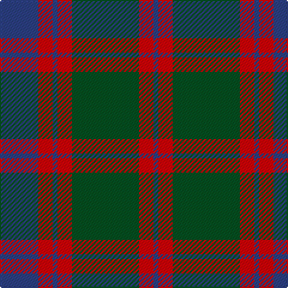

In pattern [BRBRGRB](/patterns/brbrgrb/).

This was sourced from register-of-tartans.  It is a [7 stripes tartan](/stripes/stripes7/).

Original link https://www.tartanregister.gov.uk/tartanDetails.aspx?ref=2181

## Thread count
B/32 R12 B4 R12 G56 R12 B/4

## Palette
Each colour and its ΔE from the base-6 reference it is a variant of.

| Colour | Shade | Base | ΔE (OKLab) |
|---|---|---|---|
| B | <code style="background-color:#2C4084;">#2C4084</code> `#2C4084` | B <code style="background-color:#2C4084;">#2C4084</code> | 0.00 |
| G | <code style="background-color:#005020;">#005020</code> `#005020` | G <code style="background-color:#006400;">#006400</code> | 0.08 |
| R | <code style="background-color:#DC0000;">#DC0000</code> `#DC0000` | R <code style="background-color:#C80000;">#C80000</code> | 0.04 |

# Sample pattern

## Nearest tartans

The nearest existing variants by ΔTartan distance.

1. [Robertson of Struan](/setts/s7/r12b4r4b42g40r8g8-b2c4084-g005020-rdc0000/) — ΔT 0.75
1. [Logan](/setts/s7/b32r12b4r12g56r12b4-b304080-g008000-rc00000/) — ΔT 0.83
1. [Robertson of Struan 1816](/setts/s7/r12b4r4b44g40r8b8-b202060-g006818-rc80000/) — ΔT 0.86
1. [Robertson of Struan](/setts/s7/r12b4r4b42g40r8g8-b304080-g008000-rc00000/) — ΔT 0.96
1. [Skene - 1831 (Clan)](/setts/s7/b24r12g4r12g48r12g4-b202060-g006818-rc80000/) — ΔT 0.96
1. [Logan, or Skene](/setts/s7/b18r6b2r6g18r6b2-b304080-g008000-rc00000/) — ΔT 1.00
1. [Logan #5](/setts/s6/b18r6b2g18r6b2-b2c2c80-g006818-rc80000/) — ΔT 1.03
1. [Chindecella Gorse (Personal)](/setts/s8/y14b8y4b8y46ba38b38ba8-b1c1c50-ba5c5c5c-ybc8c00/) — ΔT 1.04
1. [Logan (Dark)](/setts/s7/k60r16k4r16g60r16k4-g005430-k101010-rc80000/) — ΔT 1.05
1. [McGlynn](/setts/s10/g36b6g6b6g4b16r46b4r8g4-b2c2c80-g006818-r980044/) — ΔT 1.05

## Neighbour map

Every grey dot is one of 15726 variants placed by the first two principal components of the ΔTartan feature space (44% of its variance). Red is this tartan; blue dots are its nearest — click one to open its page.

<svg viewBox="0 0 640 380" role="img" style="max-width:100%;height:auto;border:1px solid #e0e0e0;border-radius:4px;display:block" xmlns="http://www.w3.org/2000/svg"><image href="/nn/cloud.v1.png" width="640" height="380"/><a href="/setts/s7/r12b4r4b42g40r8g8-b2c4084-g005020-rdc0000/"><circle cx="282.1" cy="224.7" r="4" fill="#3465a4"><title>Robertson of Struan</title></circle></a><a href="/setts/s7/b32r12b4r12g56r12b4-b304080-g008000-rc00000/"><circle cx="277.8" cy="204.0" r="4" fill="#3465a4"><title>Logan</title></circle></a><a href="/setts/s7/r12b4r4b44g40r8b8-b202060-g006818-rc80000/"><circle cx="293.1" cy="216.5" r="4" fill="#3465a4"><title>Robertson of Struan 1816</title></circle></a><a href="/setts/s7/r12b4r4b42g40r8g8-b304080-g008000-rc00000/"><circle cx="266.9" cy="218.5" r="4" fill="#3465a4"><title>Robertson of Struan</title></circle></a><a href="/setts/s7/b24r12g4r12g48r12g4-b202060-g006818-rc80000/"><circle cx="297.5" cy="214.9" r="4" fill="#3465a4"><title>Skene - 1831 (Clan)</title></circle></a><a href="/setts/s7/b18r6b2r6g18r6b2-b304080-g008000-rc00000/"><circle cx="234.1" cy="230.9" r="4" fill="#3465a4"><title>Logan, or Skene</title></circle></a><a href="/setts/s6/b18r6b2g18r6b2-b2c2c80-g006818-rc80000/"><circle cx="258.9" cy="240.1" r="4" fill="#3465a4"><title>Logan #5</title></circle></a><a href="/setts/s8/y14b8y4b8y46ba38b38ba8-b1c1c50-ba5c5c5c-ybc8c00/"><circle cx="230.2" cy="209.2" r="4" fill="#3465a4"><title>Chindecella Gorse (Personal)</title></circle></a><a href="/setts/s7/k60r16k4r16g60r16k4-g005430-k101010-rc80000/"><circle cx="266.3" cy="204.8" r="4" fill="#3465a4"><title>Logan (Dark)</title></circle></a><a href="/setts/s10/g36b6g6b6g4b16r46b4r8g4-b2c2c80-g006818-r980044/"><circle cx="285.3" cy="193.9" r="4" fill="#3465a4"><title>McGlynn</title></circle></a><circle cx="286.7" cy="206.8" r="5" fill="#c00000"/></svg>

ID: /setts/s7/b32r12b4r12g56r12b4-b2c4084-g005020-rdc0000/
