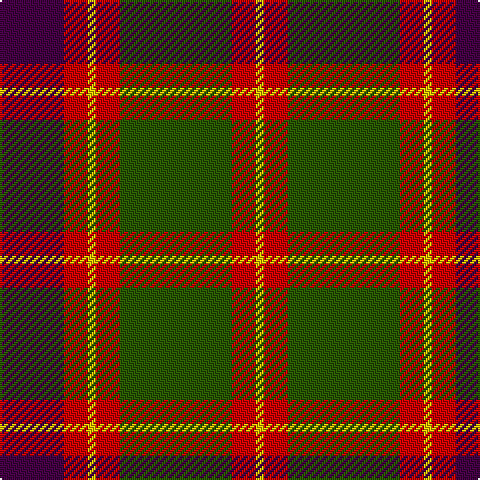

In pattern [BRYRGRY](/patterns/bryrgry/).

This was sourced from tartans-authority.  It is a [7 stripes tartan](/stripes/stripes7/).

Original link http://www.tartansauthority.com/tartan-ferret/display/590/

## Thread count
DP/32 R12 Y4 R12 G56 R12 Y/4

## Palette
Each colour and its ΔE from the base-6 reference it is a variant of.

| Colour | Shade | Base | ΔE (OKLab) |
|---|---|---|---|
| DP | <code style="background-color:#440044;">#440044</code> `#440044` | B <code style="background-color:#2A418A;">#2A418A</code> | 0.18 |
| G | <code style="background-color:#285800;">#285800</code> `#285800` | G <code style="background-color:#006100;">#006100</code> | 0.03 |
| R | <code style="background-color:#C80000;">#C80000</code> `#C80000` | R <code style="background-color:#CC0000;">#CC0000</code> | 0.01 |
| Y | <code style="background-color:#E8C000;">#E8C000</code> `#E8C000` | Y <code style="background-color:#F2BF00;">#F2BF00</code> | 0.02 |

# Sample pattern

## Nearest tartans

The nearest existing variants by ΔTartan distance.

1. [Logan with Yellow](/setts/s7/b32r12y4r12g56r12y4-b780078-g006818-rc80000-ye8c000/) — ΔT 0.45
1. [Cook (Name)](/setts/s7/g24ga12g12r30k2r2k4-g003820-ga048888-k101010-rc80000/) — ΔT 0.55
1. [Scott Hunting Clan Tartan Tartan Number: 1546. Earliest known date: 1906 Also known as Green Scott, this tartan is generally available today. The Chief of the Scotts is His Grace the 9th Duke of Buccleuch and 10th of Queensberry who lives in Selkirk in the borders region of Scotland. See products available Copyright © Blair Urquhart, Comrie, 2015](/setts/s8/r6b28g16r4g4w4g4r2-b480800-g006818-rc80000-we0e0e0/) — ΔT 0.56
1. [Unidentified #15](/setts/s6/k12r4g34r32k2b4-b3c82af-g005020-k101010-rdc0000/) — ΔT 0.58
1. [Plummer Family Personal Tartan Tartan Number: 2778. Earliest known date: 2001 From a D C Dalgliesh swatch in 2001 via Phil Smith June 2004. See products available Copyright © Blair Urquhart, Comrie, 2015](/setts/s6/r60k16g60b8r6b4-b1860a8-g005028-k101010-rc80000/) — ΔT 0.58
1. [Logan, with Yellow](/setts/s7/b32r12y4r12g56r12y4-b800080-g008000-rc00000-yf0c000/) — ΔT 0.71
1. [Cranston Dress Family Tartan Tartan Number: 753. Earliest known date: pre 2003 Restricted See products available Copyright © Blair Urquhart, Comrie, 2015](/setts/s8/r30b3r2b3r6b14g26ga6-b2c2c80-g289c18-ga006818-rc80000/) — ΔT 0.72
1. [Cranston Dress](/setts/s8/r30b4r2b4r6b14g26ga6-b2c2c80-g289c18-ga006818-rc80000/) — ΔT 0.75
1. [Geddes](/setts/s7/b4r20g60r12b36r40w4-b440044-g006818-rc80000-we0e0e0/) — ΔT 0.75
1. [Private SA Club](/setts/s8/k6r16k6r16y38r14b72r6-b14283c-k101010-r880000-yd8a028/) — ΔT 0.76

## Neighbour map

Every grey dot is one of 15726 variants placed by the first two principal components of the ΔTartan feature space (44% of its variance). Red is this tartan; blue dots are its nearest — click one to open its page.

<svg viewBox="0 0 640 380" role="img" style="max-width:100%;height:auto;border:1px solid #e0e0e0;border-radius:4px;display:block" xmlns="http://www.w3.org/2000/svg"><image href="/nn/cloud.v1.png" width="640" height="380"/><a href="/setts/s7/b32r12y4r12g56r12y4-b780078-g006818-rc80000-ye8c000/"><circle cx="245.6" cy="177.1" r="4" fill="#3465a4"><title>Logan with Yellow</title></circle></a><a href="/setts/s7/g24ga12g12r30k2r2k4-g003820-ga048888-k101010-rc80000/"><circle cx="251.2" cy="189.4" r="4" fill="#3465a4"><title>Cook (Name)</title></circle></a><a href="/setts/s8/r6b28g16r4g4w4g4r2-b480800-g006818-rc80000-we0e0e0/"><circle cx="243.7" cy="170.1" r="4" fill="#3465a4"><title>Scott Hunting Clan Tartan Tartan Number: 1546. Earliest known date: 1906 Also known as Green Scott, this tartan is generally available today. The Chief of the Scotts is His Grace the 9th Duke of Buccleuch and 10th of Queensberry who lives in Selkirk in the borders region of Scotland. See products available Copyright © Blair Urquhart, Comrie, 2015</title></circle></a><a href="/setts/s6/k12r4g34r32k2b4-b3c82af-g005020-k101010-rdc0000/"><circle cx="257.1" cy="178.1" r="4" fill="#3465a4"><title>Unidentified #15</title></circle></a><a href="/setts/s6/r60k16g60b8r6b4-b1860a8-g005028-k101010-rc80000/"><circle cx="278.9" cy="186.1" r="4" fill="#3465a4"><title>Plummer Family Personal Tartan Tartan Number: 2778. Earliest known date: 2001 From a D C Dalgliesh swatch in 2001 via Phil Smith June 2004. See products available Copyright © Blair Urquhart, Comrie, 2015</title></circle></a><a href="/setts/s7/b32r12y4r12g56r12y4-b800080-g008000-rc00000-yf0c000/"><circle cx="238.1" cy="173.8" r="4" fill="#3465a4"><title>Logan, with Yellow</title></circle></a><a href="/setts/s8/r30b3r2b3r6b14g26ga6-b2c2c80-g289c18-ga006818-rc80000/"><circle cx="235.0" cy="166.0" r="4" fill="#3465a4"><title>Cranston Dress Family Tartan Tartan Number: 753. Earliest known date: pre 2003 Restricted See products available Copyright © Blair Urquhart, Comrie, 2015</title></circle></a><a href="/setts/s8/r30b4r2b4r6b14g26ga6-b2c2c80-g289c18-ga006818-rc80000/"><circle cx="227.3" cy="168.9" r="4" fill="#3465a4"><title>Cranston Dress</title></circle></a><a href="/setts/s7/b4r20g60r12b36r40w4-b440044-g006818-rc80000-we0e0e0/"><circle cx="242.4" cy="187.0" r="4" fill="#3465a4"><title>Geddes</title></circle></a><a href="/setts/s8/k6r16k6r16y38r14b72r6-b14283c-k101010-r880000-yd8a028/"><circle cx="227.1" cy="172.4" r="4" fill="#3465a4"><title>Private SA Club</title></circle></a><circle cx="246.7" cy="179.3" r="5" fill="#c00000"/></svg>

ID: /setts/s7/b32r12y4r12g56r12y4-b440044-g285800-rc80000-ye8c000/
