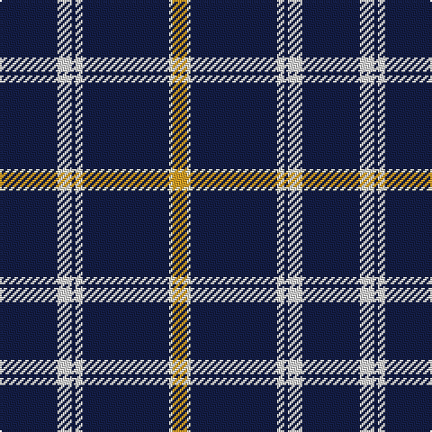

In pattern [BWBWBWY](/patterns/bwbwbwy/).

This was sourced from register-of-tartans.  It is a [7 stripes tartan](/stripes/stripes7/).

Original link https://www.tartanregister.gov.uk/tartanDetails.aspx?ref=11510

## Thread count
DB/32 LN8 DB2 LN4 DB48 LY2 Y/8

## Palette
Each colour and its ΔE from the base-6 reference it is a variant of.

| Colour | Shade | Base | ΔE (OKLab) |
|---|---|---|---|
| DB | <code style="background-color:#141E46;">#141E46</code> `#141E46` | B <code style="background-color:#2C4084;">#2C4084</code> | 0.15 |
| LN | <code style="background-color:#E0E0E0;">#E0E0E0</code> `#E0E0E0` | W <code style="background-color:#F4F4F0;">#F4F4F0</code> | 0.06 |
| LY | <code style="background-color:#F9F5C8;">#F9F5C8</code> `#F9F5C8` | W <code style="background-color:#F4F4F0;">#F4F4F0</code> | 0.05 |
| Y | <code style="background-color:#E0A126;">#E0A126</code> `#E0A126` | Y <code style="background-color:#E8C000;">#E8C000</code> | 0.08 |

# Sample pattern

## Nearest tartans

The nearest existing variants by ΔTartan distance.

1. [East of Scotland Tartan Army](/setts/s6/b40y10b8r20b100w5-b14283c-rc80000-wfcfcfc-ye8c000/) — ΔT 1.19
1. [Tokyo Bluebells](/setts/s8/b72r4b4r4b4k28b52w8-b304080-k000000-rc00000-we0e0e0/) — ΔT 1.22
1. [St. John (Corporate?)](/setts/s5/b67w10y14b10w2-b1c1c50-we0e0e0-ye8c000/) — ΔT 1.37
1. [Dundee F.C. Corporate Tartan Tartan Number: 2058. Earliest known date: 1990 The tartan of the Dundee Football Club launched on the 10th December, 1990. See products available Copyright © Blair Urquhart, Comrie, 2015](/setts/s10/b6w4b3w6b8y3b52y3b8r4-b202060-rc80000-we0e0e0-ydc943c/) — ΔT 1.41
1. [Morris of Wales](/setts/s8/w4y3b3y2b3y4b48y4-b202060-we0e0e0-ye8c000/) — ΔT 1.50
1. [London Fog Black](/setts/s6/k20y4w10y8k100b4-b1474b4-k101010-we0e0e0-yb8b8b8/) — ΔT 1.52
1. [Norwich University Regimental Tartan Tartan Number: 10631. Earliest known date: 2012 The tartan was designed for use by the Norwich University Pipes and Drums Band primarily in kilts. The blue is from the Corps of Cadets formal attire coatee and the University colors are maroon and gold See products available Copyright © Blair Urquhart, Comrie, 2015](/setts/s4/b156y32r12w4-b242470-r880000-we0e0e0-ye8c000/) — ΔT 1.55
1. [George, Stuart (Personal)](/setts/s9/b124w4b8w10b12y4r16y6w8-b1c1c50-r800028-wffffff-ye0a126/) — ΔT 1.55
1. [Dundee F.C.](/setts/s10/b6w4b3w6b8y3b52y3b8r4-b000050-rc00000-we0e0e0-yf0c000/) — ΔT 1.57
1. [Morris Welsh Name Tartan Tartan Number: 5749. Earliest known date: 2002 The tartan for this Welsh surname and its variations, Meyrick, Meurig, is actually woven in Wales at the Cambrian Woollen Mill, weaving on the same site since 1830. This tartan differs from many traditional patterns in that the warp and weft differ, giving the finished worsted wool cloth more of a predominant stripe, vertically noticeable in the finished Kilt, or Cilt in Wales. See products available Copyright © Blair Urquhart, Comrie, 2015](/setts/s8/w6y3b3y2b3y4b48y4-b202060-we0e0e0-ye8c000/) — ΔT 1.57

## Neighbour map

Every grey dot is one of 15726 variants placed by the first two principal components of the ΔTartan feature space (44% of its variance). Red is this tartan; blue dots are its nearest — click one to open its page.

<svg viewBox="0 0 640 380" role="img" style="max-width:100%;height:auto;border:1px solid #e0e0e0;border-radius:4px;display:block" xmlns="http://www.w3.org/2000/svg"><image href="/nn/cloud.v1.png" width="640" height="380"/><a href="/setts/s6/b40y10b8r20b100w5-b14283c-rc80000-wfcfcfc-ye8c000/"><circle cx="518.0" cy="180.3" r="4" fill="#3465a4"><title>East of Scotland Tartan Army</title></circle></a><a href="/setts/s8/b72r4b4r4b4k28b52w8-b304080-k000000-rc00000-we0e0e0/"><circle cx="458.3" cy="167.0" r="4" fill="#3465a4"><title>Tokyo Bluebells</title></circle></a><a href="/setts/s5/b67w10y14b10w2-b1c1c50-we0e0e0-ye8c000/"><circle cx="481.8" cy="165.5" r="4" fill="#3465a4"><title>St. John (Corporate?)</title></circle></a><a href="/setts/s10/b6w4b3w6b8y3b52y3b8r4-b202060-rc80000-we0e0e0-ydc943c/"><circle cx="495.3" cy="135.6" r="4" fill="#3465a4"><title>Dundee F.C. Corporate Tartan Tartan Number: 2058. Earliest known date: 1990 The tartan of the Dundee Football Club launched on the 10th December, 1990. See products available Copyright © Blair Urquhart, Comrie, 2015</title></circle></a><a href="/setts/s8/w4y3b3y2b3y4b48y4-b202060-we0e0e0-ye8c000/"><circle cx="501.0" cy="133.5" r="4" fill="#3465a4"><title>Morris of Wales</title></circle></a><a href="/setts/s6/k20y4w10y8k100b4-b1474b4-k101010-we0e0e0-yb8b8b8/"><circle cx="538.3" cy="152.6" r="4" fill="#3465a4"><title>London Fog Black</title></circle></a><a href="/setts/s4/b156y32r12w4-b242470-r880000-we0e0e0-ye8c000/"><circle cx="507.0" cy="156.6" r="4" fill="#3465a4"><title>Norwich University Regimental Tartan Tartan Number: 10631. Earliest known date: 2012 The tartan was designed for use by the Norwich University Pipes and Drums Band primarily in kilts. The blue is from the Corps of Cadets formal attire coatee and the University colors are maroon and gold See products available Copyright © Blair Urquhart, Comrie, 2015</title></circle></a><a href="/setts/s9/b124w4b8w10b12y4r16y6w8-b1c1c50-r800028-wffffff-ye0a126/"><circle cx="481.3" cy="102.5" r="4" fill="#3465a4"><title>George, Stuart (Personal)</title></circle></a><a href="/setts/s10/b6w4b3w6b8y3b52y3b8r4-b000050-rc00000-we0e0e0-yf0c000/"><circle cx="478.8" cy="137.1" r="4" fill="#3465a4"><title>Dundee F.C.</title></circle></a><a href="/setts/s8/w6y3b3y2b3y4b48y4-b202060-we0e0e0-ye8c000/"><circle cx="478.4" cy="132.9" r="4" fill="#3465a4"><title>Morris Welsh Name Tartan Tartan Number: 5749. Earliest known date: 2002 The tartan for this Welsh surname and its variations, Meyrick, Meurig, is actually woven in Wales at the Cambrian Woollen Mill, weaving on the same site since 1830. This tartan differs from many traditional patterns in that the warp and weft differ, giving the finished worsted wool cloth more of a predominant stripe, vertically noticeable in the finished Kilt, or Cilt in Wales. See products available Copyright © Blair Urquhart, Comrie, 2015</title></circle></a><circle cx="481.0" cy="155.6" r="5" fill="#c00000"/></svg>

ID: /setts/s7/b32w8b2w4b48wa2y8-b141e46-we0e0e0-waf9f5c8-ye0a126/
