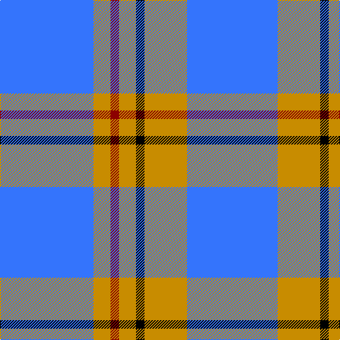

In pattern [BYKYRYB](/stripes/bykyryb/).

This was sourced from tartans-authority.  It is a [7 stripe tartan](/stripes/stripes7/).

Original link http://www.tartansauthority.com/tartan-ferret/display/674/

## Also known as

This cloth is also recorded under:

- Carlisle Family

## Thread count
B/132 DY24 DR12 DY24 K12 DY60 B/128

## Palette
Each colour and the base-6 reference it is a variant of.

| Colour | Shade | Base |
|---|---|---|
| B | <code style="background-color:#3474FC;">#3474FC</code> `oklch(59.7% 0.214 262.7)` <small>#3474FC</small> | B <code style="background-color:#2A418A;">#2A418A</code> |
| DR | <code style="background-color:#8C0000;">#8C0000</code> `oklch(40.2% 0.165 29.2)` <small>#8C0000</small> | R <code style="background-color:#CC0000;">#CC0000</code> |
| DY | <code style="background-color:#C88C00;">#C88C00</code> `oklch(68.2% 0.142 78.2)` <small>#C88C00</small> | Y <code style="background-color:#F2BF00;">#F2BF00</code> |
| K | <code style="background-color:#000000;">#000000</code> `oklch(0.0% 0.000 0.0)` <small>#000000</small> | K <code style="background-color:#000000;">#000000</code> |

# Sample pattern

## Nearest tartans

The nearest existing variants by ΔTartan distance.

1. [Maud, Mary](/setts/s8/b130k9b21ly8b21w8b35r70/) — ΔT 1.33
1. [Loch Lomond](/setts/s5/t37w9t3db9w3~x2/) — ΔT 1.38
1. [Whitley (Personal)](/setts/s6/b1w5b1w5b15ly1~x4/) — ΔT 1.39
1. [Carlisle Ancient](/setts/s5/b11lo2r1lo2r1~x4/) — ΔT 1.45
1. [Alaska Highlanders Pipes & Drums Corporate Tartan Tartan Number: 8433. Earliest known date: pre 2001 Found on http://www.alaskahighlanders.com/alaska-flag-tartan: Captain Cook's own Alaska Highlanders was reformed in 1987 by the late great Pipe Major Iain MacPherson. We are a dedicated pipe band that is open to new discovery and experiences. We have played all over Alaska, Scotland twice and London in 2005. Our band has been represented at the Pipefest in 1995, 2000 and 2005. On August 23, 2005 (when his family and fellow Scots were finally allowed to hold a public funeral and memorial service 700 years to the day after his execution, we had the honor of escorting the spirit of the braveheart Sir William Wallace on his first mile home to Scotland. At the invitation of Clan Wallace Society convienor David Ross provided an Honour Guard with swords and led the funeral procession from the site of his execution thru the streets of London to the London Welsh Center where a Wake was held. The Highlanders wear the Alaska Flag Tartan and our uniforms reflect those worn by those pipers and drummers who sailed with Captain James Cook in 1778, when he discovered Alaska. (State of Alaska) See products available Copyright © Blair Urquhart, Comrie, 2015](/setts/s8/db9lb27db2k4db2lb10db2w3~x2/) — ΔT 1.50
1. [Orlando Dress, City of (District)](/setts/s9/b12ly1w16b1w1b14w3b14r2~x4/) — ΔT 1.51
1. [Wheadon (Name)](/setts/s6/db40g7ly3g7db15r5~x2/) — ΔT 1.55
1. [Mortell (Personal)](/setts/s10/db20b2w5r2db10b5db20b2w5r5~x2/) — ΔT 1.56
1. [Loch Lomond #2](/setts/s5/b13w3b1k3w1~x6/) — ΔT 1.59
1. [Debbie Munro Memorial (Corporate)](/setts/s5/db26lp11db3lp4k2~x4/) — ΔT 1.59

## Neighbour map

Every grey dot is one of 14299 variants placed by the first two principal components of the ΔTartan feature space (44% of its variance). Red is this tartan; blue dots are its nearest — click one to open its page.

<svg viewBox="0 0 640 380" role="img" style="max-width:100%;height:auto;border:1px solid #e0e0e0;border-radius:4px;display:block" xmlns="http://www.w3.org/2000/svg"><image href="/nn/cloud.v1.png" width="640" height="380"/><a href="/setts/s8/b130k9b21ly8b21w8b35r70/"><circle cx="387.2" cy="148.3" r="4" fill="#3465a4"><title>Maud, Mary</title></circle></a><a href="/setts/s5/t37w9t3db9w3~x2/"><circle cx="382.6" cy="206.0" r="4" fill="#3465a4"><title>Loch Lomond</title></circle></a><a href="/setts/s6/b1w5b1w5b15ly1~x4/"><circle cx="366.6" cy="181.8" r="4" fill="#3465a4"><title>Whitley (Personal)</title></circle></a><a href="/setts/s5/b11lo2r1lo2r1~x4/"><circle cx="396.5" cy="209.3" r="4" fill="#3465a4"><title>Carlisle Ancient</title></circle></a><a href="/setts/s8/db9lb27db2k4db2lb10db2w3~x2/"><circle cx="320.1" cy="150.0" r="4" fill="#3465a4"><title>Alaska Highlanders Pipes &amp; Drums Corporate Tartan Tartan Number: 8433. Earliest known date: pre 2001 Found on http://www.alaskahighlanders.com/alaska-flag-tartan: Captain Cook's own Alaska Highlanders was reformed in 1987 by the late great Pipe Major Iain MacPherson. We are a dedicated pipe band that is open to new discovery and experiences. We have played all over Alaska, Scotland twice and London in 2005. Our band has been represented at the Pipefest in 1995, 2000 and 2005. On August 23, 2005 (when his family and fellow Scots were finally allowed to hold a public funeral and memorial service 700 years to the day after his execution, we had the honor of escorting the spirit of the braveheart Sir William Wallace on his first mile home to Scotland. At the invitation of Clan Wallace Society convienor David Ross provided an Honour Guard with swords and led the funeral procession from the site of his execution thru the streets of London to the London Welsh Center where a Wake was held. The Highlanders wear the Alaska Flag Tartan and our uniforms reflect those worn by those pipers and drummers who sailed with Captain James Cook in 1778, when he discovered Alaska. (State of Alaska) See products available Copyright © Blair Urquhart, Comrie, 2015</title></circle></a><a href="/setts/s9/b12ly1w16b1w1b14w3b14r2~x4/"><circle cx="340.6" cy="160.1" r="4" fill="#3465a4"><title>Orlando Dress, City of (District)</title></circle></a><a href="/setts/s6/db40g7ly3g7db15r5~x2/"><circle cx="428.1" cy="201.7" r="4" fill="#3465a4"><title>Wheadon (Name)</title></circle></a><a href="/setts/s10/db20b2w5r2db10b5db20b2w5r5~x2/"><circle cx="337.7" cy="186.6" r="4" fill="#3465a4"><title>Mortell (Personal)</title></circle></a><a href="/setts/s5/b13w3b1k3w1~x6/"><circle cx="375.4" cy="196.6" r="4" fill="#3465a4"><title>Loch Lomond #2</title></circle></a><a href="/setts/s5/db26lp11db3lp4k2~x4/"><circle cx="378.3" cy="206.0" r="4" fill="#3465a4"><title>Debbie Munro Memorial (Corporate)</title></circle></a><circle cx="360.8" cy="194.4" r="5" fill="#c00000"/></svg>

ID: /setts/s7/b33lo6r3lo6k3lo15b32~x4/
