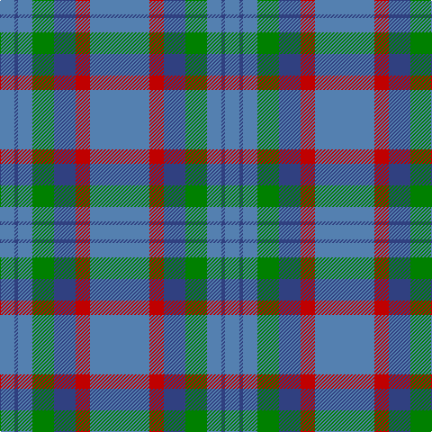

In pattern [BBBGBRB](/patterns/bbbgbrb/).

This was sourced from weddslist.  It is a [7 stripes tartan](/stripes/stripes7/).

Original link http://www.weddslist.com/cgi-bin/tartans/pg.pl?source=sts

## Thread count
Ba/16 B4 Ba16 G24 B24 R16 Ba/66

## Palette
Each colour and its ΔE from the base-6 reference it is a variant of.

| Colour | Shade | Base | ΔE (OKLab) |
|---|---|---|---|
| B | <code style="background-color:#304080;">#304080</code> `#304080` | B <code style="background-color:#2A418A;">#2A418A</code> | 0.02 |
| Ba | <code style="background-color:#5480B0;">#5480B0</code> `#5480B0` | B <code style="background-color:#2A418A;">#2A418A</code> | 0.19 |
| G | <code style="background-color:#008000;">#008000</code> `#008000` | G <code style="background-color:#006100;">#006100</code> | 0.10 |
| R | <code style="background-color:#C00000;">#C00000</code> `#C00000` | R <code style="background-color:#CC0000;">#CC0000</code> | 0.03 |

# Sample pattern

## Nearest tartans

The nearest existing variants by ΔTartan distance.

1. [Bermuda Plaid (1947) (District)](/setts/s7/b33r8ba12g12b8ba2b8~b5c8ca8-ba2c2c80-g006818-rc80000~x2/) — ΔT 0.68
1. [Thorburn (Lochcarron)](/setts/s6/b3ba14b3r16b34ra3~b003c64-ba5c8ca8-r888888-rac80000~x2/) — ΔT 1.19
1. [Devlin, Craig (Personal)](/setts/s6/g8w3b6ba11b30ba5~b5c5c5c-ba2c2c80-g006818-we0e0e0~x2/) — ΔT 1.23
1. [Lockhart](/setts/s9/g13k2g34k6b16r2b16k2g13~b1474b4-g408060-k101010-rc80000~x2/) — ΔT 1.24
1. [Port Authority of NY & NJ](/setts/s6/b9ba2b39bb33y2bb5~b5c8ca8-ba1c0070-bb003c64-ybc8c00~x2/) — ΔT 1.40
1. [Burt #1 (Name)](/setts/s9/r2y13b8y3b33ya3b8ya13ra2~b5c649c-rb468ac-rac80000-y44ac64-yaa49058~x2/) — ΔT 1.50
1. [Cameron Hunting](/setts/s6/b15r5b30ba32b4y3~b4c3428-ba1474b4-rc80000-yd09800~x2/) — ΔT 1.52
1. [Kildare, County (District)](/setts/s8/g8b2g13r4g12ba22g5ra3~b4c3428-ba2c2c80-g74846c-r880000-rab84c00~x2/) — ΔT 1.53
1. [Loch Lomond Trade Tartan Tartan Number: 628. Earliest known date: pre 1984 Sent to the Scottish Tartans Society in Comrie by Lumsden of Toronto. See products available Copyright © Blair Urquhart, Comrie, 2015](/setts/s5/b37ba9b3bb9w3~b5c8ca8-ba1870a4-bb202060-we0e0e0~x2/) — ΔT 1.57
1. [North Sea Commission](/setts/s5/b9ba3b1ba12y1~b5c8ca8-ba344054-ye8c000~x4/) — ΔT 1.60

## Neighbour map

Every grey dot is one of 15726 variants placed by the first two principal components of the ΔTartan feature space (44% of its variance). Red is this tartan; blue dots are its nearest — click one to open its page.

<svg viewBox="0 0 640 380" role="img" style="max-width:100%;height:auto;border:1px solid #e0e0e0;border-radius:4px;display:block" xmlns="http://www.w3.org/2000/svg"><image href="/nn/cloud.v1.png" width="640" height="380"/><a href="/setts/s7/b33r8ba12g12b8ba2b8~b5c8ca8-ba2c2c80-g006818-rc80000~x2/"><circle cx="345.1" cy="207.0" r="4" fill="#3465a4"><title>Bermuda Plaid (1947) (District)</title></circle></a><a href="/setts/s6/b3ba14b3r16b34ra3~b003c64-ba5c8ca8-r888888-rac80000~x2/"><circle cx="330.6" cy="220.5" r="4" fill="#3465a4"><title>Thorburn (Lochcarron)</title></circle></a><a href="/setts/s6/g8w3b6ba11b30ba5~b5c5c5c-ba2c2c80-g006818-we0e0e0~x2/"><circle cx="356.0" cy="236.1" r="4" fill="#3465a4"><title>Devlin, Craig (Personal)</title></circle></a><a href="/setts/s9/g13k2g34k6b16r2b16k2g13~b1474b4-g408060-k101010-rc80000~x2/"><circle cx="371.8" cy="205.9" r="4" fill="#3465a4"><title>Lockhart</title></circle></a><a href="/setts/s6/b9ba2b39bb33y2bb5~b5c8ca8-ba1c0070-bb003c64-ybc8c00~x2/"><circle cx="379.0" cy="198.4" r="4" fill="#3465a4"><title>Port Authority of NY &amp; NJ</title></circle></a><a href="/setts/s9/r2y13b8y3b33ya3b8ya13ra2~b5c649c-rb468ac-rac80000-y44ac64-yaa49058~x2/"><circle cx="370.2" cy="175.2" r="4" fill="#3465a4"><title>Burt #1 (Name)</title></circle></a><a href="/setts/s6/b15r5b30ba32b4y3~b4c3428-ba1474b4-rc80000-yd09800~x2/"><circle cx="347.4" cy="231.0" r="4" fill="#3465a4"><title>Cameron Hunting</title></circle></a><a href="/setts/s8/g8b2g13r4g12ba22g5ra3~b4c3428-ba2c2c80-g74846c-r880000-rab84c00~x2/"><circle cx="301.2" cy="203.3" r="4" fill="#3465a4"><title>Kildare, County (District)</title></circle></a><a href="/setts/s5/b37ba9b3bb9w3~b5c8ca8-ba1870a4-bb202060-we0e0e0~x2/"><circle cx="415.8" cy="220.1" r="4" fill="#3465a4"><title>Loch Lomond Trade Tartan Tartan Number: 628. Earliest known date: pre 1984 Sent to the Scottish Tartans Society in Comrie by Lumsden of Toronto. See products available Copyright © Blair Urquhart, Comrie, 2015</title></circle></a><a href="/setts/s5/b9ba3b1ba12y1~b5c8ca8-ba344054-ye8c000~x4/"><circle cx="396.1" cy="249.5" r="4" fill="#3465a4"><title>North Sea Commission</title></circle></a><circle cx="362.6" cy="214.9" r="5" fill="#c00000"/></svg>

ID: /setts/s7/b33r8ba12g12b8ba2b8~b5480b0-ba304080-g008000-rc00000~x2/
