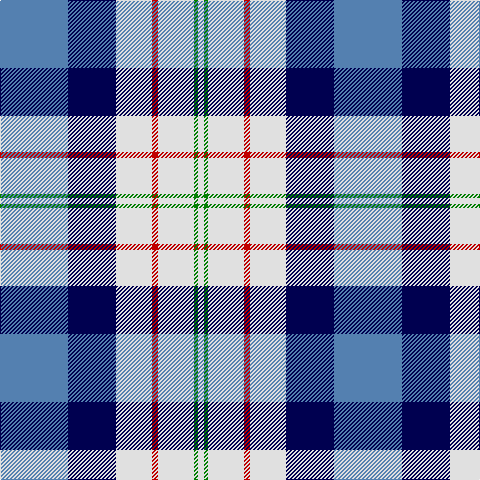

In pattern [BBWRWGW](/patterns/bbwrwgw/).

This was sourced from weddslist.  It is a [7 stripes tartan](/stripes/stripes7/).

Original link http://www.weddslist.com/cgi-bin/tartans/pg.pl?source=sts

## Thread count
B/68 DB48 LN36 R6 LN36 G4 LN/6

## Palette
Each colour and its ΔE from the base-6 reference it is a variant of.

| Colour | Shade | Base | ΔE (OKLab) |
|---|---|---|---|
| B | <code style="background-color:#5480B0;">#5480B0</code> `#5480B0` | B <code style="background-color:#2A418A;">#2A418A</code> | 0.19 |
| DB | <code style="background-color:#000050;">#000050</code> `#000050` | B <code style="background-color:#2A418A;">#2A418A</code> | 0.21 |
| G | <code style="background-color:#008000;">#008000</code> `#008000` | G <code style="background-color:#006100;">#006100</code> | 0.10 |
| LN | <code style="background-color:#E0E0E0;">#E0E0E0</code> `#E0E0E0` | W <code style="background-color:#F7F7F7;">#F7F7F7</code> | 0.07 |
| R | <code style="background-color:#C00000;">#C00000</code> `#C00000` | R <code style="background-color:#CC0000;">#CC0000</code> | 0.03 |

# Sample pattern

## Nearest tartans

The nearest existing variants by ΔTartan distance.

1. [Ferguson Dress Clan Tartan Tartan Number: 92. Earliest known date: 1980 See also 371 where the dark blue is changed to black. These are problably one and the same tartan. Dark blue being the correct colour. See products available Copyright © Blair Urquhart, Comrie, 2015](/setts/s7/b34ba24w18r3w18g2w3x2~b588ca8-ba202060-g006818-r880000-we0e0e0/) — ΔT 0.49
1. [St Andrews Dress, Earl of.. District Tartan Tartan Number: 45. Earliest known date: pre 2003 See products available Copyright © Blair Urquhart, Comrie, 2015](/setts/s7/w28b19ba19w4bb2wa2ba7x2~b5c8ca8-ba2c2c80-bb202060-we0e0e0-wac49cd8/) — ΔT 0.58
1. [St. Andrews Dress, Earl of (Danc](/setts/s7/w28b19ba19w4bb2bc2ba7x2~b5c8ca8-ba2c2c80-bb202060-bc9058d8-we0e0e0/) — ΔT 0.58
1. [St Andrews, Earl of, dress](/setts/s7/w28b19ba19w4bb2wa2ba7x2~b5480b0-ba304080-bb000050-we0e0e0-wac0a0e0/) — ΔT 0.70
1. [Ferguson Dress](/setts/s7/b17k12w9r2w9g1w2x4~b5c8ca8-g006818-k101010-r980044-we0e0e0/) — ΔT 0.81
1. [Ferguson Dress #2](/setts/s7/b68k42w32r5w32g4w6~b2c4084-g002814-k101010-r960028-we0e0e0/) — ΔT 0.82
1. [Earl of St. Andrews Dress](/setts/s7/w20b14ba14w4bb2bc2ba7x2~b003478-ba3c3c64-bb000064-bc6478b0-wf8f8f8/) — ΔT 0.87
1. [Arran - 1989 (Fashion)](/setts/s8/b12k1b1k1b1ba8w9r2x4~b5c8ca8-ba202060-k101010-r888888-wfcfcfc/) — ΔT 0.92
1. [Davidson (Wedding) (Personal)](/setts/s7/r2b14k6g1w12g1w2x4~b2c2c80-g006818-k101010-rc80000-wfcfcfc/) — ΔT 0.92
1. [Manx Dress](/setts/s6/g4w28b8y2ba17g4x2~b780078-ba2c2c80-g006818-we0e0e0-ye8c000/) — ΔT 0.96

## Neighbour map

Every grey dot is one of 15726 variants placed by the first two principal components of the ΔTartan feature space (44% of its variance). Red is this tartan; blue dots are its nearest — click one to open its page.

<svg viewBox="0 0 640 380" role="img" style="max-width:100%;height:auto;border:1px solid #e0e0e0;border-radius:4px;display:block" xmlns="http://www.w3.org/2000/svg"><image href="/nn/cloud.v1.png" width="640" height="380"/><a href="/setts/s7/b34ba24w18r3w18g2w3x2~b588ca8-ba202060-g006818-r880000-we0e0e0/"><circle cx="165.0" cy="153.2" r="4" fill="#3465a4"><title>Ferguson Dress Clan Tartan Tartan Number: 92. Earliest known date: 1980 See also 371 where the dark blue is changed to black. These are problably one and the same tartan. Dark blue being the correct colour. See products available Copyright © Blair Urquhart, Comrie, 2015</title></circle></a><a href="/setts/s7/w28b19ba19w4bb2wa2ba7x2~b5c8ca8-ba2c2c80-bb202060-we0e0e0-wac49cd8/"><circle cx="166.8" cy="156.4" r="4" fill="#3465a4"><title>St Andrews Dress, Earl of.. District Tartan Tartan Number: 45. Earliest known date: pre 2003 See products available Copyright © Blair Urquhart, Comrie, 2015</title></circle></a><a href="/setts/s7/w28b19ba19w4bb2bc2ba7x2~b5c8ca8-ba2c2c80-bb202060-bc9058d8-we0e0e0/"><circle cx="166.8" cy="156.6" r="4" fill="#3465a4"><title>St. Andrews Dress, Earl of (Danc</title></circle></a><a href="/setts/s7/w28b19ba19w4bb2wa2ba7x2~b5480b0-ba304080-bb000050-we0e0e0-wac0a0e0/"><circle cx="171.1" cy="158.4" r="4" fill="#3465a4"><title>St Andrews, Earl of, dress</title></circle></a><a href="/setts/s7/b17k12w9r2w9g1w2x4~b5c8ca8-g006818-k101010-r980044-we0e0e0/"><circle cx="153.1" cy="152.9" r="4" fill="#3465a4"><title>Ferguson Dress</title></circle></a><a href="/setts/s7/b68k42w32r5w32g4w6~b2c4084-g002814-k101010-r960028-we0e0e0/"><circle cx="157.0" cy="150.3" r="4" fill="#3465a4"><title>Ferguson Dress #2</title></circle></a><a href="/setts/s7/w20b14ba14w4bb2bc2ba7x2~b003478-ba3c3c64-bb000064-bc6478b0-wf8f8f8/"><circle cx="125.8" cy="173.9" r="4" fill="#3465a4"><title>Earl of St. Andrews Dress</title></circle></a><a href="/setts/s8/b12k1b1k1b1ba8w9r2x4~b5c8ca8-ba202060-k101010-r888888-wfcfcfc/"><circle cx="152.8" cy="143.4" r="4" fill="#3465a4"><title>Arran - 1989 (Fashion)</title></circle></a><a href="/setts/s7/r2b14k6g1w12g1w2x4~b2c2c80-g006818-k101010-rc80000-wfcfcfc/"><circle cx="146.2" cy="141.7" r="4" fill="#3465a4"><title>Davidson (Wedding) (Personal)</title></circle></a><a href="/setts/s6/g4w28b8y2ba17g4x2~b780078-ba2c2c80-g006818-we0e0e0-ye8c000/"><circle cx="178.9" cy="153.5" r="4" fill="#3465a4"><title>Manx Dress</title></circle></a><circle cx="155.8" cy="151.5" r="5" fill="#c00000"/></svg>

ID: /setts/s7/b34ba24w18r3w18g2w3x2~b5480b0-ba000050-g008000-rc00000-we0e0e0/
