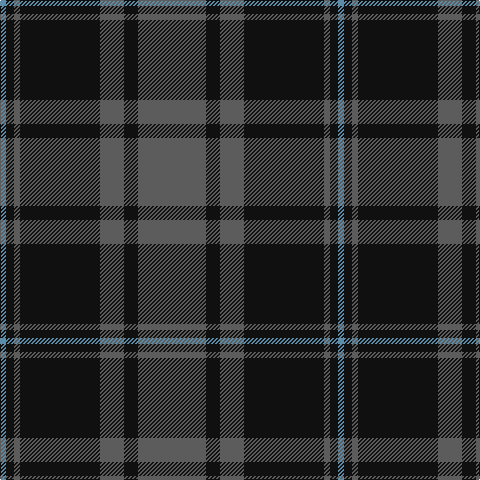

In pattern [BKBKBKB](/patterns/bkbkbkb/).

This was sourced from tartans-authority.  It is a [7 stripes tartan](/stripes/stripes7/).

Original link http://www.tartansauthority.com/tartan-ferret/display/10578/

## Thread count
B/6 K8 N6 K80 N24 K14 N/68

## Palette
Each colour and its ΔE from the base-6 reference it is a variant of.

| Colour | Shade | Base | ΔE (OKLab) |
|---|---|---|---|
| B | <code style="background-color:#5C8CA8;">#5C8CA8</code> `#5C8CA8` | B <code style="background-color:#2A418A;">#2A418A</code> | 0.23 |
| K | <code style="background-color:#101010;">#101010</code> `#101010` | K <code style="background-color:#000000;">#000000</code> | 0.17 |
| N | <code style="background-color:#5C5C5C;">#5C5C5C</code> `#5C5C5C` | B <code style="background-color:#2A418A;">#2A418A</code> | 0.15 |

# Sample pattern

## Nearest tartans

The nearest existing variants by ΔTartan distance.

1. [Tartan Army Children's Charity (Corp](/setts/s7/b34k7b12k39b3k4y3x2~b5c5c5c-k101010-y48a4c0/) — ΔT 0.14
1. [Korner-MacPherson (Personal)](/setts/s7/b5r3b35k28b4k11b2x2~b5c5c5c-k101010-rc80000/) — ΔT 0.51
1. [Scottish National Party (Corporate)](/setts/s6/k3b31k3b3k27y3x2~b5c5c5c-k101010-ye8c000/) — ΔT 0.87
1. [Pride of the Forth](/setts/s6/b3k20ba3k3ba23k3x2~b3c82af-ba5c5c5c-k101010/) — ΔT 0.94
1. [Pride of the Forth](/setts/s6/k3b23k3b3k20y3x2~b5c5c5c-k101010-y48a4c0/) — ΔT 0.99
1. [Perthshire (New) District Tartan Tartan Number: 2188. Earliest known date: 1992 The New Perthshire District tartan has established itself through use and wont since 1992. It provides a useful alternative to the Drummond pattern which was always closely associated with Perthshire. See products available Copyright © Blair Urquhart, Comrie, 2015](/setts/s6/b26r6g16b8g3r2x2~b202060-g006818-rc80000/) — ΔT 1.06
1. [Brown, Barnaby (Personal)](/setts/s9/g2r1g8b2g1b2g1b10r2x4~b202060-g006818-rc8002c/) — ΔT 1.08
1. [Slanj, Grey (Corporate)](/setts/s6/b3k21b3k3b25k3x2~b5c5c5c-k101010/) — ΔT 1.23
1. [South African Air Force](/setts/s8/b15k14ba1y2ba1k14b15k2x4~b3c5470-ba5c8ca8-k101010-ye8c000/) — ΔT 1.23
1. [Brown, Barnaby (Personal)](/setts/s9/g2r1g8b2g1b2g1b10r2x4~b2c2c80-g006818-rc80000/) — ΔT 1.25

## Neighbour map

Every grey dot is one of 15726 variants placed by the first two principal components of the ΔTartan feature space (44% of its variance). Red is this tartan; blue dots are its nearest — click one to open its page.

<svg viewBox="0 0 640 380" role="img" style="max-width:100%;height:auto;border:1px solid #e0e0e0;border-radius:4px;display:block" xmlns="http://www.w3.org/2000/svg"><image href="/nn/cloud.v1.png" width="640" height="380"/><a href="/setts/s7/b34k7b12k39b3k4y3x2~b5c5c5c-k101010-y48a4c0/"><circle cx="360.8" cy="221.6" r="4" fill="#3465a4"><title>Tartan Army Children's Charity (Corp</title></circle></a><a href="/setts/s7/b5r3b35k28b4k11b2x2~b5c5c5c-k101010-rc80000/"><circle cx="387.3" cy="210.4" r="4" fill="#3465a4"><title>Korner-MacPherson (Personal)</title></circle></a><a href="/setts/s6/k3b31k3b3k27y3x2~b5c5c5c-k101010-ye8c000/"><circle cx="339.5" cy="223.0" r="4" fill="#3465a4"><title>Scottish National Party (Corporate)</title></circle></a><a href="/setts/s6/b3k20ba3k3ba23k3x2~b3c82af-ba5c5c5c-k101010/"><circle cx="331.0" cy="248.0" r="4" fill="#3465a4"><title>Pride of the Forth</title></circle></a><a href="/setts/s6/k3b23k3b3k20y3x2~b5c5c5c-k101010-y48a4c0/"><circle cx="322.9" cy="244.6" r="4" fill="#3465a4"><title>Pride of the Forth</title></circle></a><a href="/setts/s6/b26r6g16b8g3r2x2~b202060-g006818-rc80000/"><circle cx="350.8" cy="235.5" r="4" fill="#3465a4"><title>Perthshire (New) District Tartan Tartan Number: 2188. Earliest known date: 1992 The New Perthshire District tartan has established itself through use and wont since 1992. It provides a useful alternative to the Drummond pattern which was always closely associated with Perthshire. See products available Copyright © Blair Urquhart, Comrie, 2015</title></circle></a><a href="/setts/s9/g2r1g8b2g1b2g1b10r2x4~b202060-g006818-rc8002c/"><circle cx="316.8" cy="216.6" r="4" fill="#3465a4"><title>Brown, Barnaby (Personal)</title></circle></a><a href="/setts/s6/b3k21b3k3b25k3x2~b5c5c5c-k101010/"><circle cx="399.1" cy="263.4" r="4" fill="#3465a4"><title>Slanj, Grey (Corporate)</title></circle></a><a href="/setts/s8/b15k14ba1y2ba1k14b15k2x4~b3c5470-ba5c8ca8-k101010-ye8c000/"><circle cx="308.5" cy="205.7" r="4" fill="#3465a4"><title>South African Air Force</title></circle></a><a href="/setts/s9/g2r1g8b2g1b2g1b10r2x4~b2c2c80-g006818-rc80000/"><circle cx="319.7" cy="216.9" r="4" fill="#3465a4"><title>Brown, Barnaby (Personal)</title></circle></a><circle cx="367.7" cy="221.7" r="5" fill="#c00000"/></svg>

ID: /setts/s7/b34k7b12k40b3k4ba3x2~b5c5c5c-ba5c8ca8-k101010/
