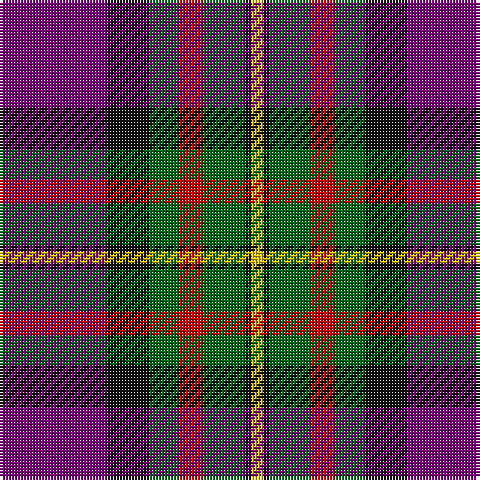

In pattern [BKGRGKY](/patterns/bkgrgky/).

This was sourced from house-of-tartan.  It is a [7 stripes tartan](/stripes/stripes7/).

Original link http://www.house-of-tartan.scotland.net/house/TartanViewjs.asp?colr=Def&tnam=341

## Thread count
P/36 K14 G10 R8 G14 K2 Y/4

## Palette
Each colour and its ΔE from the base-6 reference it is a variant of.

| Colour | Shade | Base | ΔE (OKLab) |
|---|---|---|---|
| G | <code style="background-color:#006818;">#006818</code> `#006818` | G <code style="background-color:#006100;">#006100</code> | 0.02 |
| K | <code style="background-color:#101010;">#101010</code> `#101010` | K <code style="background-color:#000000;">#000000</code> | 0.17 |
| P | <code style="background-color:#780078;">#780078</code> `#780078` | B <code style="background-color:#2A418A;">#2A418A</code> | 0.17 |
| R | <code style="background-color:#C80000;">#C80000</code> `#C80000` | R <code style="background-color:#CC0000;">#CC0000</code> | 0.01 |
| Y | <code style="background-color:#E8C000;">#E8C000</code> `#E8C000` | Y <code style="background-color:#F2BF00;">#F2BF00</code> | 0.02 |

# Sample pattern

## Nearest tartans

The nearest existing variants by ΔTartan distance.

1. [Regent](/setts/s7/b36k14g10r8g14k2y4-b480048-g006818-k101010-rc80000-ye8c000/) — ΔT 0.66
1. [Ross Dempster (Personal)](/setts/s7/b8ba58g20r20ra36g4ba8-b0000ff-ba141e46-g003c14-r960000-rac80028/) — ΔT 0.84
1. [Regent](/setts/s7/b36k14g10r8g14k2y4-b800080-g008000-k000000-rc00000-yf0c000/) — ΔT 0.86
1. [Afternoon Tea / Assam](/setts/s6/r15ra98b72ba25b8w15-b202060-ba5c8ca8-rc80000-ra880000-wfcfcfc/) — ΔT 0.91
1. [McGurk (Personal)](/setts/s9/b8k4b31y5r26k5ya10y5k2-b2c2c80-k101010-rc80000-yd87c00-yae8c000/) — ΔT 0.98
1. [McKnight (Personal)](/setts/s7/b8y2r56ba50k20b10k6-b2c4084-ba141e46-k101010-rdc0000-ye8c000/) — ΔT 1.01
1. [Bush Pilot](/setts/s9/b2r40g12k12g12r2k12b40w2-b2c2c80-g006818-k101010-rc80000-wf8f8f8/) — ΔT 1.03
1. [Harrower, John Anthony (Personal)](/setts/s8/g16b10k2b34r20b4r20ra4-b2c2c80-g003820-k101010-rc80000-ra888888/) — ΔT 1.05
1. [Abernethy (Colerain, USA)](/setts/s7/y2b28r56g28r2ga28y2-b0b148e-g355f3b-ga273f2a-rec0416-ye0a126/) — ΔT 1.09
1. [Patterson, John (Personal)](/setts/s6/g6b24w2ga24r24ga4-b2c4084-g005020-ga002814-rdc0000-we0e0e0/) — ΔT 1.09

## Neighbour map

Every grey dot is one of 15726 variants placed by the first two principal components of the ΔTartan feature space (44% of its variance). Red is this tartan; blue dots are its nearest — click one to open its page.

<svg viewBox="0 0 640 380" role="img" style="max-width:100%;height:auto;border:1px solid #e0e0e0;border-radius:4px;display:block" xmlns="http://www.w3.org/2000/svg"><image href="/nn/cloud.v1.png" width="640" height="380"/><a href="/setts/s7/b36k14g10r8g14k2y4-b480048-g006818-k101010-rc80000-ye8c000/"><circle cx="211.9" cy="167.5" r="4" fill="#3465a4"><title>Regent</title></circle></a><a href="/setts/s7/b8ba58g20r20ra36g4ba8-b0000ff-ba141e46-g003c14-r960000-rac80028/"><circle cx="221.7" cy="180.7" r="4" fill="#3465a4"><title>Ross Dempster (Personal)</title></circle></a><a href="/setts/s7/b36k14g10r8g14k2y4-b800080-g008000-k000000-rc00000-yf0c000/"><circle cx="183.1" cy="150.5" r="4" fill="#3465a4"><title>Regent</title></circle></a><a href="/setts/s6/r15ra98b72ba25b8w15-b202060-ba5c8ca8-rc80000-ra880000-wfcfcfc/"><circle cx="214.7" cy="173.9" r="4" fill="#3465a4"><title>Afternoon Tea / Assam</title></circle></a><a href="/setts/s9/b8k4b31y5r26k5ya10y5k2-b2c2c80-k101010-rc80000-yd87c00-yae8c000/"><circle cx="184.8" cy="136.7" r="4" fill="#3465a4"><title>McGurk (Personal)</title></circle></a><a href="/setts/s7/b8y2r56ba50k20b10k6-b2c4084-ba141e46-k101010-rdc0000-ye8c000/"><circle cx="222.1" cy="134.2" r="4" fill="#3465a4"><title>McKnight (Personal)</title></circle></a><a href="/setts/s9/b2r40g12k12g12r2k12b40w2-b2c2c80-g006818-k101010-rc80000-wf8f8f8/"><circle cx="174.6" cy="137.2" r="4" fill="#3465a4"><title>Bush Pilot</title></circle></a><a href="/setts/s8/g16b10k2b34r20b4r20ra4-b2c2c80-g003820-k101010-rc80000-ra888888/"><circle cx="245.3" cy="172.7" r="4" fill="#3465a4"><title>Harrower, John Anthony (Personal)</title></circle></a><a href="/setts/s7/y2b28r56g28r2ga28y2-b0b148e-g355f3b-ga273f2a-rec0416-ye0a126/"><circle cx="218.4" cy="132.9" r="4" fill="#3465a4"><title>Abernethy (Colerain, USA)</title></circle></a><a href="/setts/s6/g6b24w2ga24r24ga4-b2c4084-g005020-ga002814-rdc0000-we0e0e0/"><circle cx="160.3" cy="194.1" r="4" fill="#3465a4"><title>Patterson, John (Personal)</title></circle></a><circle cx="208.1" cy="160.8" r="5" fill="#c00000"/></svg>

ID: /setts/s7/b36k14g10r8g14k2y4-b780078-g006818-k101010-rc80000-ye8c000/
