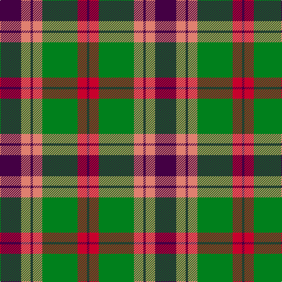

In pattern [BRGYBYB](/patterns/brgybyb/).

This was sourced from register-of-tartans.  It is a [7 stripes tartan](/stripes/stripes7/).

Original link https://www.tartanregister.gov.uk/tartanDetails.aspx?ref=2183

## Thread count
DP/36 LR16 DP4 LR16 G60 Ra16 DP/4

## Palette
Each colour and its ΔE from the base-6 reference it is a variant of.

| Colour | Shade | Base | ΔE (OKLab) |
|---|---|---|---|
| DP | <code style="background-color:#440044;">#440044</code> `#440044` | B <code style="background-color:#2C4084;">#2C4084</code> | 0.17 |
| G | <code style="background-color:#00801C;">#00801C</code> `#00801C` | G <code style="background-color:#006400;">#006400</code> | 0.09 |
| LR | <code style="background-color:#E08070;">#E08070</code> `#E08070` | Y <code style="background-color:#E8C000;">#E8C000</code> | 0.20 |
| R | <code style="background-color:#C80000;">#C80000</code> `#C80000` | R <code style="background-color:#C80000;">#C80000</code> | 0.00 |
| Ra | <code style="background-color:#C8002C;">#C8002C</code> `#C8002C` | R <code style="background-color:#C80000;">#C80000</code> | 0.03 |

# Sample pattern

## Nearest tartans

The nearest existing variants by ΔTartan distance.

1. [Logan Light](/setts/s7/b18r8b2r8g30ra8b2-b5a008c-g309c18-rc82828-radc0000/) — ΔT 0.43
1. [Cranston Dress](/setts/s8/r30b4r2b4r6b14g26ga6-b2c2c80-g289c18-ga006818-rc80000/) — ΔT 0.51
1. [Cranston Dress Family Tartan Tartan Number: 753. Earliest known date: pre 2003 Restricted See products available Copyright © Blair Urquhart, Comrie, 2015](/setts/s8/r30b3r2b3r6b14g26ga6-b2c2c80-g289c18-ga006818-rc80000/) — ΔT 0.63
1. [Logan, with Yellow](/setts/s7/b32r12y4r12g56r12y4-b800080-g008000-rc00000-yf0c000/) — ΔT 0.67
1. [Logan, Light](/setts/s7/b18r8b2r8g30ra8b2-b800080-g30a010-rd03030-rac00000/) — ΔT 0.74
1. [Logan with Yellow](/setts/s7/b32r12y4r12g56r12y4-b780078-g006818-rc80000-ye8c000/) — ΔT 0.74
1. [Nibley](/setts/s6/w6g30b36r30g2r4-b304080-g008000-rc00000-we0e0e0/) — ΔT 0.79
1. [Buccleuch Weavers Tartan Tartan Number: 6009. Earliest known date: pre 2003 A Fashion tartan from Marton Mills See products available Copyright © Blair Urquhart, Comrie, 2015](/setts/s8/y30k2y4k2y4k20g28w4-g4c5428-k101010-we0e0e0-ya08858/) — ΔT 0.80
1. [Cranston, dress](/setts/s8/r30b3r2b3r6b14g26ga6-b304080-g30a010-ga008000-rc00000/) — ΔT 0.80
1. [McCook/Cook (Name)](/setts/s7/g48b24g24r60k4r4k8-b2888c4-g006818-k101010-rc80000/) — ΔT 0.80

## Neighbour map

Every grey dot is one of 15726 variants placed by the first two principal components of the ΔTartan feature space (44% of its variance). Red is this tartan; blue dots are its nearest — click one to open its page.

<svg viewBox="0 0 640 380" role="img" style="max-width:100%;height:auto;border:1px solid #e0e0e0;border-radius:4px;display:block" xmlns="http://www.w3.org/2000/svg"><image href="/nn/cloud.v1.png" width="640" height="380"/><a href="/setts/s7/b18r8b2r8g30ra8b2-b5a008c-g309c18-rc82828-radc0000/"><circle cx="208.6" cy="173.0" r="4" fill="#3465a4"><title>Logan Light</title></circle></a><a href="/setts/s8/r30b4r2b4r6b14g26ga6-b2c2c80-g289c18-ga006818-rc80000/"><circle cx="227.3" cy="168.9" r="4" fill="#3465a4"><title>Cranston Dress</title></circle></a><a href="/setts/s8/r30b3r2b3r6b14g26ga6-b2c2c80-g289c18-ga006818-rc80000/"><circle cx="235.0" cy="166.0" r="4" fill="#3465a4"><title>Cranston Dress Family Tartan Tartan Number: 753. Earliest known date: pre 2003 Restricted See products available Copyright © Blair Urquhart, Comrie, 2015</title></circle></a><a href="/setts/s7/b32r12y4r12g56r12y4-b800080-g008000-rc00000-yf0c000/"><circle cx="238.1" cy="173.8" r="4" fill="#3465a4"><title>Logan, with Yellow</title></circle></a><a href="/setts/s7/b18r8b2r8g30ra8b2-b800080-g30a010-rd03030-rac00000/"><circle cx="217.2" cy="173.5" r="4" fill="#3465a4"><title>Logan, Light</title></circle></a><a href="/setts/s7/b32r12y4r12g56r12y4-b780078-g006818-rc80000-ye8c000/"><circle cx="245.6" cy="177.1" r="4" fill="#3465a4"><title>Logan with Yellow</title></circle></a><a href="/setts/s6/w6g30b36r30g2r4-b304080-g008000-rc00000-we0e0e0/"><circle cx="203.1" cy="186.0" r="4" fill="#3465a4"><title>Nibley</title></circle></a><a href="/setts/s8/y30k2y4k2y4k20g28w4-g4c5428-k101010-we0e0e0-ya08858/"><circle cx="226.9" cy="167.9" r="4" fill="#3465a4"><title>Buccleuch Weavers Tartan Tartan Number: 6009. Earliest known date: pre 2003 A Fashion tartan from Marton Mills See products available Copyright © Blair Urquhart, Comrie, 2015</title></circle></a><a href="/setts/s8/r30b3r2b3r6b14g26ga6-b304080-g30a010-ga008000-rc00000/"><circle cx="240.7" cy="169.1" r="4" fill="#3465a4"><title>Cranston, dress</title></circle></a><a href="/setts/s7/g48b24g24r60k4r4k8-b2888c4-g006818-k101010-rc80000/"><circle cx="247.4" cy="187.4" r="4" fill="#3465a4"><title>McCook/Cook (Name)</title></circle></a><circle cx="208.8" cy="176.2" r="5" fill="#c00000"/></svg>

ID: /setts/s7/b36y16b4y16g60r16b4-b440044-g00801c-rc8002c-ye08070/
