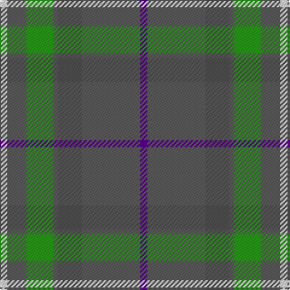

In pattern [BBBBGBW](/patterns/bbbbgbw/).

This was sourced from register-of-tartans.  It is a [7 stripes tartan](/stripes/stripes7/).

Original link https://www.tartanregister.gov.uk/tartanDetails.aspx?ref=11536

## Register references

External register numbers recorded for this tartan.

- Scottish Register of Tartans: [11536](https://www.tartanregister.gov.uk/tartanDetails.aspx?ref=11536)

## Thread count
LN/6 Na16 G22 Na4 N20 Na48 P/6

## Palette
Each colour and its ΔE from the base-6 reference it is a variant of.

| Colour | Shade | Base | ΔE (OKLab) |
|---|---|---|---|
| G | <code style="background-color:#289C18;">#289C18</code> `#289C18` | G <code style="background-color:#006100;">#006100</code> | 0.19 |
| LN | <code style="background-color:#E0E0E0;">#E0E0E0</code> `#E0E0E0` | W <code style="background-color:#F7F7F7;">#F7F7F7</code> | 0.07 |
| N | <code style="background-color:#505050;">#505050</code> `#505050` | B <code style="background-color:#2A418A;">#2A418A</code> | 0.13 |
| Na | <code style="background-color:#5C5C5C;">#5C5C5C</code> `#5C5C5C` | B <code style="background-color:#2A418A;">#2A418A</code> | 0.15 |
| P | <code style="background-color:#5A008C;">#5A008C</code> `#5A008C` | B <code style="background-color:#2A418A;">#2A418A</code> | 0.13 |

# Sample pattern

## Nearest tartans

The nearest existing variants by ΔTartan distance.

1. [Bressuire (District)](/setts/s7/r1g4y1g3r4b15w1~b506878-g006818-r880000-we0e0e0-ybc8c00~x4/) — ΔT 1.13
1. [Kildare](/setts/s8/g8b2g13r4g12ba22g5ga3~b401000-ba5480b0-g407040-ga908000-rc00000~x2/) — ΔT 1.22
1. [McMoosie Htg (Fashion)](/setts/s5/g46ga23b23r4y4~b1870a4-g604000-ga00643c-rcc4438-ye8c000~x2/) — ΔT 1.30
1. [Rotary Corporate Tartan Tartan Number: 2187. Earliest known date: 1995 The tartan was designed by K. Lumsden of the Scottish Tartans Society in conjuntion with the Rotary Club of Glasgow. It was decided to use as a base the City of Glasgow Tartan; the colours being brightened and the gold and the deep blue of the Rotary Wheel added. The actual shades are specific Rotary colours. The tartan is currently available only from Geoffrey (Tailor) Highland Crafts, The Royal Mile, Edinburgh. See products available Copyright © Blair Urquhart, Comrie, 2015](/setts/s7/g19r3b19r11g19y2ba4~b5c8ca8-ba2c2c80-g5c6428-rc80000-ye8c000~x2/) — ΔT 1.34
1. [Lawrence of Broughty Ferry](/setts/s6/g20k2g20b25w2ba3~b3d2e60-ba3e647a-g124b24-k120a01-wf7f1e8~x2/) — ΔT 1.37
1. [Taylor](/setts/s8/g8k2g13y4g12b22g5ya3~b506878-g006818-k101010-yd0908c-yabc8c00~x2/) — ΔT 1.41
1. [Royal Deeside (District)](/setts/s6/r4g2b4g35ba27ra3~b1c1c50-ba2888c4-g746440-re87878-rac80000~x2/) — ΔT 1.41
1. [Fraser hunting](/setts/s11/r3ra18g10ra2b10ra2b10ra2g10ra18w3~b304080-g008000-rc00000-ra806050-we0e0e0~x2/) — ΔT 1.42
1. [Devlin, Craig (Personal)](/setts/s6/g8w3b6ba11b30ba5~b5c5c5c-ba2c2c80-g006818-we0e0e0~x2/) — ΔT 1.42
1. [Hawaii (District)](/setts/s8/b4r1y1b12ba4g10y1r3~b5c8ca8-ba4c3428-g406054-rc80000-ye8c000~x4/) — ΔT 1.44

## Neighbour map

Every grey dot is one of 15726 variants placed by the first two principal components of the ΔTartan feature space (44% of its variance). Red is this tartan; blue dots are its nearest — click one to open its page.

<svg viewBox="0 0 640 380" role="img" style="max-width:100%;height:auto;border:1px solid #e0e0e0;border-radius:4px;display:block" xmlns="http://www.w3.org/2000/svg"><image href="/nn/cloud.v1.png" width="640" height="380"/><a href="/setts/s7/r1g4y1g3r4b15w1~b506878-g006818-r880000-we0e0e0-ybc8c00~x4/"><circle cx="331.2" cy="176.1" r="4" fill="#3465a4"><title>Bressuire (District)</title></circle></a><a href="/setts/s8/g8b2g13r4g12ba22g5ga3~b401000-ba5480b0-g407040-ga908000-rc00000~x2/"><circle cx="348.4" cy="227.7" r="4" fill="#3465a4"><title>Kildare</title></circle></a><a href="/setts/s5/g46ga23b23r4y4~b1870a4-g604000-ga00643c-rcc4438-ye8c000~x2/"><circle cx="282.0" cy="229.9" r="4" fill="#3465a4"><title>McMoosie Htg (Fashion)</title></circle></a><a href="/setts/s7/g19r3b19r11g19y2ba4~b5c8ca8-ba2c2c80-g5c6428-rc80000-ye8c000~x2/"><circle cx="264.5" cy="219.3" r="4" fill="#3465a4"><title>Rotary Corporate Tartan Tartan Number: 2187. Earliest known date: 1995 The tartan was designed by K. Lumsden of the Scottish Tartans Society in conjuntion with the Rotary Club of Glasgow. It was decided to use as a base the City of Glasgow Tartan; the colours being brightened and the gold and the deep blue of the Rotary Wheel added. The actual shades are specific Rotary colours. The tartan is currently available only from Geoffrey (Tailor) Highland Crafts, The Royal Mile, Edinburgh. See products available Copyright © Blair Urquhart, Comrie, 2015</title></circle></a><a href="/setts/s6/g20k2g20b25w2ba3~b3d2e60-ba3e647a-g124b24-k120a01-wf7f1e8~x2/"><circle cx="358.7" cy="228.6" r="4" fill="#3465a4"><title>Lawrence of Broughty Ferry</title></circle></a><a href="/setts/s8/g8k2g13y4g12b22g5ya3~b506878-g006818-k101010-yd0908c-yabc8c00~x2/"><circle cx="334.5" cy="227.0" r="4" fill="#3465a4"><title>Taylor</title></circle></a><a href="/setts/s6/r4g2b4g35ba27ra3~b1c1c50-ba2888c4-g746440-re87878-rac80000~x2/"><circle cx="340.4" cy="179.7" r="4" fill="#3465a4"><title>Royal Deeside (District)</title></circle></a><a href="/setts/s11/r3ra18g10ra2b10ra2b10ra2g10ra18w3~b304080-g008000-rc00000-ra806050-we0e0e0~x2/"><circle cx="248.0" cy="200.0" r="4" fill="#3465a4"><title>Fraser hunting</title></circle></a><a href="/setts/s6/g8w3b6ba11b30ba5~b5c5c5c-ba2c2c80-g006818-we0e0e0~x2/"><circle cx="356.0" cy="236.1" r="4" fill="#3465a4"><title>Devlin, Craig (Personal)</title></circle></a><a href="/setts/s8/b4r1y1b12ba4g10y1r3~b5c8ca8-ba4c3428-g406054-rc80000-ye8c000~x4/"><circle cx="248.0" cy="183.9" r="4" fill="#3465a4"><title>Hawaii (District)</title></circle></a><circle cx="322.8" cy="209.6" r="5" fill="#c00000"/></svg>

ID: /setts/s7/b3ba24bb10ba2g11ba8w3~b5a008c-ba5c5c5c-bb505050-g289c18-we0e0e0~x2/
