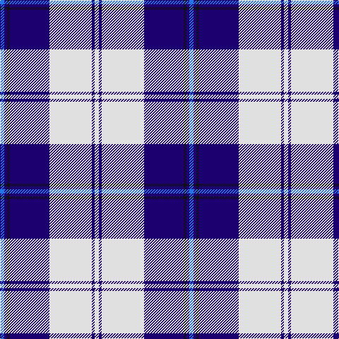

This page is one **sett** — a single exact thread-count. It belongs to the [tartan](/tartans/b3db2k2db28w30db2w3/)
(the same proportion at any scale), whose colour order is pattern [BBKBWBW](/stripes/bbkbwbw/).

Sourced from register-of-tartans.  It is a [7 stripe tartan](/stripes/stripes7/).

Original link https://www.tartanregister.gov.uk/tartanDetails.aspx?ref=851

## Also known as

This cloth is also recorded under:

- Cunningham, Dress Blue

2 attestations — the source records this cloth was collapsed from (oldest owns this page)

<ul>
<li>01/01/2002 — Cunningham, Dress Blue (Dance) (register-of-tartans, <a href="https://www.tartanregister.gov.uk/tartanDetails.aspx?ref=851">record</a>)</li>
<li>pre 2002 — Cunningham Dress, Blue (Dance) (tartans-authority, <a href="http://www.tartansauthority.com/tartan-ferret/display/4642/">record</a>)</li>
</ul>

## Register references

External register numbers recorded for this tartan.

- Scottish Register of Tartans: [851](https://www.tartanregister.gov.uk/tartanDetails.aspx?ref=851)
- Scottish Tartans Authority (ITI): 4642

## Thread count
B/6 DB4 K4 DB56 LN60 DB4 LN/6

## Palette

Palette: <strong>Tartan Register</strong>
<table><thead><tr><th>Colour</th><th>Threads</th><th>Shade</th><th>Base</th><th>OKLCh</th></tr></thead><tbody><tr><td>B/</td><td style="text-align:right;font-variant-numeric:tabular-nums">6</td><td><code style="background-color:#2474E8;">#2474E8</code> <small style="color:#888">#2474E8</small></td><td>B <code style="background-color:#2A418A;">#2A418A</code></td><td><small style="color:#888">oklch(57.8% 0.192 258.7)</small></td></tr><tr><td>DB</td><td style="text-align:right;font-variant-numeric:tabular-nums">4</td><td><code style="background-color:#1C0070;">#1C0070</code> <small style="color:#888">#1C0070</small></td><td>B <code style="background-color:#2A418A;">#2A418A</code></td><td><small style="color:#888">oklch(26.3% 0.162 277.1)</small></td></tr><tr><td>K</td><td style="text-align:right;font-variant-numeric:tabular-nums">4</td><td><code style="background-color:#101010;">#101010</code> <small style="color:#888">#101010</small></td><td>K <code style="background-color:#000000;">#000000</code></td><td><small style="color:#888">oklch(17.3% 0.000 89.9)</small></td></tr><tr><td>DB</td><td style="text-align:right;font-variant-numeric:tabular-nums">56</td><td><code style="background-color:#1C0070;">#1C0070</code> <small style="color:#888">#1C0070</small></td><td>B <code style="background-color:#2A418A;">#2A418A</code></td><td><small style="color:#888">oklch(26.3% 0.162 277.1)</small></td></tr><tr><td>LN</td><td style="text-align:right;font-variant-numeric:tabular-nums">60</td><td><code style="background-color:#E0E0E0;">#E0E0E0</code> <small style="color:#888">#E0E0E0</small></td><td>W <code style="background-color:#F7F7F7;">#F7F7F7</code></td><td><small style="color:#888">oklch(90.7% 0.000 89.9)</small></td></tr><tr><td>DB</td><td style="text-align:right;font-variant-numeric:tabular-nums">4</td><td><code style="background-color:#1C0070;">#1C0070</code> <small style="color:#888">#1C0070</small></td><td>B <code style="background-color:#2A418A;">#2A418A</code></td><td><small style="color:#888">oklch(26.3% 0.162 277.1)</small></td></tr><tr><td>LN/</td><td style="text-align:right;font-variant-numeric:tabular-nums">6</td><td><code style="background-color:#E0E0E0;">#E0E0E0</code> <small style="color:#888">#E0E0E0</small></td><td>W <code style="background-color:#F7F7F7;">#F7F7F7</code></td><td><small style="color:#888">oklch(90.7% 0.000 89.9)</small></td></tr></tbody></table>

# Sample pattern

## Nearest tartans

The nearest existing variants by ΔTartan distance, with this tartan at the top so the swatches line up against it.

ΔTartan

Tartan

Sett

—

<a href="/ttd/edit/#slug=b3db2k2db28w30db2w3~x2">Cunningham, Dress Blue (Dance)</a> <a class="nn-out" href="/setts/s7/b3db2k2db28w30db2w3~x2/" title="open its dictionary page">↗</a>

0.68

<a href="/ttd/edit/#slug=t2db1k1db20w20db1w2~x4">Cunningham, Dress Blue (Dance) Fashion Tartan Tartan Number: 4642. Earliest known date: 01/01/2002 Like so many of the invented 'Dance' tartans this one is not known by the relevant Clan Cunningham Association (USA). /Threadcount and colours aren't 100% original. Generated manually./ See products available Copyright © Blair Urquhart, Comrie, 2015</a> <a class="nn-out" href="/setts/s7/t2db1k1db20w20db1w2~x4/" title="open its dictionary page">↗</a>

0.93

<a href="/ttd/edit/#slug=db30t2w2t2db4t10w25db4~x2">Eildon/Longniddry Blue Dress Fashion Tartan Tartan Number: 4799. Earliest known date: 01/01/1980 A Dancers' Fancy from Dalgliesh. This appears under three different names - Longniddry #5486, Eildon #4799 and Harmony Eildon #87 (original Scottish Tartans Authority references). Needs resolving. Sample in Scottish Tartans Authority's Dalgety Collection. /Threadcount and colours aren't 100% original. Generated manually./ See products available Copyright © Blair Urquhart, Comrie, 2015</a> <a class="nn-out" href="/setts/s8/db30t2w2t2db4t10w25db4~x2/" title="open its dictionary page">↗</a>

0.96

<a href="/ttd/edit/#slug=db41t2w2t2db5t12w31db4~x2">Harmony Eildon (Dance)</a> <a class="nn-out" href="/setts/s8/db41t2w2t2db5t12w31db4~x2/" title="open its dictionary page">↗</a>

0.96

<a href="/ttd/edit/#slug=w3db2w30db30k2db2ly3~x2">Torridon, Saphire (Dance)</a> <a class="nn-out" href="/setts/s7/w3db2w30db30k2db2ly3~x2/" title="open its dictionary page">↗</a>

1.15

<a href="/ttd/edit/#slug=db41t2w2t2db5b12w31db4~x2">Harmony, Eildon</a> <a class="nn-out" href="/setts/s8/db41t2w2t2db5b12w31db4~x2/" title="open its dictionary page">↗</a>

1.20

<a href="/ttd/edit/#slug=db8t3db28w32dt3w4~x2">Ailsa, Royal Blue (Dance)</a> <a class="nn-out" href="/setts/s6/db8t3db28w32dt3w4~x2/" title="open its dictionary page">↗</a>

1.29

<a href="/ttd/edit/#slug=db42lb2lb2lb2db5dt12lb32db4~x2">Longniddry Eildon Blue Dress Fancy Tartan Tartan Number: 5486. Earliest known date: pre 1992 Dancers tartan See products available Copyright © Blair Urquhart, Comrie, 2015</a> <a class="nn-out" href="/setts/s8/db42lb2lb2lb2db5dt12lb32db4~x2/" title="open its dictionary page">↗</a>

1.33

<a href="/ttd/edit/#slug=w32db3r4db3r8db32w3db4~x2">Clemens and August (Personal)</a> <a class="nn-out" href="/setts/s8/w32db3r4db3r8db32w3db4~x2/" title="open its dictionary page">↗</a>

1.33

<a href="/ttd/edit/#slug=w3db2k4db2w2db26r4w30r2w3~x2">Harris, Royal Blue (Dance)</a> <a class="nn-out" href="/setts/s10/w3db2k4db2w2db26r4w30r2w3~x2/" title="open its dictionary page">↗</a>

1.39

<a href="/ttd/edit/#slug=r3dy1w12dy2db2dy2db14w2db2~x2">Lord Arran (Corporate)</a> <a class="nn-out" href="/setts/s9/r3dy1w12dy2db2dy2db14w2db2~x2/" title="open its dictionary page">↗</a>

## Neighbour map

Every grey dot is one of 14299 variants placed by the first two principal components of the ΔTartan feature space (44% of its variance). Red is this tartan; blue dots are its nearest — click one to open its page.

<svg viewBox="0 0 640 380" role="img" style="max-width:100%;height:auto;border:1px solid #e0e0e0;border-radius:4px;display:block" xmlns="http://www.w3.org/2000/svg"><image href="/nn/cloud.v1.png" width="640" height="380"/><a href="/setts/s7/t2db1k1db20w20db1w2~x4/"><circle cx="289.3" cy="128.7" r="4" fill="#3465a4"><title>Cunningham, Dress Blue (Dance) Fashion Tartan Tartan Number: 4642. Earliest known date: 01/01/2002 Like so many of the invented 'Dance' tartans this one is not known by the relevant Clan Cunningham Association (USA). /Threadcount and colours aren't 100% original. Generated manually./ See products available Copyright © Blair Urquhart, Comrie, 2015</title></circle></a><a href="/setts/s8/db30t2w2t2db4t10w25db4~x2/"><circle cx="244.1" cy="146.8" r="4" fill="#3465a4"><title>Eildon/Longniddry Blue Dress Fashion Tartan Tartan Number: 4799. Earliest known date: 01/01/1980 A Dancers' Fancy from Dalgliesh. This appears under three different names - Longniddry #5486, Eildon #4799 and Harmony Eildon #87 (original Scottish Tartans Authority references). Needs resolving. Sample in Scottish Tartans Authority's Dalgety Collection. /Threadcount and colours aren't 100% original. Generated manually./ See products available Copyright © Blair Urquhart, Comrie, 2015</title></circle></a><a href="/setts/s8/db41t2w2t2db5t12w31db4~x2/"><circle cx="279.3" cy="133.8" r="4" fill="#3465a4"><title>Harmony Eildon (Dance)</title></circle></a><a href="/setts/s7/w3db2w30db30k2db2ly3~x2/"><circle cx="239.6" cy="121.8" r="4" fill="#3465a4"><title>Torridon, Saphire (Dance)</title></circle></a><a href="/setts/s8/db41t2w2t2db5b12w31db4~x2/"><circle cx="286.7" cy="135.3" r="4" fill="#3465a4"><title>Harmony, Eildon</title></circle></a><a href="/setts/s6/db8t3db28w32dt3w4~x2/"><circle cx="243.3" cy="175.5" r="4" fill="#3465a4"><title>Ailsa, Royal Blue (Dance)</title></circle></a><a href="/setts/s8/db42lb2lb2lb2db5dt12lb32db4~x2/"><circle cx="289.4" cy="138.9" r="4" fill="#3465a4"><title>Longniddry Eildon Blue Dress Fancy Tartan Tartan Number: 5486. Earliest known date: pre 1992 Dancers tartan See products available Copyright © Blair Urquhart, Comrie, 2015</title></circle></a><a href="/setts/s8/w32db3r4db3r8db32w3db4~x2/"><circle cx="228.8" cy="148.1" r="4" fill="#3465a4"><title>Clemens and August (Personal)</title></circle></a><a href="/setts/s10/w3db2k4db2w2db26r4w30r2w3~x2/"><circle cx="258.8" cy="113.1" r="4" fill="#3465a4"><title>Harris, Royal Blue (Dance)</title></circle></a><a href="/setts/s9/r3dy1w12dy2db2dy2db14w2db2~x2/"><circle cx="225.2" cy="143.2" r="4" fill="#3465a4"><title>Lord Arran (Corporate)</title></circle></a><circle cx="269.1" cy="140.6" r="5" fill="#c00000"/></svg>

ID: /setts/s7/b3db2k2db28w30db2w3~x2/
