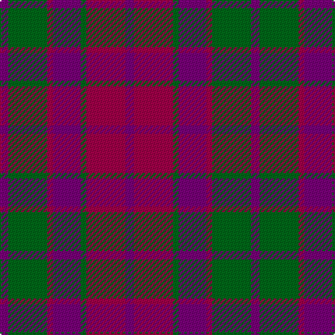

In pattern [BGRBGRB](/patterns/bgrbgrb/).

This was sourced from tartans-authority.  It is a [7 stripes tartan](/stripes/stripes7/).

Original link http://www.tartansauthority.com/tartan-ferret/display/177/

## Attestations

This cloth appears in 2 source records; the oldest owns this page.

- 1986 — Scottish Netball (1986) (Corporate) (tartans-authority, [record](http://www.tartansauthority.com/tartan-ferret/display/177/))
- undated — Scottish Netball Association Corporate Tartan Tartan Number: 177. Earliest known date: 1986 Designed for the World Netball Championship held in 1987. See products available Copyright © Blair Urquhart, Comrie, 2015 (house-of-tartan, [record](http://www.house-of-tartan.scotland.net/house/TartanViewjs.asp?colr=Def&tnam=177))

## Thread count
P/6 G28 R4 P20 G4 R28 P/6

## Palette
Each colour and its ΔE from the base-6 reference it is a variant of.

| Colour | Shade | Base | ΔE (OKLab) |
|---|---|---|---|
| G | <code style="background-color:#006818;">#006818</code> `#006818` | G <code style="background-color:#006100;">#006100</code> | 0.02 |
| P | <code style="background-color:#780078;">#780078</code> `#780078` | B <code style="background-color:#2A418A;">#2A418A</code> | 0.17 |
| R | <code style="background-color:#A00048;">#A00048</code> `#A00048` | R <code style="background-color:#CC0000;">#CC0000</code> | 0.12 |

# Sample pattern

## Nearest tartans

The nearest existing variants by ΔTartan distance.

1. [Scottish Netball Association](/setts/s7/b3g14r2b10g2r14b3x2~b5a008c-g005020-r960028/) — ΔT 0.60
1. [Scottish Netball Association](/setts/s7/b3g14r2b10g2r14b3x2~b800080-g008000-r900030/) — ΔT 0.77
1. [Unidentified Artifact Tartan Tartan Number: 463. Earliest known date: 0 Wilson's of Bannockburn 'New Broad Sett' perhaps. See products available Copyright © Blair Urquhart, Comrie, 2015](/setts/s6/b4r3b26r26g26r4x2~b780078-g006818-rc80000/) — ΔT 1.09
1. [MacNab (Macgregor - Hastie)](/setts/s6/b3r19b18g19b3g3x2~b500050-g005020-rdc0000/) — ΔT 1.18
1. [Unidentified 16](/setts/s6/b4r3b26r26g26r4x2~b800080-g008000-rc00000/) — ΔT 1.32
1. [Little's Chauffeur Drive](/setts/s6/b1ba8w1b4r8w1x6~b141e46-ba505050-r781c38-we0e0e0/) — ΔT 1.35
1. [Unidentified #21](/setts/s6/b4r3b26r26g26r4x2~b5a008c-g005020-rdc0000/) — ΔT 1.36
1. [Unidentified Scarlett #12](/setts/s12/r14g2b10r2g14b3g14r2b10g2r14b3x2~b780078-g408060-rd05054/) — ΔT 1.37
1. [Ferguson Britt Red (Corporate)](/setts/s5/r4ra21r21b24ra4x2~b2c2c80-r880000-rac80000/) — ΔT 1.39
1. [Bristol Gramar School Check (School)](/setts/s6/r4b3ba12bb8b2r4~b447084-ba5c5c5c-bb1c1c50-rc80000/) — ΔT 1.46

## Neighbour map

Every grey dot is one of 15726 variants placed by the first two principal components of the ΔTartan feature space (44% of its variance). Red is this tartan; blue dots are its nearest — click one to open its page.

<svg viewBox="0 0 640 380" role="img" style="max-width:100%;height:auto;border:1px solid #e0e0e0;border-radius:4px;display:block" xmlns="http://www.w3.org/2000/svg"><image href="/nn/cloud.v1.png" width="640" height="380"/><a href="/setts/s7/b3g14r2b10g2r14b3x2~b5a008c-g005020-r960028/"><circle cx="242.0" cy="252.1" r="4" fill="#3465a4"><title>Scottish Netball Association</title></circle></a><a href="/setts/s7/b3g14r2b10g2r14b3x2~b800080-g008000-r900030/"><circle cx="218.7" cy="238.9" r="4" fill="#3465a4"><title>Scottish Netball Association</title></circle></a><a href="/setts/s6/b4r3b26r26g26r4x2~b780078-g006818-rc80000/"><circle cx="249.0" cy="235.8" r="4" fill="#3465a4"><title>Unidentified Artifact Tartan Tartan Number: 463. Earliest known date: 0 Wilson's of Bannockburn 'New Broad Sett' perhaps. See products available Copyright © Blair Urquhart, Comrie, 2015</title></circle></a><a href="/setts/s6/b3r19b18g19b3g3x2~b500050-g005020-rdc0000/"><circle cx="225.0" cy="251.1" r="4" fill="#3465a4"><title>MacNab (Macgregor - Hastie)</title></circle></a><a href="/setts/s6/b4r3b26r26g26r4x2~b800080-g008000-rc00000/"><circle cx="239.5" cy="232.0" r="4" fill="#3465a4"><title>Unidentified 16</title></circle></a><a href="/setts/s6/b1ba8w1b4r8w1x6~b141e46-ba505050-r781c38-we0e0e0/"><circle cx="206.4" cy="225.1" r="4" fill="#3465a4"><title>Little's Chauffeur Drive</title></circle></a><a href="/setts/s6/b4r3b26r26g26r4x2~b5a008c-g005020-rdc0000/"><circle cx="231.4" cy="230.7" r="4" fill="#3465a4"><title>Unidentified #21</title></circle></a><a href="/setts/s12/r14g2b10r2g14b3g14r2b10g2r14b3x2~b780078-g408060-rd05054/"><circle cx="227.2" cy="222.0" r="4" fill="#3465a4"><title>Unidentified Scarlett #12</title></circle></a><a href="/setts/s5/r4ra21r21b24ra4x2~b2c2c80-r880000-rac80000/"><circle cx="240.5" cy="281.2" r="4" fill="#3465a4"><title>Ferguson Britt Red (Corporate)</title></circle></a><a href="/setts/s6/r4b3ba12bb8b2r4~b447084-ba5c5c5c-bb1c1c50-rc80000/"><circle cx="196.0" cy="259.4" r="4" fill="#3465a4"><title>Bristol Gramar School Check (School)</title></circle></a><circle cx="238.6" cy="246.5" r="5" fill="#c00000"/></svg>

ID: /setts/s7/b3g14r2b10g2r14b3x2~b780078-g006818-ra00048/
