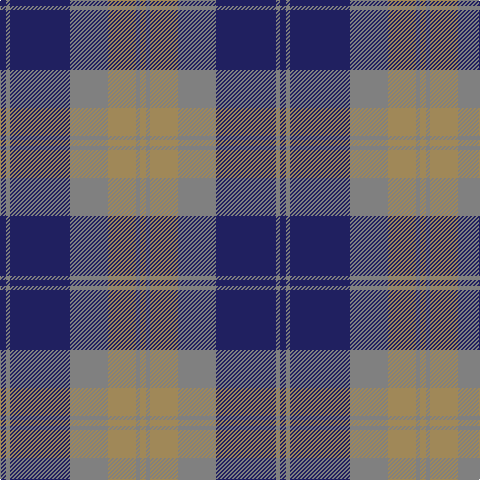

In pattern [BGBGYGY](/patterns/bgbgygy/).

This was sourced from register-of-tartans.  It is a [7 stripes tartan](/stripes/stripes7/).

Original link https://www.tartanregister.gov.uk/tartanDetails.aspx?ref=4977

## Thread count
DB/6 N4 DB60 N38 LT28 N4 LT/6

## Palette
Each colour and its ΔE from the base-6 reference it is a variant of.

| Colour | Shade | Base | ΔE (OKLab) |
|---|---|---|---|
| DB | <code style="background-color:#202060;">#202060</code> `#202060` | B <code style="background-color:#2A418A;">#2A418A</code> | 0.11 |
| LT | <code style="background-color:#A08858;">#A08858</code> `#A08858` | Y <code style="background-color:#F2BF00;">#F2BF00</code> | 0.21 |
| N | <code style="background-color:#808080;">#808080</code> `#808080` | G <code style="background-color:#006100;">#006100</code> | 0.23 |

# Sample pattern

## Nearest tartans

The nearest existing variants by ΔTartan distance.

1. [Robertson of Struan 1816](/setts/s7/r3b1r1b11g10r2b2x4~b202060-g006818-rc80000/) — ΔT 1.06
1. [Donnolly](/setts/s6/b3g21b3r21b35w3x2~b2c2c80-g00643c-rc04c08-wfcfcfc/) — ΔT 1.12
1. [Lang](/setts/s10/b4ba2b6ba2b10ba30g10ba2g9ba2x2~b5c8ca8-ba780078-g006818/) — ΔT 1.13
1. [Robertson of Struan](/setts/s7/r6b2r2b21g20r4g4x2~b2c4084-g005020-rdc0000/) — ΔT 1.15
1. [Logan](/setts/s7/b8r3b1r3g14r3b1x4~b2c4084-g005020-rdc0000/) — ΔT 1.17
1. [Manx Centenary District Tartan Tartan Number: 129. Earliest known date: pre 1992 Sample presented by Dr. D.G. Teall See products available Copyright © Blair Urquhart, Comrie, 2015](/setts/s9/b22g3b3g3b3g9r28g3r6x2~b2c2c80-g006818-r888888/) — ΔT 1.24
1. [Logan #5](/setts/s6/b9r3b1g9r3b1x2~b2c2c80-g006818-rc80000/) — ΔT 1.27
1. [Kinnaird (Australia) (Name)](/setts/s8/r33k4r4k5r4k7b41ra4x2~b2c2c80-k101010-r888888-rac80000/) — ΔT 1.31
1. [Speyside Blue (Fashion)](/setts/s8/b32k3b3k3ba5k8r21k4x2~b5c5c5c-ba1474b4-k101010-r888888/) — ΔT 1.36
1. [Harvey](/setts/s6/b4r11g11b22y1g4x2~b2c2c80-g006818-rc80000-ye8c000/) — ΔT 1.37

## Neighbour map

Every grey dot is one of 15726 variants placed by the first two principal components of the ΔTartan feature space (44% of its variance). Red is this tartan; blue dots are its nearest — click one to open its page.

<svg viewBox="0 0 640 380" role="img" style="max-width:100%;height:auto;border:1px solid #e0e0e0;border-radius:4px;display:block" xmlns="http://www.w3.org/2000/svg"><image href="/nn/cloud.v1.png" width="640" height="380"/><a href="/setts/s7/r3b1r1b11g10r2b2x4~b202060-g006818-rc80000/"><circle cx="293.1" cy="218.1" r="4" fill="#3465a4"><title>Robertson of Struan 1816</title></circle></a><a href="/setts/s6/b3g21b3r21b35w3x2~b2c2c80-g00643c-rc04c08-wfcfcfc/"><circle cx="262.7" cy="206.2" r="4" fill="#3465a4"><title>Donnolly</title></circle></a><a href="/setts/s10/b4ba2b6ba2b10ba30g10ba2g9ba2x2~b5c8ca8-ba780078-g006818/"><circle cx="324.3" cy="179.8" r="4" fill="#3465a4"><title>Lang</title></circle></a><a href="/setts/s7/r6b2r2b21g20r4g4x2~b2c4084-g005020-rdc0000/"><circle cx="282.4" cy="225.2" r="4" fill="#3465a4"><title>Robertson of Struan</title></circle></a><a href="/setts/s7/b8r3b1r3g14r3b1x4~b2c4084-g005020-rdc0000/"><circle cx="287.1" cy="207.8" r="4" fill="#3465a4"><title>Logan</title></circle></a><a href="/setts/s9/b22g3b3g3b3g9r28g3r6x2~b2c2c80-g006818-r888888/"><circle cx="276.1" cy="210.9" r="4" fill="#3465a4"><title>Manx Centenary District Tartan Tartan Number: 129. Earliest known date: pre 1992 Sample presented by Dr. D.G. Teall See products available Copyright © Blair Urquhart, Comrie, 2015</title></circle></a><a href="/setts/s6/b9r3b1g9r3b1x2~b2c2c80-g006818-rc80000/"><circle cx="258.5" cy="241.2" r="4" fill="#3465a4"><title>Logan #5</title></circle></a><a href="/setts/s8/r33k4r4k5r4k7b41ra4x2~b2c2c80-k101010-r888888-rac80000/"><circle cx="245.2" cy="179.9" r="4" fill="#3465a4"><title>Kinnaird (Australia) (Name)</title></circle></a><a href="/setts/s8/b32k3b3k3ba5k8r21k4x2~b5c5c5c-ba1474b4-k101010-r888888/"><circle cx="264.8" cy="193.0" r="4" fill="#3465a4"><title>Speyside Blue (Fashion)</title></circle></a><a href="/setts/s6/b4r11g11b22y1g4x2~b2c2c80-g006818-rc80000-ye8c000/"><circle cx="296.5" cy="192.9" r="4" fill="#3465a4"><title>Harvey</title></circle></a><circle cx="295.8" cy="200.2" r="5" fill="#c00000"/></svg>

ID: /setts/s7/b3g2b30g19y14g2y3x2~b202060-g808080-ya08858/
