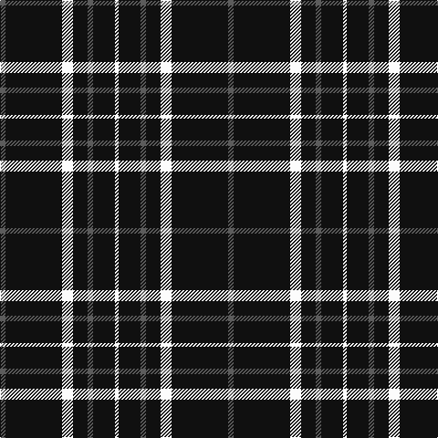

In pattern [BKWKBKW](/patterns/bkwkbkw/).

This was sourced from tartans-authority.  It is a [7 stripes tartan](/stripes/stripes7/).

Original link http://www.tartansauthority.com/tartan-ferret/display/11004/

## Thread count
N/6 K62 W12 K16 N6 K24 W/4

## Palette
Each colour and its ΔE from the base-6 reference it is a variant of.

| Colour | Shade | Base | ΔE (OKLab) |
|---|---|---|---|
| K | <code style="background-color:#101010;">#101010</code> `#101010` | K <code style="background-color:#000000;">#000000</code> | 0.17 |
| N | <code style="background-color:#5C5C5C;">#5C5C5C</code> `#5C5C5C` | B <code style="background-color:#2A418A;">#2A418A</code> | 0.15 |
| W | <code style="background-color:#FCFCFC;">#FCFCFC</code> `#FCFCFC` | W <code style="background-color:#F7F7F7;">#F7F7F7</code> | 0.01 |

# Sample pattern

## Nearest tartans

The nearest existing variants by ΔTartan distance.

1. [Believe - Colette](/setts/s7/b3k31w6k7b3k12w2~b646464-k101010-wffffff~x2/) — ΔT 0.10
1. [New Zealand District Tartan Tartan Number: 3250. Earliest known date: 2000 Designed as a District sett by Timely Marketing Promotions, Christchurch, New Zealand See products available Copyright © Blair Urquhart, Comrie, 2015](/setts/s6/k21w2k5w9k13g2~g006818-k101010-we0e0e0~x4/) — ΔT 1.15
1. [Sunderland of Scotland (Fashion)](/setts/s7/r1k21r5k3r5k9ra1~k101010-r888888-rac80000~x4/) — ΔT 1.15
1. [Gwynn](/setts/s8/k45y4k4y9k4y4k45r4~k101010-rc80000-ye8c000~x2/) — ΔT 1.16
1. [Jensen, Sven (Personal)](/setts/s9/g12k8w6k22w3k8w3k40g6~g006818-k101010-we0e0e0/) — ΔT 1.21
1. [Lanoir](/setts/s6/k4r4k20r1k20w4~k101010-rc80000-we0e0e0~x6/) — ΔT 1.21
1. [Anzac (Fashion)](/setts/s8/k21w2k4w4b2w4k13g2~b4c3428-g006818-k101010-wc0c0c0~x4/) — ΔT 1.32
1. [Gwynn (Name)](/setts/s5/y9k4y4k45r4~k101010-rc80000-ye8c000~x2/) — ΔT 1.40
1. [Dobelman (Personal)](/setts/s4/r1k20w5r1~k101010-r880000-wc0c0c0~x4/) — ΔT 1.43
1. [East of Scotland Tartan Army](/setts/s6/b40y10b8r20b100w5~b14283c-rc80000-wfcfcfc-ye8c000/) — ΔT 1.47

## Neighbour map

Every grey dot is one of 15726 variants placed by the first two principal components of the ΔTartan feature space (44% of its variance). Red is this tartan; blue dots are its nearest — click one to open its page.

<svg viewBox="0 0 640 380" role="img" style="max-width:100%;height:auto;border:1px solid #e0e0e0;border-radius:4px;display:block" xmlns="http://www.w3.org/2000/svg"><image href="/nn/cloud.v1.png" width="640" height="380"/><a href="/setts/s7/b3k31w6k7b3k12w2~b646464-k101010-wffffff~x2/"><circle cx="470.3" cy="199.7" r="4" fill="#3465a4"><title>Believe - Colette</title></circle></a><a href="/setts/s6/k21w2k5w9k13g2~g006818-k101010-we0e0e0~x4/"><circle cx="413.7" cy="235.4" r="4" fill="#3465a4"><title>New Zealand District Tartan Tartan Number: 3250. Earliest known date: 2000 Designed as a District sett by Timely Marketing Promotions, Christchurch, New Zealand See products available Copyright © Blair Urquhart, Comrie, 2015</title></circle></a><a href="/setts/s7/r1k21r5k3r5k9ra1~k101010-r888888-rac80000~x4/"><circle cx="478.3" cy="198.9" r="4" fill="#3465a4"><title>Sunderland of Scotland (Fashion)</title></circle></a><a href="/setts/s8/k45y4k4y9k4y4k45r4~k101010-rc80000-ye8c000~x2/"><circle cx="515.2" cy="203.4" r="4" fill="#3465a4"><title>Gwynn</title></circle></a><a href="/setts/s9/g12k8w6k22w3k8w3k40g6~g006818-k101010-we0e0e0/"><circle cx="414.3" cy="202.6" r="4" fill="#3465a4"><title>Jensen, Sven (Personal)</title></circle></a><a href="/setts/s6/k4r4k20r1k20w4~k101010-rc80000-we0e0e0~x6/"><circle cx="537.0" cy="217.1" r="4" fill="#3465a4"><title>Lanoir</title></circle></a><a href="/setts/s8/k21w2k4w4b2w4k13g2~b4c3428-g006818-k101010-wc0c0c0~x4/"><circle cx="400.6" cy="194.1" r="4" fill="#3465a4"><title>Anzac (Fashion)</title></circle></a><a href="/setts/s5/y9k4y4k45r4~k101010-rc80000-ye8c000~x2/"><circle cx="451.6" cy="209.6" r="4" fill="#3465a4"><title>Gwynn (Name)</title></circle></a><a href="/setts/s4/r1k20w5r1~k101010-r880000-wc0c0c0~x4/"><circle cx="477.6" cy="205.9" r="4" fill="#3465a4"><title>Dobelman (Personal)</title></circle></a><a href="/setts/s6/b40y10b8r20b100w5~b14283c-rc80000-wfcfcfc-ye8c000/"><circle cx="516.9" cy="186.5" r="4" fill="#3465a4"><title>East of Scotland Tartan Army</title></circle></a><circle cx="473.5" cy="202.0" r="5" fill="#c00000"/></svg>

ID: /setts/s7/b3k31w6k8b3k12w2~b5c5c5c-k101010-wfcfcfc~x2/
