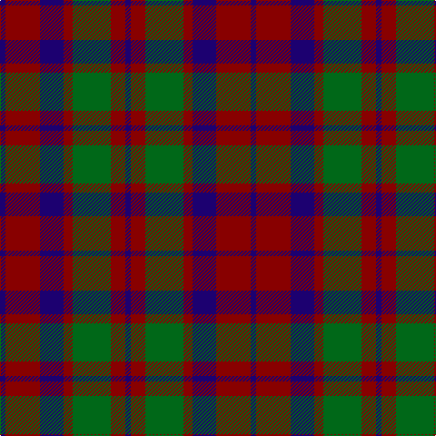

In pattern [BRBRGRB](/patterns/brbrgrb/).

This was sourced from tartans-authority.  It is a [7 stripes tartan](/stripes/stripes7/).

Original link http://www.tartansauthority.com/tartan-ferret/display/3342/

## Attestations

This cloth appears in 2 source records; the oldest owns this page.

- pre 2002 — MacBean of Tomatin (Clan) (tartans-authority, [record](http://www.tartansauthority.com/tartan-ferret/display/3342/))
- undated — MacBean of Tomatin (register-of-tartans, [record](https://www.tartanregister.gov.uk/tartanDetails.aspx?ref=5023))

## Thread count
DB/6 DR38 DB26 DR10 G42 DR16 DB/6

## Palette
Each colour and its ΔE from the base-6 reference it is a variant of.

| Colour | Shade | Base | ΔE (OKLab) |
|---|---|---|---|
| DB | <code style="background-color:#1C0070;">#1C0070</code> `#1C0070` | B <code style="background-color:#2A418A;">#2A418A</code> | 0.14 |
| DR | <code style="background-color:#880000;">#880000</code> `#880000` | R <code style="background-color:#CC0000;">#CC0000</code> | 0.15 |
| G | <code style="background-color:#006818;">#006818</code> `#006818` | G <code style="background-color:#006100;">#006100</code> | 0.02 |

# Sample pattern

## Nearest tartans

The nearest existing variants by ΔTartan distance.

1. [Skene D](/setts/s7/b9r6g2r6g18r6g2~b000052-g11450d-raa0000~x2/) — ΔT 0.68
1. [Skene D](/setts/s7/b9r6g2r6g18r6g2~b000052-g11450d-raa0000/) — ΔT 0.68
1. [GS Gaelic School (School)](/setts/s7/b30r5g30r22b30r5g4~b003c64-g006818-rc80000/) — ΔT 0.92
1. [Glasgow #2](/setts/s7/g25r4b24r21g25r3b4~b2c4084-g005020-rc82828~x2/) — ΔT 1.02
1. [Skene](/setts/s7/b9r3b1r3g9r3b1~b000052-g11450d-raa0000~x2/) — ΔT 1.05
1. [Logan #5](/setts/s6/b9r3b1g9r3b1~b2c2c80-g006818-rc80000~x2/) — ΔT 1.06
1. [MacFadyan (MacGregor Hastie)](/setts/s7/b3r25b17r5g22r9b3~b2c2c80-g006818-rc80000~x2/) — ΔT 1.08
1. [Skene D](/setts/s7/b9r6g2r6g18r6g2~b00004c-g004c00-rc80000/) — ΔT 1.13
1. [MacNab (Macgregor - Hastie)](/setts/s6/b3r19b18g19b3g3~b500050-g005020-rdc0000~x2/) — ΔT 1.16
1. [MacFadyen, MacBean (Old)](/setts/s7/b3r25b17r5g22r9b3~b304080-g008000-rc00000~x2/) — ΔT 1.17

## Neighbour map

Every grey dot is one of 15726 variants placed by the first two principal components of the ΔTartan feature space (44% of its variance). Red is this tartan; blue dots are its nearest — click one to open its page.

<svg viewBox="0 0 640 380" role="img" style="max-width:100%;height:auto;border:1px solid #e0e0e0;border-radius:4px;display:block" xmlns="http://www.w3.org/2000/svg"><image href="/nn/cloud.v1.png" width="640" height="380"/><a href="/setts/s7/b9r6g2r6g18r6g2~b000052-g11450d-raa0000~x2/"><circle cx="275.6" cy="244.8" r="4" fill="#3465a4"><title>Skene D</title></circle></a><a href="/setts/s7/b9r6g2r6g18r6g2~b000052-g11450d-raa0000/"><circle cx="275.6" cy="244.8" r="4" fill="#3465a4"><title>Skene D</title></circle></a><a href="/setts/s7/b30r5g30r22b30r5g4~b003c64-g006818-rc80000/"><circle cx="268.3" cy="259.3" r="4" fill="#3465a4"><title>GS Gaelic School (School)</title></circle></a><a href="/setts/s7/g25r4b24r21g25r3b4~b2c4084-g005020-rc82828~x2/"><circle cx="280.0" cy="258.0" r="4" fill="#3465a4"><title>Glasgow #2</title></circle></a><a href="/setts/s7/b9r3b1r3g9r3b1~b000052-g11450d-raa0000~x2/"><circle cx="234.4" cy="237.8" r="4" fill="#3465a4"><title>Skene</title></circle></a><a href="/setts/s6/b9r3b1g9r3b1~b2c2c80-g006818-rc80000~x2/"><circle cx="258.5" cy="241.2" r="4" fill="#3465a4"><title>Logan #5</title></circle></a><a href="/setts/s7/b3r25b17r5g22r9b3~b2c2c80-g006818-rc80000~x2/"><circle cx="265.1" cy="234.3" r="4" fill="#3465a4"><title>MacFadyan (MacGregor Hastie)</title></circle></a><a href="/setts/s7/b9r6g2r6g18r6g2~b00004c-g004c00-rc80000/"><circle cx="254.3" cy="234.5" r="4" fill="#3465a4"><title>Skene D</title></circle></a><a href="/setts/s6/b3r19b18g19b3g3~b500050-g005020-rdc0000~x2/"><circle cx="225.0" cy="251.1" r="4" fill="#3465a4"><title>MacNab (Macgregor - Hastie)</title></circle></a><a href="/setts/s7/b3r25b17r5g22r9b3~b304080-g008000-rc00000~x2/"><circle cx="267.4" cy="235.9" r="4" fill="#3465a4"><title>MacFadyen, MacBean (Old)</title></circle></a><circle cx="254.8" cy="255.9" r="5" fill="#c00000"/></svg>

ID: /setts/s7/b3r19b13r5g21r8b3~b1c0070-g006818-r880000~x2/
