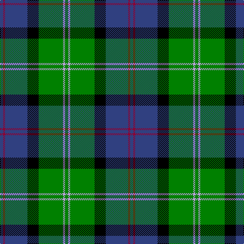

In pattern [BRBKGWG](/patterns/brbkgwg/).

This was sourced from weddslist.  It is a [7 stripes tartan](/stripes/stripes7/).

Original link http://www.weddslist.com/cgi-bin/tartans/pg.pl?source=sts

## Thread count
B/6 DR4 B44 K22 G48 LP4 G/6

## Palette
Each colour and its ΔE from the base-6 reference it is a variant of.

| Colour | Shade | Base | ΔE (OKLab) |
|---|---|---|---|
| B | <code style="background-color:#304080;">#304080</code> `#304080` | B <code style="background-color:#2A418A;">#2A418A</code> | 0.02 |
| DR | <code style="background-color:#900030;">#900030</code> `#900030` | R <code style="background-color:#CC0000;">#CC0000</code> | 0.14 |
| G | <code style="background-color:#008000;">#008000</code> `#008000` | G <code style="background-color:#006100;">#006100</code> | 0.10 |
| K | <code style="background-color:#000000;">#000000</code> `#000000` | K <code style="background-color:#000000;">#000000</code> | 0.00 |
| LP | <code style="background-color:#C0A0E0;">#C0A0E0</code> `#C0A0E0` | W <code style="background-color:#F7F7F7;">#F7F7F7</code> | 0.24 |

# Sample pattern

## Nearest tartans

The nearest existing variants by ΔTartan distance.

1. [Snodgrass](/setts/s8/k3r1y1b11g13b5r1y1x2~b304080-g008000-k000000-rc00000-yf0c000/) — ΔT 0.68
1. [Leslie, Hebridean](/setts/s6/k6g15w2b22r2k4x2~b304080-g008000-k000000-rd03030-we0e0e0/) — ΔT 0.70
1. [City of Guelph](/setts/s8/g28k4g5b4g5k19ba19ga2x2~b600030-ba304080-g008000-ga908000-k000030/) — ΔT 0.72
1. [MacPhadran](/setts/s7/g3b12y1k12g13r2g2x2~b304080-g008000-k000000-rc00000-yb0b0b0/) — ΔT 0.79
1. [MacFadzean, MacPhedran](/setts/s7/g3b12w1k12g13r2g2x2~b304080-g008000-k000000-rc00000-we0e0e0/) — ΔT 0.81
1. [MacTaggert](/setts/s7/g9b2g1k6ba6r1ba1x2~b5480b0-ba304080-g008000-k000000-rc00000/) — ΔT 0.84
1. [Patterson (blue)](/setts/s6/b22w2k10g11r3g4x2~b304080-g008000-k000000-rc00000-we0e0e0/) — ΔT 0.86
1. [Ayrshire](/setts/s8/b2r1b10w1g4ga8ga1ga2x4~b1c0070-g785000-ga30ac38-r880000-we0e0e0/) — ΔT 0.86
1. [Highlander, Highland Laddie Kilts](/setts/s5/k7r3g29b29w3x2~b304080-g008000-k000000-r802040-we0e0e0/) — ΔT 0.89
1. [Skene](/setts/s7/b24k4r3k4g24k4y4x2~b304080-g008000-k000000-rc00000-yff8500/) — ΔT 0.89

## Neighbour map

Every grey dot is one of 15726 variants placed by the first two principal components of the ΔTartan feature space (44% of its variance). Red is this tartan; blue dots are its nearest — click one to open its page.

<svg viewBox="0 0 640 380" role="img" style="max-width:100%;height:auto;border:1px solid #e0e0e0;border-radius:4px;display:block" xmlns="http://www.w3.org/2000/svg"><image href="/nn/cloud.v1.png" width="640" height="380"/><a href="/setts/s8/k3r1y1b11g13b5r1y1x2~b304080-g008000-k000000-rc00000-yf0c000/"><circle cx="218.7" cy="159.9" r="4" fill="#3465a4"><title>Snodgrass</title></circle></a><a href="/setts/s6/k6g15w2b22r2k4x2~b304080-g008000-k000000-rd03030-we0e0e0/"><circle cx="184.4" cy="184.9" r="4" fill="#3465a4"><title>Leslie, Hebridean</title></circle></a><a href="/setts/s8/g28k4g5b4g5k19ba19ga2x2~b600030-ba304080-g008000-ga908000-k000030/"><circle cx="205.8" cy="176.4" r="4" fill="#3465a4"><title>City of Guelph</title></circle></a><a href="/setts/s7/g3b12y1k12g13r2g2x2~b304080-g008000-k000000-rc00000-yb0b0b0/"><circle cx="165.1" cy="179.7" r="4" fill="#3465a4"><title>MacPhadran</title></circle></a><a href="/setts/s7/g3b12w1k12g13r2g2x2~b304080-g008000-k000000-rc00000-we0e0e0/"><circle cx="163.0" cy="178.7" r="4" fill="#3465a4"><title>MacFadzean, MacPhedran</title></circle></a><a href="/setts/s7/g9b2g1k6ba6r1ba1x2~b5480b0-ba304080-g008000-k000000-rc00000/"><circle cx="141.0" cy="191.4" r="4" fill="#3465a4"><title>MacTaggert</title></circle></a><a href="/setts/s6/b22w2k10g11r3g4x2~b304080-g008000-k000000-rc00000-we0e0e0/"><circle cx="171.8" cy="191.3" r="4" fill="#3465a4"><title>Patterson (blue)</title></circle></a><a href="/setts/s8/b2r1b10w1g4ga8ga1ga2x4~b1c0070-g785000-ga30ac38-r880000-we0e0e0/"><circle cx="174.0" cy="169.9" r="4" fill="#3465a4"><title>Ayrshire</title></circle></a><a href="/setts/s5/k7r3g29b29w3x2~b304080-g008000-k000000-r802040-we0e0e0/"><circle cx="194.8" cy="203.9" r="4" fill="#3465a4"><title>Highlander, Highland Laddie Kilts</title></circle></a><a href="/setts/s7/b24k4r3k4g24k4y4x2~b304080-g008000-k000000-rc00000-yff8500/"><circle cx="145.8" cy="181.8" r="4" fill="#3465a4"><title>Skene</title></circle></a><circle cx="191.5" cy="174.9" r="5" fill="#c00000"/></svg>

ID: /setts/s7/b3r2b22k11g24w2g3x2~b304080-g008000-k000000-r900030-wc0a0e0/
