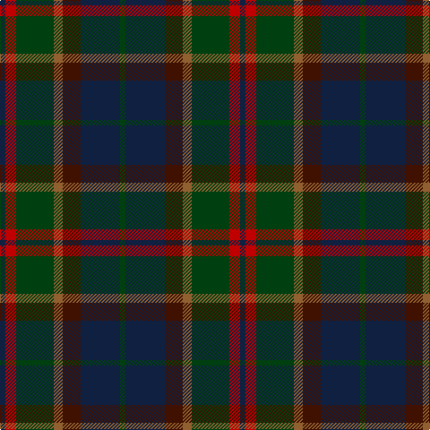

In pattern [BRGRBBG](/patterns/brgrbbg/).

This was sourced from weddslist.  It is a [7 stripes tartan](/stripes/stripes7/).

Original link http://www.weddslist.com/cgi-bin/tartans/pg.pl?source=sts

## Thread count
DB/6 R12 DG42 LT10 DR20 DB44 DG/6

## Palette
Each colour and its ΔE from the base-6 reference it is a variant of.

| Colour | Shade | Base | ΔE (OKLab) |
|---|---|---|---|
| DB | <code style="background-color:#102040;">#102040</code> `#102040` | B <code style="background-color:#2A418A;">#2A418A</code> | 0.16 |
| DG | <code style="background-color:#004010;">#004010</code> `#004010` | G <code style="background-color:#006100;">#006100</code> | 0.11 |
| DR | <code style="background-color:#401000;">#401000</code> `#401000` | B <code style="background-color:#2A418A;">#2A418A</code> | 0.24 |
| LT | <code style="background-color:#906030;">#906030</code> `#906030` | R <code style="background-color:#CC0000;">#CC0000</code> | 0.15 |
| R | <code style="background-color:#C00000;">#C00000</code> `#C00000` | R <code style="background-color:#CC0000;">#CC0000</code> | 0.03 |

# Sample pattern

## Nearest tartans

The nearest existing variants by ΔTartan distance.

1. [Bennachie (Whisky)](/setts/s7/b14k5ba5k5b14g32r4x2~b003c64-ba6c0070-g285800-k101010-r880000/) — ΔT 0.97
1. [Royal Highland Society (Corporate)](/setts/s8/y4g17k10b3k3b17r3b3x2~b003c64-g003820-k101010-r880000-yc4ac74/) — ΔT 1.10
1. [Lochaber (Ingles Buchan)](/setts/s10/b6r4ba22ra4k22b22k2ra5k2b6x2~b4c3428-ba5c5c5c-k101010-r888888-ra880000/) — ΔT 1.21
1. [Andover](/setts/s6/r1b12k6ka1ba10r1x4~b5c5c5c-ba4c3428-k101010-ka000000-rc80000/) — ΔT 1.22
1. [Longford, County](/setts/s10/b5k3b18g6k6g6ga12r5ga12r3x2~b202060-g003820-ga604000-k101010-rc80000/) — ΔT 1.28
1. [South Australia](/setts/s10/b13g19k2g7k2g7k2ba18r2b13x2~b102040-ba304080-g004010-k000000-rc00000/) — ΔT 1.30
1. [Edinburgh International Conference Centre, The](/setts/s6/g4b20g3k20r24b3x2~b14283c-g603800-k101010-r98481c/) — ΔT 1.30
1. [Cairngorm #2](/setts/s7/b5ba4b22k15g22r4g4x2~b445464-ba607c88-g406454-k101010-r982c2c/) — ΔT 1.31
1. [Haughfoot (Commemorative)](/setts/s6/g4ga24b15ba4k15r4x2~b14283c-ba5c8ca8-g789484-ga003820-k101010-rc80000/) — ΔT 1.31
1. [Royal Highland](/setts/s8/w4g17k10b3k3b17r3b3x2~b003c64-g003820-k101010-r880000-wc0c0c0/) — ΔT 1.33

## Neighbour map

Every grey dot is one of 15726 variants placed by the first two principal components of the ΔTartan feature space (44% of its variance). Red is this tartan; blue dots are its nearest — click one to open its page.

<svg viewBox="0 0 640 380" role="img" style="max-width:100%;height:auto;border:1px solid #e0e0e0;border-radius:4px;display:block" xmlns="http://www.w3.org/2000/svg"><image href="/nn/cloud.v1.png" width="640" height="380"/><a href="/setts/s7/b14k5ba5k5b14g32r4x2~b003c64-ba6c0070-g285800-k101010-r880000/"><circle cx="250.1" cy="231.8" r="4" fill="#3465a4"><title>Bennachie (Whisky)</title></circle></a><a href="/setts/s8/y4g17k10b3k3b17r3b3x2~b003c64-g003820-k101010-r880000-yc4ac74/"><circle cx="194.5" cy="234.9" r="4" fill="#3465a4"><title>Royal Highland Society (Corporate)</title></circle></a><a href="/setts/s10/b6r4ba22ra4k22b22k2ra5k2b6x2~b4c3428-ba5c5c5c-k101010-r888888-ra880000/"><circle cx="234.5" cy="194.8" r="4" fill="#3465a4"><title>Lochaber (Ingles Buchan)</title></circle></a><a href="/setts/s6/r1b12k6ka1ba10r1x4~b5c5c5c-ba4c3428-k101010-ka000000-rc80000/"><circle cx="253.8" cy="208.2" r="4" fill="#3465a4"><title>Andover</title></circle></a><a href="/setts/s10/b5k3b18g6k6g6ga12r5ga12r3x2~b202060-g003820-ga604000-k101010-rc80000/"><circle cx="152.7" cy="236.3" r="4" fill="#3465a4"><title>Longford, County</title></circle></a><a href="/setts/s10/b13g19k2g7k2g7k2ba18r2b13x2~b102040-ba304080-g004010-k000000-rc00000/"><circle cx="232.1" cy="220.2" r="4" fill="#3465a4"><title>South Australia</title></circle></a><a href="/setts/s6/g4b20g3k20r24b3x2~b14283c-g603800-k101010-r98481c/"><circle cx="215.8" cy="248.2" r="4" fill="#3465a4"><title>Edinburgh International Conference Centre, The</title></circle></a><a href="/setts/s7/b5ba4b22k15g22r4g4x2~b445464-ba607c88-g406454-k101010-r982c2c/"><circle cx="216.4" cy="255.4" r="4" fill="#3465a4"><title>Cairngorm #2</title></circle></a><a href="/setts/s6/g4ga24b15ba4k15r4x2~b14283c-ba5c8ca8-g789484-ga003820-k101010-rc80000/"><circle cx="154.8" cy="234.6" r="4" fill="#3465a4"><title>Haughfoot (Commemorative)</title></circle></a><a href="/setts/s8/w4g17k10b3k3b17r3b3x2~b003c64-g003820-k101010-r880000-wc0c0c0/"><circle cx="185.6" cy="231.4" r="4" fill="#3465a4"><title>Royal Highland</title></circle></a><circle cx="215.1" cy="237.4" r="5" fill="#c00000"/></svg>

ID: /setts/s7/b3r6g21ra5ba10b22g3x2~b102040-ba401000-g004010-rc00000-ra906030/
