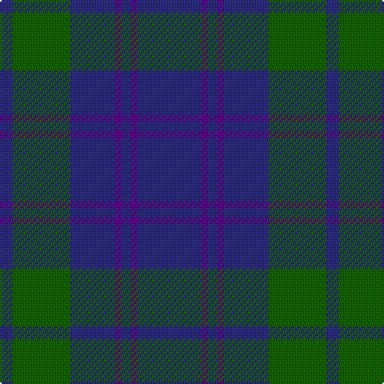

In pattern [BBBBBGB](/patterns/bbbbbgb/).

This was sourced from tartans-authority.  It is a [7 stripes tartan](/stripes/stripes7/).

Original link http://www.tartansauthority.com/tartan-ferret/display/5293/

## Thread count
DBa/8 G36 DBa28 P4 DBa6 P4 DBa/40

## Palette
Each colour and its ΔE from the base-6 reference it is a variant of.

| Colour | Shade | Base | ΔE (OKLab) |
|---|---|---|---|
| DB | <code style="background-color:#2C2C80;">#2C2C80</code> `#2C2C80` | B <code style="background-color:#2C4084;">#2C4084</code> | 0.05 |
| DBa | <code style="background-color:#2C2C80;">#2C2C80</code> `#2C2C80` | B <code style="background-color:#2C4084;">#2C4084</code> | 0.05 |
| G | <code style="background-color:#146400;">#146400</code> `#146400` | G <code style="background-color:#006400;">#006400</code> | 0.01 |
| P | <code style="background-color:#64008C;">#64008C</code> `#64008C` | B <code style="background-color:#2C4084;">#2C4084</code> | 0.13 |
| Pa | <code style="background-color:#64008C;">#64008C</code> `#64008C` | B <code style="background-color:#2C4084;">#2C4084</code> | 0.13 |

# Sample pattern

ID: /setts/s7/b40ba4b6ba4b28g36b8-b2c2c80-ba64008c-g146400/
