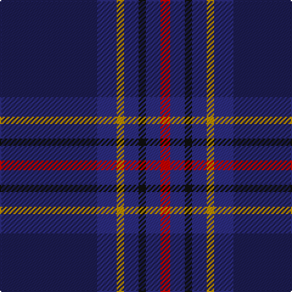

In pattern [BBYBKBR](/patterns/bbybkbr/).

This was sourced from tartans-authority.  It is a [7 stripes tartan](/stripes/stripes7/).

Original link http://www.tartansauthority.com/tartan-ferret/display/7401/

## Attestations

This cloth appears in 2 source records; the oldest owns this page.

- 1995 — Edinburgh & Lothian T.B. (Corporate) (tartans-authority, [record](http://www.tartansauthority.com/tartan-ferret/display/7401/))
- undated — Edinburgh & Lothian Tourist Board (register-of-tartans, [record](https://www.tartanregister.gov.uk/tartanDetails.aspx?ref=5485))

## Thread count
DBa/80 DB16 DY6 DB12 K6 DB12 R/8

## Palette
Each colour and its ΔE from the base-6 reference it is a variant of.

| Colour | Shade | Base | ΔE (OKLab) |
|---|---|---|---|
| DB | <code style="background-color:#2C2C80;">#2C2C80</code> `#2C2C80` | B <code style="background-color:#2A418A;">#2A418A</code> | 0.06 |
| DBa | <code style="background-color:#1C1C50;">#1C1C50</code> `#1C1C50` | B <code style="background-color:#2A418A;">#2A418A</code> | 0.14 |
| DY | <code style="background-color:#BC8C00;">#BC8C00</code> `#BC8C00` | Y <code style="background-color:#F2BF00;">#F2BF00</code> | 0.16 |
| K | <code style="background-color:#101010;">#101010</code> `#101010` | K <code style="background-color:#000000;">#000000</code> | 0.17 |
| R | <code style="background-color:#C80000;">#C80000</code> `#C80000` | R <code style="background-color:#CC0000;">#CC0000</code> | 0.01 |

# Sample pattern

## Nearest tartans

The nearest existing variants by ΔTartan distance.

1. [Stone of Destiny, The (Commemorative](/setts/s9/b4y2b20ba2r4ba2b3ba12b2~b2c2c80-ba14283c-r880000-yd09800~x2/) — ΔT 1.27
1. [Pride of Fife](/setts/s10/b2w2ba16y2ba2r5b37ba6y2b2~b202060-ba440044-r800028-wfcfcfc-y48a4c0~x2/) — ΔT 1.44
1. [Monarchs Corporate Sport Tartan Tartan Number: 2222. Earliest known date: 2002 Designed by Enid Brown of Lyle & Scott Ltd for Gleneagles Golf Developments. To be used for golf clothing and accessories. The Monarch's Course, created in the early 1990's by Jack Nicklaus, was renamed The PGA Centenary Course in February 2001 to celebrate the centenary year of The Professional Golfer's Association and is the selected venue for the 2014 Ryder Cup. See products available Copyright © Blair Urquhart, Comrie, 2015](/setts/s6/b19k4ba1k4g9ka1~b2c2c80-ba680028-g005448-k101010-ka000000~x4/) — ΔT 1.45
1. [Round Table (1997)](/setts/s6/b47g14ba5bb2r3g7~b202060-ba440044-bb4c3428-g285800-r880000~x2/) — ΔT 1.52
1. [Stewmann (Personal)](/setts/s9/g24b4g3ba11bb8ba37k3ba2r4~b5c8ca8-ba2c2c80-bb440044-g003820-k101010-re87878~x2/) — ΔT 1.62
1. [Edinburgh and Lothian Tourist Board](/setts/s7/k40b8r3b6ka3b6ra4~b141e46-k000028-ka101010-rc87814-radc0000~x2/) — ΔT 1.65
1. [Paxton Tartan Tartan Number: 6691. Earliest known date: 2004 Thread samples supplied See products available Copyright © Blair Urquhart, Comrie, 2015](/setts/s11/b30ba4b5g3b2g2b2g10ba7k2ba9~b003054-ba780078-g005030-k101010~x2/) — ΔT 1.65
1. [Passion of Scotland (Fashion)](/setts/s7/b6r4b2ba25k30g2k2~b344054-ba1c1c50-g408060-k101010-r888888~x2/) — ΔT 1.65
1. [Earl Blue Marl](/setts/s6/b80k28ba9k3r5k12~b2c2c80-ba780078-k101010-r9c68a4~x2/) — ΔT 1.66
1. [Royal British Legion Scotland (Corp)](/setts/s8/y4b2ba30k3b8ba5b1r2~b440044-ba202060-k101010-rc80000-ybc8c00~x2/) — ΔT 1.66

## Neighbour map

Every grey dot is one of 15726 variants placed by the first two principal components of the ΔTartan feature space (44% of its variance). Red is this tartan; blue dots are its nearest — click one to open its page.

<svg viewBox="0 0 640 380" role="img" style="max-width:100%;height:auto;border:1px solid #e0e0e0;border-radius:4px;display:block" xmlns="http://www.w3.org/2000/svg"><image href="/nn/cloud.v1.png" width="640" height="380"/><a href="/setts/s9/b4y2b20ba2r4ba2b3ba12b2~b2c2c80-ba14283c-r880000-yd09800~x2/"><circle cx="398.8" cy="223.2" r="4" fill="#3465a4"><title>Stone of Destiny, The (Commemorative</title></circle></a><a href="/setts/s10/b2w2ba16y2ba2r5b37ba6y2b2~b202060-ba440044-r800028-wfcfcfc-y48a4c0~x2/"><circle cx="371.2" cy="143.0" r="4" fill="#3465a4"><title>Pride of Fife</title></circle></a><a href="/setts/s6/b19k4ba1k4g9ka1~b2c2c80-ba680028-g005448-k101010-ka000000~x4/"><circle cx="348.6" cy="201.1" r="4" fill="#3465a4"><title>Monarchs Corporate Sport Tartan Tartan Number: 2222. Earliest known date: 2002 Designed by Enid Brown of Lyle &amp; Scott Ltd for Gleneagles Golf Developments. To be used for golf clothing and accessories. The Monarch's Course, created in the early 1990's by Jack Nicklaus, was renamed The PGA Centenary Course in February 2001 to celebrate the centenary year of The Professional Golfer's Association and is the selected venue for the 2014 Ryder Cup. See products available Copyright © Blair Urquhart, Comrie, 2015</title></circle></a><a href="/setts/s6/b47g14ba5bb2r3g7~b202060-ba440044-bb4c3428-g285800-r880000~x2/"><circle cx="440.5" cy="183.1" r="4" fill="#3465a4"><title>Round Table (1997)</title></circle></a><a href="/setts/s9/g24b4g3ba11bb8ba37k3ba2r4~b5c8ca8-ba2c2c80-bb440044-g003820-k101010-re87878~x2/"><circle cx="323.4" cy="155.5" r="4" fill="#3465a4"><title>Stewmann (Personal)</title></circle></a><a href="/setts/s7/k40b8r3b6ka3b6ra4~b141e46-k000028-ka101010-rc87814-radc0000~x2/"><circle cx="365.9" cy="185.3" r="4" fill="#3465a4"><title>Edinburgh and Lothian Tourist Board</title></circle></a><a href="/setts/s11/b30ba4b5g3b2g2b2g10ba7k2ba9~b003054-ba780078-g005030-k101010~x2/"><circle cx="383.1" cy="194.1" r="4" fill="#3465a4"><title>Paxton Tartan Tartan Number: 6691. Earliest known date: 2004 Thread samples supplied See products available Copyright © Blair Urquhart, Comrie, 2015</title></circle></a><a href="/setts/s7/b6r4b2ba25k30g2k2~b344054-ba1c1c50-g408060-k101010-r888888~x2/"><circle cx="332.6" cy="198.7" r="4" fill="#3465a4"><title>Passion of Scotland (Fashion)</title></circle></a><a href="/setts/s6/b80k28ba9k3r5k12~b2c2c80-ba780078-k101010-r9c68a4~x2/"><circle cx="451.2" cy="193.1" r="4" fill="#3465a4"><title>Earl Blue Marl</title></circle></a><a href="/setts/s8/y4b2ba30k3b8ba5b1r2~b440044-ba202060-k101010-rc80000-ybc8c00~x2/"><circle cx="449.4" cy="147.4" r="4" fill="#3465a4"><title>Royal British Legion Scotland (Corp)</title></circle></a><circle cx="398.0" cy="193.0" r="5" fill="#c00000"/></svg>

ID: /setts/s7/b40ba8y3ba6k3ba6r4~b1c1c50-ba2c2c80-k101010-rc80000-ybc8c00~x2/
