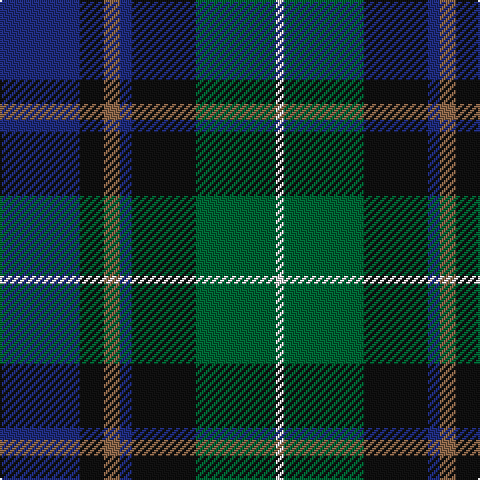

In pattern [BKRBKGW](/patterns/bkrbkgw/).

This was sourced from register-of-tartans.  It is a [7 stripes tartan](/stripes/stripes7/).

Original link https://www.tartanregister.gov.uk/tartanDetails.aspx?ref=10658

## Attestations

This cloth appears in 2 source records; the oldest owns this page.

- 09/07/2012 — Deloughery, Paul (register-of-tartans, [record](https://www.tartanregister.gov.uk/tartanDetails.aspx?ref=10658))
- undated — Deloughery, Paul Name Tartan Tartan Number: 10658. Earliest known date: 09/07/2012 Registration notes: Created by the designer for his family. Colours: saffron, green and blue represent their Irish heritage. See products available Copyright © Blair Urquhart, Comrie, 2015 (house-of-tartan, [record](http://www.house-of-tartan.scotland.net/house/TartanViewjs.asp?colr=Def&tnam=10658))

## Thread count
DB/40 K12 LT8 DB6 K32 G40 LN/4

## Palette
Each colour and its ΔE from the base-6 reference it is a variant of.

| Colour | Shade | Base | ΔE (OKLab) |
|---|---|---|---|
| DB | <code style="background-color:#202C7C;">#202C7C</code> `#202C7C` | B <code style="background-color:#2C4084;">#2C4084</code> | 0.06 |
| G | <code style="background-color:#006434;">#006434</code> `#006434` | G <code style="background-color:#006400;">#006400</code> | 0.04 |
| K | <code style="background-color:#101010;">#101010</code> `#101010` | K <code style="background-color:#000000;">#000000</code> | 0.17 |
| LN | <code style="background-color:#E8E8E8;">#E8E8E8</code> `#E8E8E8` | W <code style="background-color:#F4F4F0;">#F4F4F0</code> | 0.04 |
| LT | <code style="background-color:#886448;">#886448</code> `#886448` | R <code style="background-color:#C80000;">#C80000</code> | 0.16 |

# Sample pattern

ID: /setts/s7/b40k12r8b6k32g40w4-b202c7c-g006434-k101010-r886448-we8e8e8/
