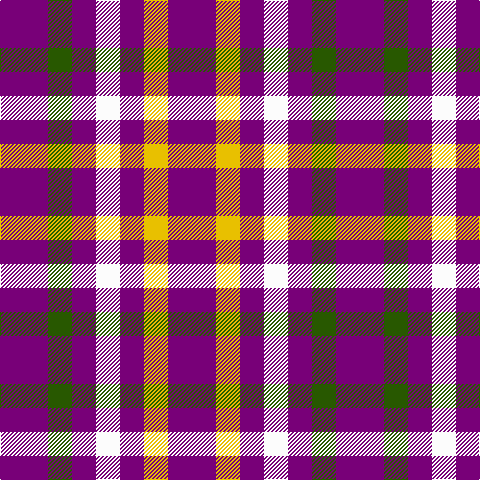

In pattern [BGBWBYB](/patterns/bgbwbyb/).

This was sourced from tartans-authority.  It is a [7 stripes tartan](/stripes/stripes7/).

Original link http://www.tartansauthority.com/tartan-ferret/display/109/

## Thread count
P/48 G24 P24 W24 P24 Y24 P/48

## Palette
Each colour and its ΔE from the base-6 reference it is a variant of.

| Colour | Shade | Base | ΔE (OKLab) |
|---|---|---|---|
| G | <code style="background-color:#285800;">#285800</code> `#285800` | G <code style="background-color:#006100;">#006100</code> | 0.03 |
| P | <code style="background-color:#780078;">#780078</code> `#780078` | B <code style="background-color:#2A418A;">#2A418A</code> | 0.17 |
| W | <code style="background-color:#FCFCFC;">#FCFCFC</code> `#FCFCFC` | W <code style="background-color:#F7F7F7;">#F7F7F7</code> | 0.01 |
| Y | <code style="background-color:#E8C000;">#E8C000</code> `#E8C000` | Y <code style="background-color:#F2BF00;">#F2BF00</code> | 0.02 |

# Sample pattern

## Nearest tartans

The nearest existing variants by ΔTartan distance.

1. [Justus International Tartan Tartan Number: 109. Earliest known date: pre 2003 Y = Saffron. Seen at Grandfather Mountain Games by Bob Martin in 1981 or 1982 See products available Copyright © Blair Urquhart, Comrie, 2015](/setts/s7/b12g6b6w6b6y6b12-b780078-g006818-we0e0e0-ye8c000/) — ΔT 0.20
1. [Justus International](/setts/s7/b48g24b24w24b24y24b48-b800080-g008000-we0e0e0-yf0c000/) — ΔT 0.22
1. [Justus International (Personal)](/setts/s12/b48g24b24w24b24y24b48y24b24w24b24g24-b780078-g285800-wfcfcfc-ye8c000/) — ΔT 1.72
1. [Ikelman No 3](/setts/s5/g50k20r20y20g50-g808080-k000000-rc00000-yf0c000/) — ΔT 2.41
1. [U.S. Coast Guard](/setts/s8/r20b24r4b24r4b24r20w20-b2c2c80-rc80000-we0e0e0/) — ΔT 2.48
1. [U.S. Coast Guard (Corporate)](/setts/s5/b24r4b24r20w20-b2c2c80-rc80000-we0e0e0/) — ΔT 2.59
1. [Unidentified, Sample](/setts/s6/b22r8y18b8y4b22-b304080-rc00000-yf0c000/) — ΔT 2.66
1. [Unidentified Sample](/setts/s6/b22r8y18b8y4b22-b2c4084-rdc0000-ye8c000/) — ΔT 2.69
1. [Coronation](/setts/s7/b14w2r14b8r4b8w4-b2c4084-rdc0000-we0e0e0/) — ΔT 2.71
1. [North Carolina State University](/setts/s12/w15b25r10w5b25w7b16k9b17k10b23r9-b5c5c5c-k101010-rc80000-wfcfcfc/) — ΔT 2.73

## Neighbour map

Every grey dot is one of 15726 variants placed by the first two principal components of the ΔTartan feature space (44% of its variance). Red is this tartan; blue dots are its nearest — click one to open its page.

<svg viewBox="0 0 640 380" role="img" style="max-width:100%;height:auto;border:1px solid #e0e0e0;border-radius:4px;display:block" xmlns="http://www.w3.org/2000/svg"><image href="/nn/cloud.v1.png" width="640" height="380"/><a href="/setts/s7/b12g6b6w6b6y6b12-b780078-g006818-we0e0e0-ye8c000/"><circle cx="235.8" cy="299.0" r="4" fill="#3465a4"><title>Justus International Tartan Tartan Number: 109. Earliest known date: pre 2003 Y = Saffron. Seen at Grandfather Mountain Games by Bob Martin in 1981 or 1982 See products available Copyright © Blair Urquhart, Comrie, 2015</title></circle></a><a href="/setts/s7/b48g24b24w24b24y24b48-b800080-g008000-we0e0e0-yf0c000/"><circle cx="235.2" cy="297.3" r="4" fill="#3465a4"><title>Justus International</title></circle></a><a href="/setts/s12/b48g24b24w24b24y24b48y24b24w24b24g24-b780078-g285800-wfcfcfc-ye8c000/"><circle cx="139.4" cy="272.4" r="4" fill="#3465a4"><title>Justus International (Personal)</title></circle></a><a href="/setts/s5/g50k20r20y20g50-g808080-k000000-rc00000-yf0c000/"><circle cx="227.0" cy="292.0" r="4" fill="#3465a4"><title>Ikelman No 3</title></circle></a><a href="/setts/s8/r20b24r4b24r4b24r20w20-b2c2c80-rc80000-we0e0e0/"><circle cx="224.3" cy="255.5" r="4" fill="#3465a4"><title>U.S. Coast Guard</title></circle></a><a href="/setts/s5/b24r4b24r20w20-b2c2c80-rc80000-we0e0e0/"><circle cx="213.3" cy="279.4" r="4" fill="#3465a4"><title>U.S. Coast Guard (Corporate)</title></circle></a><a href="/setts/s6/b22r8y18b8y4b22-b304080-rc00000-yf0c000/"><circle cx="296.2" cy="267.2" r="4" fill="#3465a4"><title>Unidentified, Sample</title></circle></a><a href="/setts/s6/b22r8y18b8y4b22-b2c4084-rdc0000-ye8c000/"><circle cx="294.8" cy="267.2" r="4" fill="#3465a4"><title>Unidentified Sample</title></circle></a><a href="/setts/s7/b14w2r14b8r4b8w4-b2c4084-rdc0000-we0e0e0/"><circle cx="277.5" cy="244.3" r="4" fill="#3465a4"><title>Coronation</title></circle></a><a href="/setts/s12/w15b25r10w5b25w7b16k9b17k10b23r9-b5c5c5c-k101010-rc80000-wfcfcfc/"><circle cx="233.1" cy="230.7" r="4" fill="#3465a4"><title>North Carolina State University</title></circle></a><circle cx="230.7" cy="296.2" r="5" fill="#c00000"/></svg>

ID: /setts/s7/b48g24b24w24b24y24b48-b780078-g285800-wfcfcfc-ye8c000/
