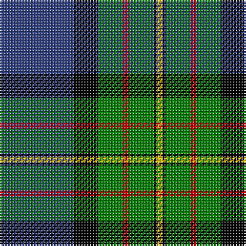

In pattern [BKGRGKY](/patterns/bkgrgky/).

This was sourced from weddslist.  It is a [7 stripes tartan](/stripes/stripes7/).

Original link http://www.weddslist.com/cgi-bin/tartans/pg.pl?source=sts

## Thread count
B/48 K16 G16 R4 G16 K2 Y/4

## Palette
Each colour and its ΔE from the base-6 reference it is a variant of.

| Colour | Shade | Base | ΔE (OKLab) |
|---|---|---|---|
| B | <code style="background-color:#304080;">#304080</code> `#304080` | B <code style="background-color:#2C4084;">#2C4084</code> | 0.01 |
| G | <code style="background-color:#008000;">#008000</code> `#008000` | G <code style="background-color:#006400;">#006400</code> | 0.09 |
| K | <code style="background-color:#000000;">#000000</code> `#000000` | K <code style="background-color:#000000;">#000000</code> | 0.00 |
| R | <code style="background-color:#C00000;">#C00000</code> `#C00000` | R <code style="background-color:#C80000;">#C80000</code> | 0.02 |
| Y | <code style="background-color:#F0C000;">#F0C000</code> `#F0C000` | Y <code style="background-color:#E8C000;">#E8C000</code> | 0.01 |

# Sample pattern

## Nearest tartans

The nearest existing variants by ΔTartan distance.

1. [Ferguson of Athol](/setts/s7/b48k16g16r4g16k2w4-b304080-g008000-k000000-rc00000-we0e0e0/) — ΔT 0.14
1. [MacFadzean](/setts/s6/b96w4k40g44r6g8-b304080-g008000-k000000-rc00000-we0e0e0/) — ΔT 0.58
1. [Colquhoun](/setts/s7/b8k4b32w2k16g48r8-b304080-g008000-k000000-rc00000-we0e0e0/) — ΔT 0.62
1. [MacNeil 3](/setts/s8/g90w4r6k30r6b30r6b30-b304080-g008000-k000000-rc00000-we0e0e0/) — ΔT 0.84
1. [Ogilvie 1](/setts/s9/b48y4k16g32k2g6k2g6r8-b304080-g008000-k000000-rc00000-yf0c000/) — ΔT 0.89
1. [Gillies](/setts/s8/b64k24b24g12r12g36k4y6-b304080-g008000-k000000-rc00000-yf0c000/) — ΔT 0.90
1. [Ebdon Muir (Personal)](/setts/s9/b8ba80k30g20b4g20b4g20w8-b780078-ba000058-g00801c-k101010-wf0f0c4/) — ΔT 1.01
1. [Wishart Htg (Clan)](/setts/s7/k14b8g62b6y4b54w8-b2c2c80-g004c00-k000000-wc8c8c8-ye8c000/) — ΔT 1.01
1. [Sandelin #2 (Personal)](/setts/s8/w20b4w2b70g20y6g20r8-b141e46-g003c14-rdc0000-we0e0e0-yc89600/) — ΔT 1.02
1. [Ferguson of Atholl Clan](/setts/s7/b48k16g16r4g16k2w4-b1860a8-g006818-k101010-rc80000-wfcfcfc/) — ΔT 1.03

## Neighbour map

Every grey dot is one of 15726 variants placed by the first two principal components of the ΔTartan feature space (44% of its variance). Red is this tartan; blue dots are its nearest — click one to open its page.

<svg viewBox="0 0 640 380" role="img" style="max-width:100%;height:auto;border:1px solid #e0e0e0;border-radius:4px;display:block" xmlns="http://www.w3.org/2000/svg"><image href="/nn/cloud.v1.png" width="640" height="380"/><a href="/setts/s7/b48k16g16r4g16k2w4-b304080-g008000-k000000-rc00000-we0e0e0/"><circle cx="230.1" cy="144.6" r="4" fill="#3465a4"><title>Ferguson of Athol</title></circle></a><a href="/setts/s6/b96w4k40g44r6g8-b304080-g008000-k000000-rc00000-we0e0e0/"><circle cx="255.0" cy="152.7" r="4" fill="#3465a4"><title>MacFadzean</title></circle></a><a href="/setts/s7/b8k4b32w2k16g48r8-b304080-g008000-k000000-rc00000-we0e0e0/"><circle cx="208.1" cy="146.8" r="4" fill="#3465a4"><title>Colquhoun</title></circle></a><a href="/setts/s8/g90w4r6k30r6b30r6b30-b304080-g008000-k000000-rc00000-we0e0e0/"><circle cx="225.6" cy="133.3" r="4" fill="#3465a4"><title>MacNeil 3</title></circle></a><a href="/setts/s9/b48y4k16g32k2g6k2g6r8-b304080-g008000-k000000-rc00000-yf0c000/"><circle cx="204.9" cy="124.5" r="4" fill="#3465a4"><title>Ogilvie 1</title></circle></a><a href="/setts/s8/b64k24b24g12r12g36k4y6-b304080-g008000-k000000-rc00000-yf0c000/"><circle cx="218.0" cy="166.2" r="4" fill="#3465a4"><title>Gillies</title></circle></a><a href="/setts/s9/b8ba80k30g20b4g20b4g20w8-b780078-ba000058-g00801c-k101010-wf0f0c4/"><circle cx="201.9" cy="139.1" r="4" fill="#3465a4"><title>Ebdon Muir (Personal)</title></circle></a><a href="/setts/s7/k14b8g62b6y4b54w8-b2c2c80-g004c00-k000000-wc8c8c8-ye8c000/"><circle cx="242.0" cy="165.9" r="4" fill="#3465a4"><title>Wishart Htg (Clan)</title></circle></a><a href="/setts/s8/w20b4w2b70g20y6g20r8-b141e46-g003c14-rdc0000-we0e0e0-yc89600/"><circle cx="267.0" cy="112.5" r="4" fill="#3465a4"><title>Sandelin #2 (Personal)</title></circle></a><a href="/setts/s7/b48k16g16r4g16k2w4-b1860a8-g006818-k101010-rc80000-wfcfcfc/"><circle cx="248.6" cy="153.3" r="4" fill="#3465a4"><title>Ferguson of Atholl Clan</title></circle></a><circle cx="231.8" cy="145.2" r="5" fill="#c00000"/></svg>

ID: /setts/s7/b48k16g16r4g16k2y4-b304080-g008000-k000000-rc00000-yf0c000/
