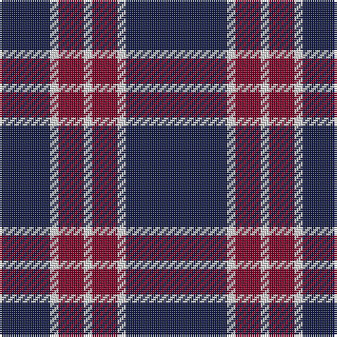

In pattern [BWRWRWB](/patterns/bwrwrwb/).

This was sourced from register-of-tartans.  It is a [7 stripes tartan](/stripes/stripes7/).

Original link https://www.tartanregister.gov.uk/tartanDetails.aspx?ref=11090

## Thread count
DB/24 LN4 DR12 LN4 DR12 LN4 DB/48

## Palette
Each colour and its ΔE from the base-6 reference it is a variant of.

| Colour | Shade | Base | ΔE (OKLab) |
|---|---|---|---|
| DB | <code style="background-color:#141E46;">#141E46</code> `#141E46` | B <code style="background-color:#2C4084;">#2C4084</code> | 0.15 |
| DR | <code style="background-color:#800028;">#800028</code> `#800028` | R <code style="background-color:#C80000;">#C80000</code> | 0.16 |
| LN | <code style="background-color:#E0E0E0;">#E0E0E0</code> `#E0E0E0` | W <code style="background-color:#F4F4F0;">#F4F4F0</code> | 0.06 |

# Sample pattern

## Nearest tartans

The nearest existing variants by ΔTartan distance.

1. [BC Corps of Commissionaires, The](/setts/s7/b48w4r12w4r12w4b24-b202060-ra00000-wc0c0c0/) — ΔT 0.56
1. [Americana - 1978 (Fashion)](/setts/s8/b66w14b10r4b10w4r26b6-b1c1c50-rc80000-we0e0e0/) — ΔT 0.98
1. [South Australian Pipes & Drums (Corp](/setts/s6/b120y12b22r50b22y12-b2c2c80-rc80000-ye8c000/) — ΔT 0.98
1. [Moffat (1984)](/setts/s7/k78r6k6r6k28r56ra6-k101010-r888888-rac80000/) — ΔT 1.25
1. [Glen Moy Trade Tartan Tartan Number: 635. Earliest known date: pre 1992 Its mainly Sheep farming in Glen Moy. Off the beaten track, its a very quiet area of the Angus glens close to Cortachy castle and great for walking if you like it to yourself! Its also close to Glen Clova which is the busiest glen around here with some fantastic mountains for walking and taking photos. See products available Copyright © Blair Urquhart, Comrie, 2015](/setts/s5/b74w18b6r18w6-b202060-rc80000-we0e0e0/) — ΔT 1.26
1. [Embrace, The](/setts/s8/b20r48b8r6b48w4r12b12-b000088-r8c0000-wfcfcfc/) — ΔT 1.28
1. [MacKay](/setts/s6/b4k12b4k12b32r2-b304080-k000000-rc00000/) — ΔT 1.34
1. [Sligo Irish County Tartan Tartan Number: 2256. Earliest known date: 1995 One of a series of Irish District tartans designed by Polly Wittering of the House of Edgar, with colours reminiscent of the Country with soft warm colours dominating. See products available Copyright © Blair Urquhart, Comrie, 2015](/setts/s6/b100k8b24k46y8k8-b687c94-k000000-yd49c1c/) — ΔT 1.34
1. [Glen Moy](/setts/s5/b74w18b6r18w6-b000050-rc00000-we0e0e0/) — ΔT 1.38
1. [Coronation (1936) #2](/setts/s7/b44w4r48b24r4b24w4-b2c2c80-rc80000-wfcfcfc/) — ΔT 1.38

## Neighbour map

Every grey dot is one of 15726 variants placed by the first two principal components of the ΔTartan feature space (44% of its variance). Red is this tartan; blue dots are its nearest — click one to open its page.

<svg viewBox="0 0 640 380" role="img" style="max-width:100%;height:auto;border:1px solid #e0e0e0;border-radius:4px;display:block" xmlns="http://www.w3.org/2000/svg"><image href="/nn/cloud.v1.png" width="640" height="380"/><a href="/setts/s7/b48w4r12w4r12w4b24-b202060-ra00000-wc0c0c0/"><circle cx="405.7" cy="207.4" r="4" fill="#3465a4"><title>BC Corps of Commissionaires, The</title></circle></a><a href="/setts/s8/b66w14b10r4b10w4r26b6-b1c1c50-rc80000-we0e0e0/"><circle cx="393.7" cy="168.1" r="4" fill="#3465a4"><title>Americana - 1978 (Fashion)</title></circle></a><a href="/setts/s6/b120y12b22r50b22y12-b2c2c80-rc80000-ye8c000/"><circle cx="410.3" cy="215.1" r="4" fill="#3465a4"><title>South Australian Pipes &amp; Drums (Corp</title></circle></a><a href="/setts/s7/k78r6k6r6k28r56ra6-k101010-r888888-rac80000/"><circle cx="371.5" cy="197.8" r="4" fill="#3465a4"><title>Moffat (1984)</title></circle></a><a href="/setts/s5/b74w18b6r18w6-b202060-rc80000-we0e0e0/"><circle cx="377.3" cy="200.1" r="4" fill="#3465a4"><title>Glen Moy Trade Tartan Tartan Number: 635. Earliest known date: pre 1992 Its mainly Sheep farming in Glen Moy. Off the beaten track, its a very quiet area of the Angus glens close to Cortachy castle and great for walking if you like it to yourself! Its also close to Glen Clova which is the busiest glen around here with some fantastic mountains for walking and taking photos. See products available Copyright © Blair Urquhart, Comrie, 2015</title></circle></a><a href="/setts/s8/b20r48b8r6b48w4r12b12-b000088-r8c0000-wfcfcfc/"><circle cx="351.2" cy="210.6" r="4" fill="#3465a4"><title>Embrace, The</title></circle></a><a href="/setts/s6/b4k12b4k12b32r2-b304080-k000000-rc00000/"><circle cx="387.2" cy="215.2" r="4" fill="#3465a4"><title>MacKay</title></circle></a><a href="/setts/s6/b100k8b24k46y8k8-b687c94-k000000-yd49c1c/"><circle cx="368.7" cy="198.4" r="4" fill="#3465a4"><title>Sligo Irish County Tartan Tartan Number: 2256. Earliest known date: 1995 One of a series of Irish District tartans designed by Polly Wittering of the House of Edgar, with colours reminiscent of the Country with soft warm colours dominating. See products available Copyright © Blair Urquhart, Comrie, 2015</title></circle></a><a href="/setts/s5/b74w18b6r18w6-b000050-rc00000-we0e0e0/"><circle cx="367.6" cy="202.8" r="4" fill="#3465a4"><title>Glen Moy</title></circle></a><a href="/setts/s7/b44w4r48b24r4b24w4-b2c2c80-rc80000-wfcfcfc/"><circle cx="361.5" cy="209.6" r="4" fill="#3465a4"><title>Coronation (1936) #2</title></circle></a><circle cx="394.7" cy="205.8" r="5" fill="#c00000"/></svg>

ID: /setts/s7/b48w4r12w4r12w4b24-b141e46-r800028-we0e0e0/
