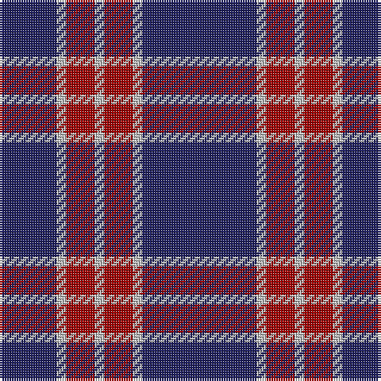

In pattern [BWRWRWB](/patterns/bwrwrwb/).

This was sourced from tartans-authority.  It is a [7 stripes tartan](/stripes/stripes7/).

Original link http://www.tartansauthority.com/tartan-ferret/display/11090/

## Thread count
DB/24 N4 DR12 N4 DR12 N4 DB/48

## Palette
Each colour and its ΔE from the base-6 reference it is a variant of.

| Colour | Shade | Base | ΔE (OKLab) |
|---|---|---|---|
| DB | <code style="background-color:#202060;">#202060</code> `#202060` | B <code style="background-color:#2A418A;">#2A418A</code> | 0.11 |
| DR | <code style="background-color:#A00000;">#A00000</code> `#A00000` | R <code style="background-color:#CC0000;">#CC0000</code> | 0.09 |
| N | <code style="background-color:#C0C0C0;">#C0C0C0</code> `#C0C0C0` | W <code style="background-color:#F7F7F7;">#F7F7F7</code> | 0.17 |

# Sample pattern

## Nearest tartans

The nearest existing variants by ΔTartan distance.

1. [BC Corps of Commissionaires](/setts/s7/b48w4r12w4r12w4b24-b141e46-r800028-we0e0e0/) — ΔT 0.56
1. [South Australian Pipes & Drums (Corp](/setts/s6/b120y12b22r50b22y12-b2c2c80-rc80000-ye8c000/) — ΔT 0.72
1. [Orlando Fire Department (Corporate)](/setts/s9/b48y4r64b4r4b56r12b56y4-b2c2c80-rc80000-ye8c000/) — ΔT 1.01
1. [Edinburgh TIC (Corporate)](/setts/s8/b64r6b6r8w6r10b8r14-b2c2c80-rc8002c-we0e0e0/) — ΔT 1.08
1. [Embrace, The](/setts/s8/b20r48b8r6b48w4r12b12-b000088-r8c0000-wfcfcfc/) — ΔT 1.11
1. [Americana - 1978 (Fashion)](/setts/s8/b66w14b10r4b10w4r26b6-b1c1c50-rc80000-we0e0e0/) — ΔT 1.12
1. [Coronation (1936) #2](/setts/s7/b44w4r48b24r4b24w4-b2c2c80-rc80000-wfcfcfc/) — ΔT 1.13
1. [MacQueen variant](/setts/s6/b4r14b4r14b44y4-b2c4084-rdc0000-ye8c000/) — ΔT 1.17
1. [MacQueen, variant](/setts/s6/b4r14b4r14b44y4-b304080-rc00000-yf0c000/) — ΔT 1.19
1. [Coronation](/setts/s7/b22w2r24b12r2b12w2-b304080-rc00000-we0e0e0/) — ΔT 1.22

## Neighbour map

Every grey dot is one of 15726 variants placed by the first two principal components of the ΔTartan feature space (44% of its variance). Red is this tartan; blue dots are its nearest — click one to open its page.

<svg viewBox="0 0 640 380" role="img" style="max-width:100%;height:auto;border:1px solid #e0e0e0;border-radius:4px;display:block" xmlns="http://www.w3.org/2000/svg"><image href="/nn/cloud.v1.png" width="640" height="380"/><a href="/setts/s7/b48w4r12w4r12w4b24-b141e46-r800028-we0e0e0/"><circle cx="394.7" cy="205.8" r="4" fill="#3465a4"><title>BC Corps of Commissionaires</title></circle></a><a href="/setts/s6/b120y12b22r50b22y12-b2c2c80-rc80000-ye8c000/"><circle cx="410.3" cy="215.1" r="4" fill="#3465a4"><title>South Australian Pipes &amp; Drums (Corp</title></circle></a><a href="/setts/s9/b48y4r64b4r4b56r12b56y4-b2c2c80-rc80000-ye8c000/"><circle cx="419.6" cy="190.0" r="4" fill="#3465a4"><title>Orlando Fire Department (Corporate)</title></circle></a><a href="/setts/s8/b64r6b6r8w6r10b8r14-b2c2c80-rc8002c-we0e0e0/"><circle cx="411.2" cy="185.1" r="4" fill="#3465a4"><title>Edinburgh TIC (Corporate)</title></circle></a><a href="/setts/s8/b20r48b8r6b48w4r12b12-b000088-r8c0000-wfcfcfc/"><circle cx="351.2" cy="210.6" r="4" fill="#3465a4"><title>Embrace, The</title></circle></a><a href="/setts/s8/b66w14b10r4b10w4r26b6-b1c1c50-rc80000-we0e0e0/"><circle cx="393.7" cy="168.1" r="4" fill="#3465a4"><title>Americana - 1978 (Fashion)</title></circle></a><a href="/setts/s7/b44w4r48b24r4b24w4-b2c2c80-rc80000-wfcfcfc/"><circle cx="361.5" cy="209.6" r="4" fill="#3465a4"><title>Coronation (1936) #2</title></circle></a><a href="/setts/s6/b4r14b4r14b44y4-b2c4084-rdc0000-ye8c000/"><circle cx="394.4" cy="206.8" r="4" fill="#3465a4"><title>MacQueen variant</title></circle></a><a href="/setts/s6/b4r14b4r14b44y4-b304080-rc00000-yf0c000/"><circle cx="407.3" cy="213.8" r="4" fill="#3465a4"><title>MacQueen, variant</title></circle></a><a href="/setts/s7/b22w2r24b12r2b12w2-b304080-rc00000-we0e0e0/"><circle cx="378.4" cy="217.4" r="4" fill="#3465a4"><title>Coronation</title></circle></a><circle cx="405.7" cy="207.4" r="5" fill="#c00000"/></svg>

ID: /setts/s7/b48w4r12w4r12w4b24-b202060-ra00000-wc0c0c0/
