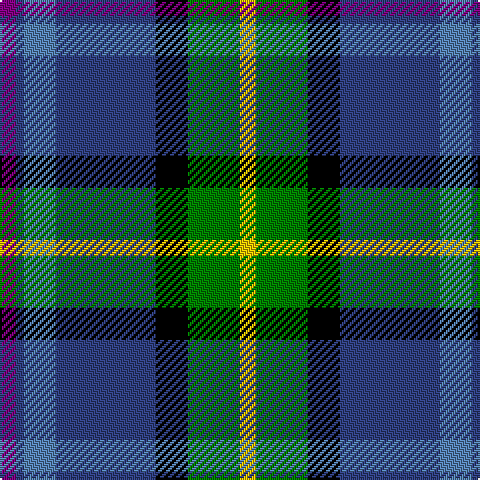

In pattern [BBBBKGY](/patterns/bbbbkgy/).

This was sourced from weddslist.  It is a [7 stripes tartan](/stripes/stripes7/).

Original link http://www.weddslist.com/cgi-bin/tartans/pg.pl?source=sts

## Thread count
P/8 B4 Ba16 B50 K16 G26 Y/8

## Palette
Each colour and its ΔE from the base-6 reference it is a variant of.

| Colour | Shade | Base | ΔE (OKLab) |
|---|---|---|---|
| B | <code style="background-color:#304080;">#304080</code> `#304080` | B <code style="background-color:#2A418A;">#2A418A</code> | 0.02 |
| Ba | <code style="background-color:#5480B0;">#5480B0</code> `#5480B0` | B <code style="background-color:#2A418A;">#2A418A</code> | 0.19 |
| G | <code style="background-color:#008000;">#008000</code> `#008000` | G <code style="background-color:#006100;">#006100</code> | 0.10 |
| K | <code style="background-color:#000000;">#000000</code> `#000000` | K <code style="background-color:#000000;">#000000</code> | 0.00 |
| P | <code style="background-color:#800080;">#800080</code> `#800080` | B <code style="background-color:#2A418A;">#2A418A</code> | 0.17 |
| Y | <code style="background-color:#F0C000;">#F0C000</code> `#F0C000` | Y <code style="background-color:#F2BF00;">#F2BF00</code> | 0.00 |

# Sample pattern

## Nearest tartans

The nearest existing variants by ΔTartan distance.

1. [Moran (Coilessan) (Personal)](/setts/s8/b26ba13k13w2g8k5r3b3x2~b2888c4-ba2c2c80-g006818-k101010-rc80000-we0e0e0/) — ΔT 0.69
1. [Renfrewshire](/setts/s7/b4ba2bb8ba25k8g13y4x2~b780078-ba2c2c80-bb5c8ca8-g006818-k101010-ye8c000/) — ΔT 0.71
1. [Souza Nery (Personal)](/setts/s7/y4g22r3k17r3b37w3x2~b2c2c80-g006818-k101010-rc8002c-we0e0e0-yfccc00/) — ΔT 0.72
1. [Renfrewshire District Tartan Tartan Number: 2560. Earliest known date: 1998 Designed for anyone residing in the County of Renfrewshire See products available Copyright © Blair Urquhart, Comrie, 2015](/setts/s7/r4b2ba7b20k7g10y4x2~b2c2c80-ba5c8ca8-g006818-k101010-ra00048-ye8c000/) — ΔT 0.72
1. [Moran (Virgin Islands) (Personal)](/setts/s9/b3r3k5g8w2k13ba13b26w3x2~b2888c4-ba2c2c80-g006818-k101010-rc80000-we0e0e0/) — ΔT 0.86
1. [St Columba](/setts/s8/b60ba5w4r12g42bb12ba5bb12~b000050-ba5480b0-bb800080-g008000-r906030-we0e0e0/) — ΔT 0.89
1. [Minnesota (District)](/setts/s8/k6w3k2b30r9k4g20y3x2~b2c2c80-g289c18-k101010-ra00024-we0e0e0-ye8c000/) — ΔT 0.92
1. [Souza Nery](/setts/s7/y4g22r3k17r3b37w3x2~b304080-g008000-k000000-rc00020-we0e0e0-yf0c000/) — ΔT 0.92
1. [Morris of Eddergoll (Personal)](/setts/s6/w2b20r3k10g20y2x2~b1c0070-g006818-k101010-rc80000-wf8f8f8-yd09800/) — ΔT 0.94
1. [Sirens & Swords](/setts/s6/b36g20ga6w12k6r3x2~b0c4252-g789484-ga003c14-k1c1714-r960028-wffffff/) — ΔT 0.95

## Neighbour map

Every grey dot is one of 15726 variants placed by the first two principal components of the ΔTartan feature space (44% of its variance). Red is this tartan; blue dots are its nearest — click one to open its page.

<svg viewBox="0 0 640 380" role="img" style="max-width:100%;height:auto;border:1px solid #e0e0e0;border-radius:4px;display:block" xmlns="http://www.w3.org/2000/svg"><image href="/nn/cloud.v1.png" width="640" height="380"/><a href="/setts/s8/b26ba13k13w2g8k5r3b3x2~b2888c4-ba2c2c80-g006818-k101010-rc80000-we0e0e0/"><circle cx="147.2" cy="155.7" r="4" fill="#3465a4"><title>Moran (Coilessan) (Personal)</title></circle></a><a href="/setts/s7/b4ba2bb8ba25k8g13y4x2~b780078-ba2c2c80-bb5c8ca8-g006818-k101010-ye8c000/"><circle cx="164.9" cy="169.5" r="4" fill="#3465a4"><title>Renfrewshire</title></circle></a><a href="/setts/s7/y4g22r3k17r3b37w3x2~b2c2c80-g006818-k101010-rc8002c-we0e0e0-yfccc00/"><circle cx="172.9" cy="152.9" r="4" fill="#3465a4"><title>Souza Nery (Personal)</title></circle></a><a href="/setts/s7/r4b2ba7b20k7g10y4x2~b2c2c80-ba5c8ca8-g006818-k101010-ra00048-ye8c000/"><circle cx="136.0" cy="180.1" r="4" fill="#3465a4"><title>Renfrewshire District Tartan Tartan Number: 2560. Earliest known date: 1998 Designed for anyone residing in the County of Renfrewshire See products available Copyright © Blair Urquhart, Comrie, 2015</title></circle></a><a href="/setts/s9/b3r3k5g8w2k13ba13b26w3x2~b2888c4-ba2c2c80-g006818-k101010-rc80000-we0e0e0/"><circle cx="129.5" cy="142.0" r="4" fill="#3465a4"><title>Moran (Virgin Islands) (Personal)</title></circle></a><a href="/setts/s8/b60ba5w4r12g42bb12ba5bb12~b000050-ba5480b0-bb800080-g008000-r906030-we0e0e0/"><circle cx="162.8" cy="135.0" r="4" fill="#3465a4"><title>St Columba</title></circle></a><a href="/setts/s8/k6w3k2b30r9k4g20y3x2~b2c2c80-g289c18-k101010-ra00024-we0e0e0-ye8c000/"><circle cx="151.3" cy="131.3" r="4" fill="#3465a4"><title>Minnesota (District)</title></circle></a><a href="/setts/s7/y4g22r3k17r3b37w3x2~b304080-g008000-k000000-rc00020-we0e0e0-yf0c000/"><circle cx="153.4" cy="146.4" r="4" fill="#3465a4"><title>Souza Nery</title></circle></a><a href="/setts/s6/w2b20r3k10g20y2x2~b1c0070-g006818-k101010-rc80000-wf8f8f8-yd09800/"><circle cx="135.2" cy="178.7" r="4" fill="#3465a4"><title>Morris of Eddergoll (Personal)</title></circle></a><a href="/setts/s6/b36g20ga6w12k6r3x2~b0c4252-g789484-ga003c14-k1c1714-r960028-wffffff/"><circle cx="151.0" cy="162.1" r="4" fill="#3465a4"><title>Sirens &amp; Swords</title></circle></a><circle cx="145.7" cy="162.3" r="5" fill="#c00000"/></svg>

ID: /setts/s7/b4ba2bb8ba25k8g13y4x2~b800080-ba304080-bb5480b0-g008000-k000000-yf0c000/
