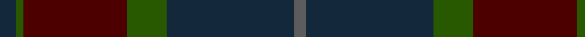
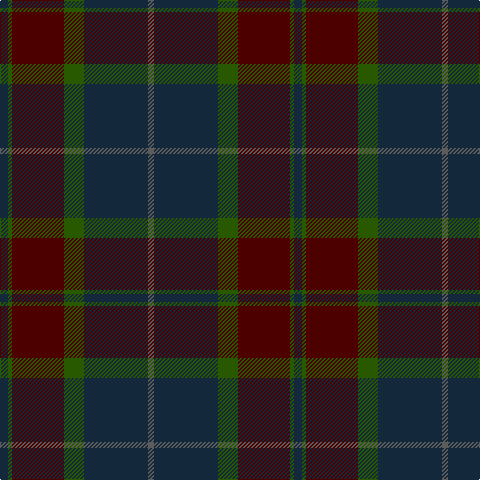

In pattern [BBGBBGB](/patterns/bbgbbgb/).

This was sourced from house-of-tartan.  It is a [7 stripes tartan](/stripes/stripes7/).

Original link http://www.house-of-tartan.scotland.net/house/TartanViewjs.asp?colr=Def&tnam=2219

## Thread count
DN/8 Ga4 DR32 DR20 Ga20 DN64 N/6

## Palette
Each colour and its ΔE from the base-6 reference it is a variant of.

| Colour | Shade | Base | ΔE (OKLab) |
|---|---|---|---|
| DN | <code style="background-color:#14283C;">#14283C</code> `#14283C` | B <code style="background-color:#2A418A;">#2A418A</code> | 0.15 |
| DR | <code style="background-color:#4C0000;">#4C0000</code> `#4C0000` | B <code style="background-color:#2A418A;">#2A418A</code> | 0.25 |
| G | <code style="background-color:#006818;">#006818</code> `#006818` | G <code style="background-color:#006100;">#006100</code> | 0.02 |
| Ga | <code style="background-color:#285800;">#285800</code> `#285800` | G <code style="background-color:#006100;">#006100</code> | 0.03 |
| N | <code style="background-color:#5C5C5C;">#5C5C5C</code> `#5C5C5C` | B <code style="background-color:#2A418A;">#2A418A</code> | 0.15 |
| R | <code style="background-color:#CC4438;">#CC4438</code> `#CC4438` | R <code style="background-color:#CC0000;">#CC0000</code> | 0.06 |

# Sample pattern

## Nearest tartans

The nearest existing variants by ΔTartan distance.

1. [Highland Granite](/setts/s10/b8g2b27k10ba4k2ba3k2ba16b2x2~b343434-ba585858-g7c7c7c-k101010/) — ΔT 1.05
1. [Aisteach](/setts/s7/b32g16r14k4r6b7k2x2~b3d2e60-g005020-k1c1714-r97342f/) — ΔT 1.28
1. [Brave for Men (Fashion)](/setts/s8/k5g5k5g34b33k6b5r2~b5c5c5c-g604000-k101010-r888888/) — ΔT 1.33
1. [Peter of Lee Family Tartan Tartan Number: 1055. Earliest known date: 1988 Designed by Harry Lindley for E. Leslie Peter. The sett was accredited by the Scottish Tartans Society in 1988. See products available Copyright © Blair Urquhart, Comrie, 2015](/setts/s8/r4g3k2g38b30k3b3k3x2~b202060-g003820-k101010-rc80000/) — ΔT 1.49
1. [Bobby Jones (Personal)](/setts/s6/r1g2b12g8ba16y1x2~b1c1c1c-ba202060-g604000-r880000-ybc8c00/) — ΔT 1.52
1. [Longmuir (2014)](/setts/s6/b43g8b8ba21g10w2x2~b1c1c1c-ba003c64-g003820-wf8f4d0/) — ΔT 1.56
1. [Madder](/setts/s7/g28r4b27r27g28r5b2x2~b280034-g044028-r780014/) — ΔT 1.58
1. [Breckon Hunting (Name)](/setts/s9/b3r1b14g14r1g1r1g1r2x4~b1c1c50-g003820-r880000/) — ΔT 1.61
1. [John Telfar Dunbar Hunting](/setts/s7/g5k2g28k10ga26b4g4x2~b2c4084-g005020-ga503c14-k101010/) — ΔT 1.63
1. [Passion of Scotland, Pewter (Fashion](/setts/s5/b8r3ba34k34bb3x2~b5c5c5c-ba484848-bb481c40-k101010-r6c0000/) — ΔT 1.67

## Neighbour map

Every grey dot is one of 15726 variants placed by the first two principal components of the ΔTartan feature space (44% of its variance). Red is this tartan; blue dots are its nearest — click one to open its page.

<svg viewBox="0 0 640 380" role="img" style="max-width:100%;height:auto;border:1px solid #e0e0e0;border-radius:4px;display:block" xmlns="http://www.w3.org/2000/svg"><image href="/nn/cloud.v1.png" width="640" height="380"/><a href="/setts/s10/b8g2b27k10ba4k2ba3k2ba16b2x2~b343434-ba585858-g7c7c7c-k101010/"><circle cx="384.8" cy="216.8" r="4" fill="#3465a4"><title>Highland Granite</title></circle></a><a href="/setts/s7/b32g16r14k4r6b7k2x2~b3d2e60-g005020-k1c1714-r97342f/"><circle cx="350.7" cy="225.0" r="4" fill="#3465a4"><title>Aisteach</title></circle></a><a href="/setts/s8/k5g5k5g34b33k6b5r2~b5c5c5c-g604000-k101010-r888888/"><circle cx="355.4" cy="203.8" r="4" fill="#3465a4"><title>Brave for Men (Fashion)</title></circle></a><a href="/setts/s8/r4g3k2g38b30k3b3k3x2~b202060-g003820-k101010-rc80000/"><circle cx="410.8" cy="202.5" r="4" fill="#3465a4"><title>Peter of Lee Family Tartan Tartan Number: 1055. Earliest known date: 1988 Designed by Harry Lindley for E. Leslie Peter. The sett was accredited by the Scottish Tartans Society in 1988. See products available Copyright © Blair Urquhart, Comrie, 2015</title></circle></a><a href="/setts/s6/r1g2b12g8ba16y1x2~b1c1c1c-ba202060-g604000-r880000-ybc8c00/"><circle cx="304.3" cy="216.5" r="4" fill="#3465a4"><title>Bobby Jones (Personal)</title></circle></a><a href="/setts/s6/b43g8b8ba21g10w2x2~b1c1c1c-ba003c64-g003820-wf8f4d0/"><circle cx="424.7" cy="238.6" r="4" fill="#3465a4"><title>Longmuir (2014)</title></circle></a><a href="/setts/s7/g28r4b27r27g28r5b2x2~b280034-g044028-r780014/"><circle cx="352.3" cy="261.6" r="4" fill="#3465a4"><title>Madder</title></circle></a><a href="/setts/s9/b3r1b14g14r1g1r1g1r2x4~b1c1c50-g003820-r880000/"><circle cx="417.9" cy="226.6" r="4" fill="#3465a4"><title>Breckon Hunting (Name)</title></circle></a><a href="/setts/s7/g5k2g28k10ga26b4g4x2~b2c4084-g005020-ga503c14-k101010/"><circle cx="390.9" cy="251.5" r="4" fill="#3465a4"><title>John Telfar Dunbar Hunting</title></circle></a><a href="/setts/s5/b8r3ba34k34bb3x2~b5c5c5c-ba484848-bb481c40-k101010-r6c0000/"><circle cx="312.2" cy="235.5" r="4" fill="#3465a4"><title>Passion of Scotland, Pewter (Fashion</title></circle></a><circle cx="382.8" cy="237.2" r="5" fill="#c00000"/></svg>

ID: /setts/s7/b4g2ba16ba10g10b32bb3x2~b14283c-ba4c0000-bb5c5c5c-g285800/
