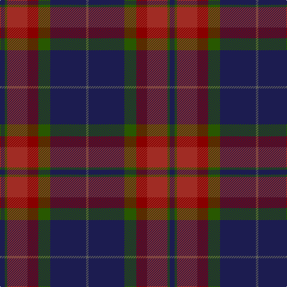

In pattern [BBGRRGB](/patterns/bbgrrgb/).

This was sourced from tartans-authority.  It is a [7 stripes tartan](/stripes/stripes7/).

Original link http://www.tartansauthority.com/tartan-ferret/display/2814/

## Thread count
DB/8 G4 DR34 DRa18 G20 DB60 N/4

## Palette
Each colour and its ΔE from the base-6 reference it is a variant of.

| Colour | Shade | Base | ΔE (OKLab) |
|---|---|---|---|
| DB | <code style="background-color:#1C1C50;">#1C1C50</code> `#1C1C50` | B <code style="background-color:#2A418A;">#2A418A</code> | 0.14 |
| DR | <code style="background-color:#A02C24;">#A02C24</code> `#A02C24` | R <code style="background-color:#CC0000;">#CC0000</code> | 0.09 |
| DRa | <code style="background-color:#880000;">#880000</code> `#880000` | R <code style="background-color:#CC0000;">#CC0000</code> | 0.15 |
| G | <code style="background-color:#285800;">#285800</code> `#285800` | G <code style="background-color:#006100;">#006100</code> | 0.03 |
| N | <code style="background-color:#5C5C5C;">#5C5C5C</code> `#5C5C5C` | B <code style="background-color:#2A418A;">#2A418A</code> | 0.15 |

# Sample pattern

## Nearest tartans

The nearest existing variants by ΔTartan distance.

1. [Loch Long One Design](/setts/s6/y4k28r2b22ba8b3~b3d3134-ba5f749c-k1c1714-rca2625-ye0a126~x2/) — ΔT 0.92
1. [Andover](/setts/s6/r1b12k6ka1ba10r1~b5c5c5c-ba4c3428-k101010-ka000000-rc80000~x4/) — ΔT 1.04
1. [Andover (Fashion)](/setts/s6/r1b12k6y1ba10r1~b5c5c5c-ba4c3428-k101010-rc80000-yfccc00~x4/) — ΔT 1.07
1. [Ormiston (Personal)](/setts/s9/g26b3r3b20r3b3r30w3k2~b2c4084-g005020-k101010-r960000-wc0c0c0~x2/) — ΔT 1.13
1. [Rannoch Moor (Fashion)](/setts/s8/r3g12r12r5g2b30r2g2~b1c1c50-g005410-ra80000~x2/) — ΔT 1.14
1. [Murdoch (Geoffrey)](/setts/s6/k2b1ba17b17bb1y2~b680028-ba003c64-bb202060-k101010-ye8c000~x4/) — ΔT 1.14
1. [Mica, Green (Fashion)](/setts/s8/g6r2g12k4b14k1g3y2~b3c3c64-g505028-k000000-r640000-yc89800~x2/) — ΔT 1.14
1. [Scotch House 2000 Antique](/setts/s8/b22r3b2r3b2k17g18ga4~b2c2c80-g604000-ga006818-k101010-rc80000~x2/) — ΔT 1.15
1. [Eachaidh](/setts/s6/k6g1r18b6ga18k2~b3a4f8e-g7c8679-ga1a5137-k101010-r911a1b~x2/) — ΔT 1.20
1. [Leslie Hebridean Artifact Tartan Tartan Number: 1111. Earliest known date: 1740 From the Telfer Dunbar collection and said to date to C.1740s. See products available Copyright © Blair Urquhart, Comrie, 2015](/setts/s6/k6g11w2b22r2k4~b403870-g344c2c-k101010-rd05054-we0e0e0~x2/) — ΔT 1.20

## Neighbour map

Every grey dot is one of 15726 variants placed by the first two principal components of the ΔTartan feature space (44% of its variance). Red is this tartan; blue dots are its nearest — click one to open its page.

<svg viewBox="0 0 640 380" role="img" style="max-width:100%;height:auto;border:1px solid #e0e0e0;border-radius:4px;display:block" xmlns="http://www.w3.org/2000/svg"><image href="/nn/cloud.v1.png" width="640" height="380"/><a href="/setts/s6/y4k28r2b22ba8b3~b3d3134-ba5f749c-k1c1714-rca2625-ye0a126~x2/"><circle cx="263.3" cy="195.8" r="4" fill="#3465a4"><title>Loch Long One Design</title></circle></a><a href="/setts/s6/r1b12k6ka1ba10r1~b5c5c5c-ba4c3428-k101010-ka000000-rc80000~x4/"><circle cx="253.8" cy="208.2" r="4" fill="#3465a4"><title>Andover</title></circle></a><a href="/setts/s6/r1b12k6y1ba10r1~b5c5c5c-ba4c3428-k101010-rc80000-yfccc00~x4/"><circle cx="239.9" cy="201.2" r="4" fill="#3465a4"><title>Andover (Fashion)</title></circle></a><a href="/setts/s9/g26b3r3b20r3b3r30w3k2~b2c4084-g005020-k101010-r960000-wc0c0c0~x2/"><circle cx="252.6" cy="158.6" r="4" fill="#3465a4"><title>Ormiston (Personal)</title></circle></a><a href="/setts/s8/r3g12r12r5g2b30r2g2~b1c1c50-g005410-ra80000~x2/"><circle cx="287.5" cy="180.7" r="4" fill="#3465a4"><title>Rannoch Moor (Fashion)</title></circle></a><a href="/setts/s6/k2b1ba17b17bb1y2~b680028-ba003c64-bb202060-k101010-ye8c000~x4/"><circle cx="326.2" cy="178.1" r="4" fill="#3465a4"><title>Murdoch (Geoffrey)</title></circle></a><a href="/setts/s8/g6r2g12k4b14k1g3y2~b3c3c64-g505028-k000000-r640000-yc89800~x2/"><circle cx="272.6" cy="189.3" r="4" fill="#3465a4"><title>Mica, Green (Fashion)</title></circle></a><a href="/setts/s8/b22r3b2r3b2k17g18ga4~b2c2c80-g604000-ga006818-k101010-rc80000~x2/"><circle cx="210.7" cy="190.2" r="4" fill="#3465a4"><title>Scotch House 2000 Antique</title></circle></a><a href="/setts/s6/k6g1r18b6ga18k2~b3a4f8e-g7c8679-ga1a5137-k101010-r911a1b~x2/"><circle cx="249.7" cy="195.9" r="4" fill="#3465a4"><title>Eachaidh</title></circle></a><a href="/setts/s6/k6g11w2b22r2k4~b403870-g344c2c-k101010-rd05054-we0e0e0~x2/"><circle cx="259.1" cy="202.6" r="4" fill="#3465a4"><title>Leslie Hebridean Artifact Tartan Tartan Number: 1111. Earliest known date: 1740 From the Telfer Dunbar collection and said to date to C.1740s. See products available Copyright © Blair Urquhart, Comrie, 2015</title></circle></a><circle cx="279.7" cy="188.5" r="5" fill="#c00000"/></svg>

ID: /setts/s7/b4g2r17ra9g10b30ba2~b1c1c50-ba5c5c5c-g285800-ra02c24-ra880000~x2/
