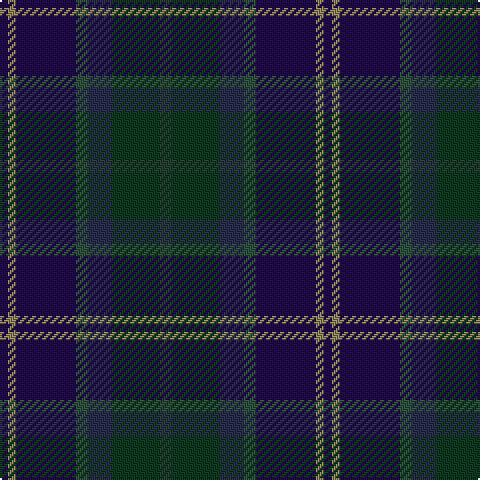

In pattern [BGBGBGB](/patterns/bgbgbgb/).

This was sourced from register-of-tartans.  It is a [7 stripes tartan](/stripes/stripes7/).

Original link https://www.tartanregister.gov.uk/tartanDetails.aspx?ref=10068

## Thread count
DBa/4 LT4 DBa30 N6 DB12 DG24 DN/6

## Palette
Each colour and its ΔE from the base-6 reference it is a variant of.

| Colour | Shade | Base | ΔE (OKLab) |
|---|---|---|---|
| DB | <code style="background-color:#282D4B;">#282D4B</code> `#282D4B` | B <code style="background-color:#2C4084;">#2C4084</code> | 0.11 |
| DBa | <code style="background-color:#200A4A;">#200A4A</code> `#200A4A` | B <code style="background-color:#2C4084;">#2C4084</code> | 0.17 |
| DG | <code style="background-color:#0E3820;">#0E3820</code> `#0E3820` | G <code style="background-color:#006400;">#006400</code> | 0.16 |
| DN | <code style="background-color:#233D30;">#233D30</code> `#233D30` | B <code style="background-color:#2C4084;">#2C4084</code> | 0.15 |
| LT | <code style="background-color:#8D815B;">#8D815B</code> `#8D815B` | G <code style="background-color:#006400;">#006400</code> | 0.21 |
| N | <code style="background-color:#2D503C;">#2D503C</code> `#2D503C` | G <code style="background-color:#006400;">#006400</code> | 0.10 |

# Sample pattern

ID: /setts/s7/b4g4b30ga6ba12gb24bb6-b200a4a-ba282d4b-bb233d30-g8d815b-ga2d503c-gb0e3820/
