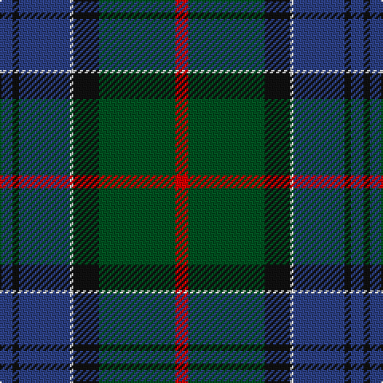

In pattern [BKBWKGR](/patterns/bkbwkgr/).

This was sourced from register-of-tartans.  It is a [7 stripes tartan](/stripes/stripes7/).

Original link https://www.tartanregister.gov.uk/tartanDetails.aspx?ref=714

## Register references

External register numbers recorded for this tartan.

- Scottish Register of Tartans: [714](https://www.tartanregister.gov.uk/tartanDetails.aspx?ref=714)
- Scottish Tartans World Register: 270

## Thread count
B/8 K4 B32 LN2 K16 G48 R/8

## Palette
Each colour and its ΔE from the base-6 reference it is a variant of.

| Colour | Shade | Base | ΔE (OKLab) |
|---|---|---|---|
| B | <code style="background-color:#2C4084;">#2C4084</code> `#2C4084` | B <code style="background-color:#2A418A;">#2A418A</code> | 0.01 |
| G | <code style="background-color:#005020;">#005020</code> `#005020` | G <code style="background-color:#006100;">#006100</code> | 0.07 |
| K | <code style="background-color:#101010;">#101010</code> `#101010` | K <code style="background-color:#000000;">#000000</code> | 0.17 |
| LN | <code style="background-color:#E0E0E0;">#E0E0E0</code> `#E0E0E0` | W <code style="background-color:#F7F7F7;">#F7F7F7</code> | 0.07 |
| R | <code style="background-color:#DC0000;">#DC0000</code> `#DC0000` | R <code style="background-color:#CC0000;">#CC0000</code> | 0.03 |

# Sample pattern

## Nearest tartans

The nearest existing variants by ΔTartan distance.

1. [Laurie Clan Tartan Tartan Number: 3201. Earliest known date: 2000 One of a set of three similar designs for Laurie, Lawrie and Lowry, designed by Peter MacDonald for Iain Laurie. See products available Copyright © Blair Urquhart, Comrie, 2015](/setts/s7/b6r2b1g25ba16k2ba4~b440044-ba2c2c80-g006818-k101010-rc80000~x2/) — ΔT 0.60
1. [Lawrie Clan Tartan Tartan Number: 3202. Earliest known date: 2000 One of a set of three similar designs for Laurie, Lawrie and Lowry, designed by Peter MacDonald for Iain Laurie. See products available Copyright © Blair Urquhart, Comrie, 2015](/setts/s7/b6r2b1g25ba16k2ba4~b440044-ba2c2c80-g006818-k101010-r945008~x2/) — ΔT 0.64
1. [Lowry](/setts/s7/b6y2b1g25ba16k2ba4~b440044-ba282878-g006438-k101010-yd8b000~x2/) — ΔT 0.71
1. [Lowry Clan Tartan Tartan Number: 3203. Earliest known date: 2000 One of a set of three similar designs for Laurie, Lawrie and Lowry, designed by Peter MacDonald for Iain Laurie. See products available Copyright © Blair Urquhart, Comrie, 2015](/setts/s7/b6y2b1g25ba16k2ba4~b440044-ba2c2c80-g006818-k101010-ye8c000~x2/) — ΔT 0.77
1. [Thomas of Craigie (Personal)](/setts/s8/y2k4y1g16k14b23k4r1~b202060-g285800-k101010-rc80000-ye8c000~x2/) — ΔT 0.86
1. [Chan (Name?)](/setts/s8/r2g13r2g13k13b30k1y2~b003c64-g285800-k101010-r880000-ye8c000~x2/) — ΔT 0.88
1. [Lochaber #2](/setts/s8/g3r1g18k20r1b18ba1g2~b2c4084-ba3c82af-g005020-k101010-rdc0000~x4/) — ΔT 0.92
1. [MacCaskill (Personal)](/setts/s7/k2r1g15k15b15y1k2~b2c2c80-g285800-k101010-rc80000-ye8c000~x2/) — ΔT 0.92
1. [Ogilvie of Inverarity - 1842 (V.S.)](/setts/s8/b28y1b2k26g24k1g2r3~b2c2c80-g006818-k101010-rc80000-ye8c000~x2/) — ΔT 0.93
1. [MacLaren Clan Tartan Tartan Number: 342. Earliest known date: pre 1820 The MacLaren differs from The Ferguson only in having a yellow line where the latter has a white. They share the unusual feature of an unbroken band of blue. The present tartan appears under this name in Mclan's plate for Clan MacLaren. The Wilsons of Bannockburn were producing it before 1820 - but only under the name of 'Regent'. The Regency ended when George IV succeeded the throne in that year, the name of the tartan then becoming outdated; but production of the sett continued, as we know from specimens attached to customers' orders for more. Writers of the period tell us that the demand around 1822 for Clan tartans exceeded the authentic supply, and that not only were new setts invented but pre-existing ones acquired new names. Our present tartan may have been one of the latter; no older MacLaren has come to light. (MacLaren Society) See products available Copyright © Blair Urquhart, Comrie, 2015](/setts/s7/b24k8g8r2g8k1y2~b2c2c80-g006818-k101010-rc80000-ye8c000~x2/) — ΔT 0.93

## Neighbour map

Every grey dot is one of 15726 variants placed by the first two principal components of the ΔTartan feature space (44% of its variance). Red is this tartan; blue dots are its nearest — click one to open its page.

<svg viewBox="0 0 640 380" role="img" style="max-width:100%;height:auto;border:1px solid #e0e0e0;border-radius:4px;display:block" xmlns="http://www.w3.org/2000/svg"><image href="/nn/cloud.v1.png" width="640" height="380"/><a href="/setts/s7/b6r2b1g25ba16k2ba4~b440044-ba2c2c80-g006818-k101010-rc80000~x2/"><circle cx="296.9" cy="160.1" r="4" fill="#3465a4"><title>Laurie Clan Tartan Tartan Number: 3201. Earliest known date: 2000 One of a set of three similar designs for Laurie, Lawrie and Lowry, designed by Peter MacDonald for Iain Laurie. See products available Copyright © Blair Urquhart, Comrie, 2015</title></circle></a><a href="/setts/s7/b6r2b1g25ba16k2ba4~b440044-ba2c2c80-g006818-k101010-r945008~x2/"><circle cx="301.9" cy="162.9" r="4" fill="#3465a4"><title>Lawrie Clan Tartan Tartan Number: 3202. Earliest known date: 2000 One of a set of three similar designs for Laurie, Lawrie and Lowry, designed by Peter MacDonald for Iain Laurie. See products available Copyright © Blair Urquhart, Comrie, 2015</title></circle></a><a href="/setts/s7/b6y2b1g25ba16k2ba4~b440044-ba282878-g006438-k101010-yd8b000~x2/"><circle cx="301.2" cy="162.7" r="4" fill="#3465a4"><title>Lowry</title></circle></a><a href="/setts/s7/b6y2b1g25ba16k2ba4~b440044-ba2c2c80-g006818-k101010-ye8c000~x2/"><circle cx="282.7" cy="155.1" r="4" fill="#3465a4"><title>Lowry Clan Tartan Tartan Number: 3203. Earliest known date: 2000 One of a set of three similar designs for Laurie, Lawrie and Lowry, designed by Peter MacDonald for Iain Laurie. See products available Copyright © Blair Urquhart, Comrie, 2015</title></circle></a><a href="/setts/s8/y2k4y1g16k14b23k4r1~b202060-g285800-k101010-rc80000-ye8c000~x2/"><circle cx="232.0" cy="159.7" r="4" fill="#3465a4"><title>Thomas of Craigie (Personal)</title></circle></a><a href="/setts/s8/r2g13r2g13k13b30k1y2~b003c64-g285800-k101010-r880000-ye8c000~x2/"><circle cx="281.6" cy="159.9" r="4" fill="#3465a4"><title>Chan (Name?)</title></circle></a><a href="/setts/s8/g3r1g18k20r1b18ba1g2~b2c4084-ba3c82af-g005020-k101010-rdc0000~x4/"><circle cx="260.4" cy="170.8" r="4" fill="#3465a4"><title>Lochaber #2</title></circle></a><a href="/setts/s7/k2r1g15k15b15y1k2~b2c2c80-g285800-k101010-rc80000-ye8c000~x2/"><circle cx="230.9" cy="186.3" r="4" fill="#3465a4"><title>MacCaskill (Personal)</title></circle></a><a href="/setts/s8/b28y1b2k26g24k1g2r3~b2c2c80-g006818-k101010-rc80000-ye8c000~x2/"><circle cx="242.3" cy="143.2" r="4" fill="#3465a4"><title>Ogilvie of Inverarity - 1842 (V.S.)</title></circle></a><a href="/setts/s7/b24k8g8r2g8k1y2~b2c2c80-g006818-k101010-rc80000-ye8c000~x2/"><circle cx="264.3" cy="158.1" r="4" fill="#3465a4"><title>MacLaren Clan Tartan Tartan Number: 342. Earliest known date: pre 1820 The MacLaren differs from The Ferguson only in having a yellow line where the latter has a white. They share the unusual feature of an unbroken band of blue. The present tartan appears under this name in Mclan's plate for Clan MacLaren. The Wilsons of Bannockburn were producing it before 1820 - but only under the name of 'Regent'. The Regency ended when George IV succeeded the throne in that year, the name of the tartan then becoming outdated; but production of the sett continued, as we know from specimens attached to customers' orders for more. Writers of the period tell us that the demand around 1822 for Clan tartans exceeded the authentic supply, and that not only were new setts invented but pre-existing ones acquired new names. Our present tartan may have been one of the latter; no older MacLaren has come to light. (MacLaren Society) See products available Copyright © Blair Urquhart, Comrie, 2015</title></circle></a><circle cx="262.6" cy="168.4" r="5" fill="#c00000"/></svg>

ID: /setts/s7/b4k2b16w1k8g24r4~b2c4084-g005020-k101010-rdc0000-we0e0e0~x2/
