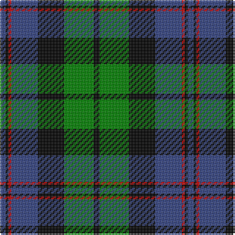

In pattern [BKRBKGK](/patterns/bkrbkgk/).

This was sourced from weddslist.  It is a [7 stripes tartan](/stripes/stripes7/).

Original link http://www.weddslist.com/cgi-bin/tartans/pg.pl?source=sts

## Thread count
B/4 K2 R2 B18 K18 G20 K/4

## Palette
Each colour and its ΔE from the base-6 reference it is a variant of.

| Colour | Shade | Base | ΔE (OKLab) |
|---|---|---|---|
| B | <code style="background-color:#304080;">#304080</code> `#304080` | B <code style="background-color:#2C4084;">#2C4084</code> | 0.01 |
| G | <code style="background-color:#008000;">#008000</code> `#008000` | G <code style="background-color:#006400;">#006400</code> | 0.09 |
| K | <code style="background-color:#000000;">#000000</code> `#000000` | K <code style="background-color:#000000;">#000000</code> | 0.00 |
| R | <code style="background-color:#C00000;">#C00000</code> `#C00000` | R <code style="background-color:#C80000;">#C80000</code> | 0.02 |

# Sample pattern

## Nearest tartans

The nearest existing variants by ΔTartan distance.

1. [Unnamed, No 59](/setts/s6/b2ba22k22g22k4b2-b5480b0-ba304080-g008000-k000000/) — ΔT 0.42
1. [Black Watch](/setts/s7/r8k8b48k48g48k4r6-b304080-g008000-k000000-rc00000/) — ΔT 0.50
1. [Ferguson of Balquhidder](/setts/s6/g4b24r2k24g24k4-b304080-g008000-k000000-rc00000/) — ΔT 0.52
1. [Gunn](/setts/s6/r4g24k24g2b24g2-b304080-g008000-k000000-rc00000/) — ΔT 0.55
1. [Ferguson](/setts/s6/g8b48r6k48g50k8-b304080-g008000-k000000-rc00000/) — ΔT 0.56
1. [MacNeil 1](/setts/s6/w4b36k36g36k8w4-b304080-g008000-k000000-we0e0e0/) — ΔT 0.61
1. [National Galleries, of Scotland](/setts/s7/k14g44k44b12r4b30r4-b000050-g008000-k000000-rc00000/) — ΔT 0.64
1. [Blair](/setts/s7/b12r4b40k32g40r4g12-b304080-g008000-k000000-rc00000/) — ΔT 0.65
1. [Unnamed, No 115](/setts/s8/b20k12ba2g12k2g12ba2k12-b304080-ba5480b0-g008000-k000000/) — ΔT 0.66
1. [Lamont](/setts/s8/b20k2b2k2b4k16g20w2-b304080-g008000-k000000-we0e0e0/) — ΔT 0.68

## Neighbour map

Every grey dot is one of 15726 variants placed by the first two principal components of the ΔTartan feature space (44% of its variance). Red is this tartan; blue dots are its nearest — click one to open its page.

<svg viewBox="0 0 640 380" role="img" style="max-width:100%;height:auto;border:1px solid #e0e0e0;border-radius:4px;display:block" xmlns="http://www.w3.org/2000/svg"><image href="/nn/cloud.v1.png" width="640" height="380"/><a href="/setts/s6/b2ba22k22g22k4b2-b5480b0-ba304080-g008000-k000000/"><circle cx="163.5" cy="210.8" r="4" fill="#3465a4"><title>Unnamed, No 59</title></circle></a><a href="/setts/s7/r8k8b48k48g48k4r6-b304080-g008000-k000000-rc00000/"><circle cx="166.1" cy="192.7" r="4" fill="#3465a4"><title>Black Watch</title></circle></a><a href="/setts/s6/g4b24r2k24g24k4-b304080-g008000-k000000-rc00000/"><circle cx="167.6" cy="210.4" r="4" fill="#3465a4"><title>Ferguson of Balquhidder</title></circle></a><a href="/setts/s6/r4g24k24g2b24g2-b304080-g008000-k000000-rc00000/"><circle cx="169.2" cy="204.7" r="4" fill="#3465a4"><title>Gunn</title></circle></a><a href="/setts/s6/g8b48r6k48g50k8-b304080-g008000-k000000-rc00000/"><circle cx="151.5" cy="224.2" r="4" fill="#3465a4"><title>Ferguson</title></circle></a><a href="/setts/s6/w4b36k36g36k8w4-b304080-g008000-k000000-we0e0e0/"><circle cx="142.8" cy="216.1" r="4" fill="#3465a4"><title>MacNeil 1</title></circle></a><a href="/setts/s7/k14g44k44b12r4b30r4-b000050-g008000-k000000-rc00000/"><circle cx="173.2" cy="211.4" r="4" fill="#3465a4"><title>National Galleries, of Scotland</title></circle></a><a href="/setts/s7/b12r4b40k32g40r4g12-b304080-g008000-k000000-rc00000/"><circle cx="163.7" cy="212.0" r="4" fill="#3465a4"><title>Blair</title></circle></a><a href="/setts/s8/b20k12ba2g12k2g12ba2k12-b304080-ba5480b0-g008000-k000000/"><circle cx="142.4" cy="213.3" r="4" fill="#3465a4"><title>Unnamed, No 115</title></circle></a><a href="/setts/s8/b20k2b2k2b4k16g20w2-b304080-g008000-k000000-we0e0e0/"><circle cx="180.2" cy="188.0" r="4" fill="#3465a4"><title>Lamont</title></circle></a><circle cx="166.1" cy="206.3" r="5" fill="#c00000"/></svg>

ID: /setts/s7/b4k2r2b18k18g20k4-b304080-g008000-k000000-rc00000/
