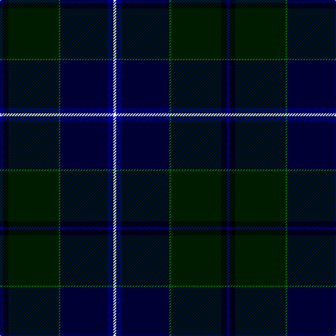

In pattern [BKKGKBW](/patterns/bkkgkbw/).

This was sourced from register-of-tartans.  It is a [7 stripes tartan](/stripes/stripes7/).

Original link https://www.tartanregister.gov.uk/tartanDetails.aspx?ref=3351

## Attestations

This cloth appears in 2 source records; the oldest owns this page.

- 01/01/1999 — Police College Tulliallan (register-of-tartans, [record](https://www.tartanregister.gov.uk/tartanDetails.aspx?ref=3351))
- 1999 — Police College Tulliallan (Corporate (tartans-authority, [record](http://www.tartansauthority.com/tartan-ferret/display/4231/))

## Thread count
DB/4 K8 DG72 G2 DBa68 DB8 W/4

## Palette
Each colour and its ΔE from the base-6 reference it is a variant of.

| Colour | Shade | Base | ΔE (OKLab) |
|---|---|---|---|
| DB | <code style="background-color:#00008C;">#00008C</code> `#00008C` | B <code style="background-color:#2C4084;">#2C4084</code> | 0.13 |
| DBa | <code style="background-color:#000034;">#000034</code> `#000034` | K <code style="background-color:#000000;">#000000</code> | 0.18 |
| DG | <code style="background-color:#001C00;">#001C00</code> `#001C00` | K <code style="background-color:#000000;">#000000</code> | 0.21 |
| G | <code style="background-color:#007800;">#007800</code> `#007800` | G <code style="background-color:#006400;">#006400</code> | 0.06 |
| K | <code style="background-color:#000000;">#000000</code> `#000000` | K <code style="background-color:#000000;">#000000</code> | 0.00 |
| W | <code style="background-color:#FCFCFC;">#FCFCFC</code> `#FCFCFC` | W <code style="background-color:#F4F4F0;">#F4F4F0</code> | 0.03 |

# Sample pattern

## Nearest tartans

The nearest existing variants by ΔTartan distance.

1. [Chesters, Eric (Personal)](/setts/s7/k24g16y2ga26w2b62k16-b000064-g006818-ga003c14-k101010-w98c8e8-yfccc00/) — ΔT 1.37
1. [Scotland the Brave](/setts/s10/k12w2k80b2ka24g24b12g4ba4g8-b800080-ba800070-g003000-k000030-ka000000-we0e0e0/) — ΔT 1.40
1. [Downs (Name)](/setts/s8/b20y4k4b2k36y2k90y4-b1474b4-k101010-ya0a0a0/) — ΔT 1.43
1. [Nova Scotia Int. Tattoo (Corporate)](/setts/s7/b6ba4b42k24g48r2y6-b000054-ba787ca8-g003820-k101010-rc80000-ybc8c00/) — ΔT 1.43
1. [Muir-Hill (Personal)](/setts/s7/w4k4r2b40k30g60y2-b003c64-g003820-k101010-rc80000-we0e0e0-yfccc00/) — ΔT 1.44
1. [Pictou County](/setts/s8/b46w2r6w2b24y18g80b6-b181034-g003c28-r700014-wfcf8ec-yb0840c/) — ΔT 1.47
1. [Singh, Gopal (Personal)](/setts/s6/k20r8b68ba68k2y6-b002814-ba000048-k000000-rfa4b00-yd87c00/) — ΔT 1.48
1. [Royal Highland Yacht Club](/setts/s11/k52b6k2ba4k2b6k6b24g28k4w4-b141e46-ba840068-g003c14-k000028-we0e0e0/) — ΔT 1.51
1. [Sidey Family Tartan (Name)](/setts/s10/b8w2k4b50k24ba2k4g32k4r2-b202060-ba1474b4-g006818-k101010-rc80000-we0e0e0/) — ΔT 1.52
1. [Highland Pride of Scotland (Fashion)](/setts/s11/b18g4ba4bb4g36ba4k4g2k38b66w4-b202060-ba780078-bb440044-g285800-k101010-we0e0e0/) — ΔT 1.54

## Neighbour map

Every grey dot is one of 15726 variants placed by the first two principal components of the ΔTartan feature space (44% of its variance). Red is this tartan; blue dots are its nearest — click one to open its page.

<svg viewBox="0 0 640 380" role="img" style="max-width:100%;height:auto;border:1px solid #e0e0e0;border-radius:4px;display:block" xmlns="http://www.w3.org/2000/svg"><image href="/nn/cloud.v1.png" width="640" height="380"/><a href="/setts/s7/k24g16y2ga26w2b62k16-b000064-g006818-ga003c14-k101010-w98c8e8-yfccc00/"><circle cx="247.2" cy="156.7" r="4" fill="#3465a4"><title>Chesters, Eric (Personal)</title></circle></a><a href="/setts/s10/k12w2k80b2ka24g24b12g4ba4g8-b800080-ba800070-g003000-k000030-ka000000-we0e0e0/"><circle cx="339.2" cy="107.6" r="4" fill="#3465a4"><title>Scotland the Brave</title></circle></a><a href="/setts/s8/b20y4k4b2k36y2k90y4-b1474b4-k101010-ya0a0a0/"><circle cx="372.3" cy="106.9" r="4" fill="#3465a4"><title>Downs (Name)</title></circle></a><a href="/setts/s7/b6ba4b42k24g48r2y6-b000054-ba787ca8-g003820-k101010-rc80000-ybc8c00/"><circle cx="239.1" cy="164.7" r="4" fill="#3465a4"><title>Nova Scotia Int. Tattoo (Corporate)</title></circle></a><a href="/setts/s7/w4k4r2b40k30g60y2-b003c64-g003820-k101010-rc80000-we0e0e0-yfccc00/"><circle cx="284.9" cy="152.2" r="4" fill="#3465a4"><title>Muir-Hill (Personal)</title></circle></a><a href="/setts/s8/b46w2r6w2b24y18g80b6-b181034-g003c28-r700014-wfcf8ec-yb0840c/"><circle cx="288.3" cy="118.3" r="4" fill="#3465a4"><title>Pictou County</title></circle></a><a href="/setts/s6/k20r8b68ba68k2y6-b002814-ba000048-k000000-rfa4b00-yd87c00/"><circle cx="276.2" cy="162.7" r="4" fill="#3465a4"><title>Singh, Gopal (Personal)</title></circle></a><a href="/setts/s11/k52b6k2ba4k2b6k6b24g28k4w4-b141e46-ba840068-g003c14-k000028-we0e0e0/"><circle cx="317.9" cy="144.9" r="4" fill="#3465a4"><title>Royal Highland Yacht Club</title></circle></a><a href="/setts/s10/b8w2k4b50k24ba2k4g32k4r2-b202060-ba1474b4-g006818-k101010-rc80000-we0e0e0/"><circle cx="268.6" cy="123.1" r="4" fill="#3465a4"><title>Sidey Family Tartan (Name)</title></circle></a><a href="/setts/s11/b18g4ba4bb4g36ba4k4g2k38b66w4-b202060-ba780078-bb440044-g285800-k101010-we0e0e0/"><circle cx="290.2" cy="112.1" r="4" fill="#3465a4"><title>Highland Pride of Scotland (Fashion)</title></circle></a><circle cx="314.8" cy="137.4" r="5" fill="#c00000"/></svg>

ID: /setts/s7/b4k8ka72g2kb68b8w4-b00008c-g007800-k000000-ka001c00-kb000034-wfcfcfc/
