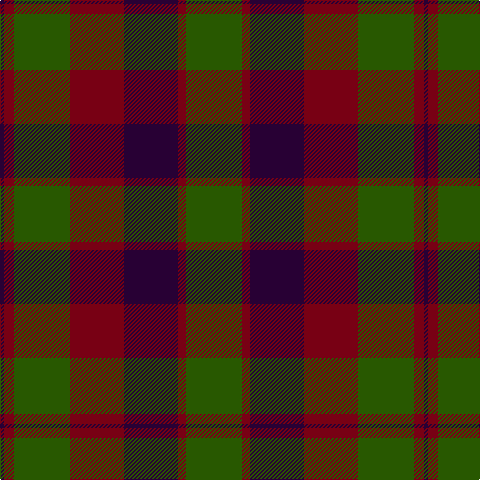

In pattern [BRGRBRG](/patterns/brgrbrg/).

This was sourced from tartans-authority.  It is a [7 stripes tartan](/stripes/stripes7/).

Original link http://www.tartansauthority.com/tartan-ferret/display/5693/

## Thread count
DP/4 DR10 G56 DR54 DP54 DR8 G/56

## Palette
Each colour and its ΔE from the base-6 reference it is a variant of.

| Colour | Shade | Base | ΔE (OKLab) |
|---|---|---|---|
| DP | <code style="background-color:#280034;">#280034</code> `#280034` | B <code style="background-color:#2C4084;">#2C4084</code> | 0.21 |
| DR | <code style="background-color:#780014;">#780014</code> `#780014` | R <code style="background-color:#C80000;">#C80000</code> | 0.18 |
| G | <code style="background-color:#285800;">#285800</code> `#285800` | G <code style="background-color:#006400;">#006400</code> | 0.04 |

# Sample pattern

ID: /setts/s7/b4r10g56r54b54r8g56-b280034-g285800-r780014/
