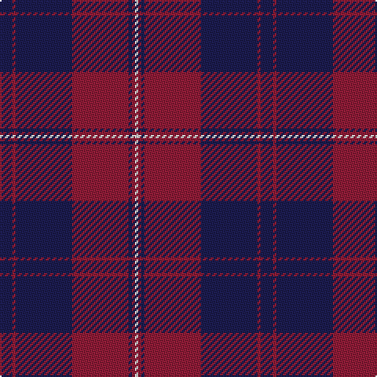

In pattern [BRBRBRW](/patterns/brbrbrw/).

This was sourced from tartans-authority.  It is a [7 stripes tartan](/stripes/stripes7/).

Original link http://www.tartansauthority.com/tartan-ferret/display/8148/

## Thread count
DB/8 DR2 DB36 DR36 DB2 DR2 LN/2

## Palette
Each colour and its ΔE from the base-6 reference it is a variant of.

| Colour | Shade | Base | ΔE (OKLab) |
|---|---|---|---|
| DB | <code style="background-color:#1C1C50;">#1C1C50</code> `#1C1C50` | B <code style="background-color:#2A418A;">#2A418A</code> | 0.14 |
| DR | <code style="background-color:#901C38;">#901C38</code> `#901C38` | R <code style="background-color:#CC0000;">#CC0000</code> | 0.13 |
| LN | <code style="background-color:#E0E0E0;">#E0E0E0</code> `#E0E0E0` | W <code style="background-color:#F7F7F7;">#F7F7F7</code> | 0.07 |

# Sample pattern

## Nearest tartans

The nearest existing variants by ΔTartan distance.

1. [Breckon](/setts/s9/b3r1b14ra14r1ra1r1ra1b2~b000064-ra88000-ra800000~x4/) — ΔT 1.38
1. [Greater Victoria Police PB (Corp)](/setts/s7/r7b1r26b31w1b1w2~b14283c-r880000-we0e0e0~x2/) — ΔT 1.46
1. [POF (Fashion)](/setts/s9/b27ba8b14ba8b14ba26r84ba6r12~b1474b4-ba1c1c50-r901c38/) — ΔT 1.49
1. [Breckon (Name)](/setts/s9/k3r1k14ra14r1ra1r1ra1k2~k000040-ra88000-ra800000~x4/) — ΔT 1.54
1. [MacGregor, Modern](/setts/s6/b18r9b2r3k1ra1~b1c1c50-k101010-rc80000-ra888888~x4/) — ΔT 1.55
1. [Unidentified Plaid 8](/setts/s8/b3r64b3r3b62r3b3r3~b304080-rc00000/) — ΔT 1.58
1. [Perthshire Tourist Board (Corporate)](/setts/s6/b26r6g16b8g3r2~b500048-g006818-r880000~x2/) — ΔT 1.60
1. [Keepers of the Quaich](/setts/s6/y3g33b24g2b2g2~b2c2c80-g604000-yd09800~x2/) — ΔT 1.64
1. [Keeper of the Quaich Corporate Tartan Tartan Number: 1731. Earliest known date: 1988 Restricted. Sample in STS collection. See products available Copyright © Blair Urquhart, Comrie, 2015](/setts/s6/b3ba3b3ba27b40y3~b4c2424-ba2c2c80-ye8c000/) — ΔT 1.65
1. [MacQueen, variant](/setts/s6/b2r7b2r7b22y2~b304080-rc00000-yf0c000~x2/) — ΔT 1.67

## Neighbour map

Every grey dot is one of 15726 variants placed by the first two principal components of the ΔTartan feature space (44% of its variance). Red is this tartan; blue dots are its nearest — click one to open its page.

<svg viewBox="0 0 640 380" role="img" style="max-width:100%;height:auto;border:1px solid #e0e0e0;border-radius:4px;display:block" xmlns="http://www.w3.org/2000/svg"><image href="/nn/cloud.v1.png" width="640" height="380"/><a href="/setts/s9/b3r1b14ra14r1ra1r1ra1b2~b000064-ra88000-ra800000~x4/"><circle cx="355.4" cy="179.8" r="4" fill="#3465a4"><title>Breckon</title></circle></a><a href="/setts/s7/r7b1r26b31w1b1w2~b14283c-r880000-we0e0e0~x2/"><circle cx="409.7" cy="167.9" r="4" fill="#3465a4"><title>Greater Victoria Police PB (Corp)</title></circle></a><a href="/setts/s9/b27ba8b14ba8b14ba26r84ba6r12~b1474b4-ba1c1c50-r901c38/"><circle cx="338.0" cy="194.3" r="4" fill="#3465a4"><title>POF (Fashion)</title></circle></a><a href="/setts/s9/k3r1k14ra14r1ra1r1ra1k2~k000040-ra88000-ra800000~x4/"><circle cx="354.5" cy="179.6" r="4" fill="#3465a4"><title>Breckon (Name)</title></circle></a><a href="/setts/s6/b18r9b2r3k1ra1~b1c1c50-k101010-rc80000-ra888888~x4/"><circle cx="389.4" cy="177.9" r="4" fill="#3465a4"><title>MacGregor, Modern</title></circle></a><a href="/setts/s8/b3r64b3r3b62r3b3r3~b304080-rc00000/"><circle cx="453.9" cy="175.2" r="4" fill="#3465a4"><title>Unidentified Plaid 8</title></circle></a><a href="/setts/s6/b26r6g16b8g3r2~b500048-g006818-r880000~x2/"><circle cx="377.9" cy="237.7" r="4" fill="#3465a4"><title>Perthshire Tourist Board (Corporate)</title></circle></a><a href="/setts/s6/y3g33b24g2b2g2~b2c2c80-g604000-yd09800~x2/"><circle cx="439.7" cy="216.7" r="4" fill="#3465a4"><title>Keepers of the Quaich</title></circle></a><a href="/setts/s6/b3ba3b3ba27b40y3~b4c2424-ba2c2c80-ye8c000/"><circle cx="456.7" cy="233.1" r="4" fill="#3465a4"><title>Keeper of the Quaich Corporate Tartan Tartan Number: 1731. Earliest known date: 1988 Restricted. Sample in STS collection. See products available Copyright © Blair Urquhart, Comrie, 2015</title></circle></a><a href="/setts/s6/b2r7b2r7b22y2~b304080-rc00000-yf0c000~x2/"><circle cx="406.5" cy="217.4" r="4" fill="#3465a4"><title>MacQueen, variant</title></circle></a><circle cx="421.7" cy="194.2" r="5" fill="#c00000"/></svg>

ID: /setts/s7/b4r1b18r18b1r1w1~b1c1c50-r901c38-we0e0e0~x2/
