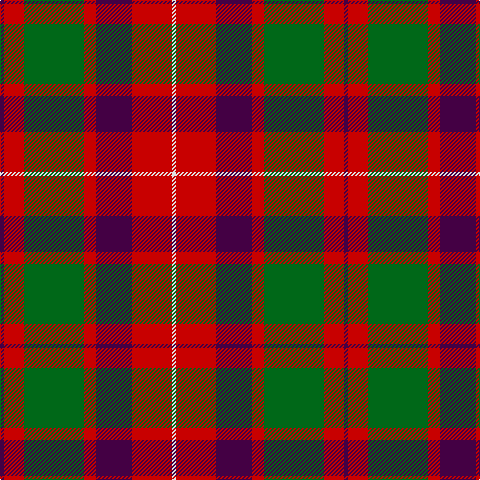

In pattern [BRGRBRW](/patterns/brgrbrw/).

This was sourced from register-of-tartans.  It is a [7 stripes tartan](/stripes/stripes7/).

Original link https://www.tartanregister.gov.uk/tartanDetails.aspx?ref=1325

## Attestations

This cloth appears in 2 source records; the oldest owns this page.

- 01/01/1840 — Geddes (register-of-tartans, [record](https://www.tartanregister.gov.uk/tartanDetails.aspx?ref=1325))
- 1840 — Geddes (Clan) (tartans-authority, [record](http://www.tartansauthority.com/tartan-ferret/display/4969/))

## Thread count
DP/4 R20 G60 R12 DP36 R40 LN/4

## Palette
Each colour and its ΔE from the base-6 reference it is a variant of.

| Colour | Shade | Base | ΔE (OKLab) |
|---|---|---|---|
| DP | <code style="background-color:#440044;">#440044</code> `#440044` | B <code style="background-color:#2C4084;">#2C4084</code> | 0.17 |
| G | <code style="background-color:#006818;">#006818</code> `#006818` | G <code style="background-color:#006400;">#006400</code> | 0.02 |
| LN | <code style="background-color:#E0E0E0;">#E0E0E0</code> `#E0E0E0` | W <code style="background-color:#F4F4F0;">#F4F4F0</code> | 0.06 |
| R | <code style="background-color:#C80000;">#C80000</code> `#C80000` | R <code style="background-color:#C80000;">#C80000</code> | 0.00 |

# Sample pattern

ID: /setts/s7/b4r20g60r12b36r40w4-b440044-g006818-rc80000-we0e0e0/
