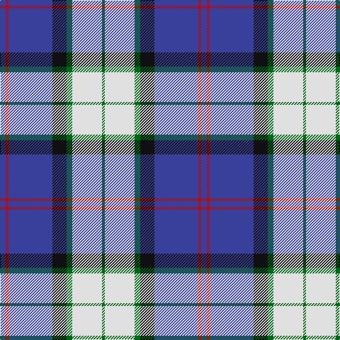

In pattern [BRBKGWG](/patterns/brbkgwg/).

This was sourced from tartans-authority.  It is a [7 stripes tartan](/stripes/stripes7/).

Original link http://www.tartansauthority.com/tartan-ferret/display/2434/

## Thread count
B/8 R4 B62 K20 G8 LN42 G/4

## Palette
Each colour and its ΔE from the base-6 reference it is a variant of.

| Colour | Shade | Base | ΔE (OKLab) |
|---|---|---|---|
| B | <code style="background-color:#38409C;">#38409C</code> `#38409C` | B <code style="background-color:#2A418A;">#2A418A</code> | 0.04 |
| G | <code style="background-color:#006818;">#006818</code> `#006818` | G <code style="background-color:#006100;">#006100</code> | 0.02 |
| K | <code style="background-color:#101010;">#101010</code> `#101010` | K <code style="background-color:#000000;">#000000</code> | 0.17 |
| LN | <code style="background-color:#E0E0E0;">#E0E0E0</code> `#E0E0E0` | W <code style="background-color:#F7F7F7;">#F7F7F7</code> | 0.07 |
| R | <code style="background-color:#C80000;">#C80000</code> `#C80000` | R <code style="background-color:#CC0000;">#CC0000</code> | 0.01 |

# Sample pattern

## Nearest tartans

The nearest existing variants by ΔTartan distance.

1. [Sinclair dress](/setts/s7/b2r1b16k5g2w11g1~b304080-g008000-k000000-rc00000-we0e0e0~x4/) — ΔT 0.57
1. [Arran, (Navy)](/setts/s8/b12k1b1k1b1ba8w9g2~b5480b0-ba000050-g808080-k000000-we0e0e0~x4/) — ΔT 0.94
1. [Afternoon Tea / Earl Grey](/setts/s6/r15b98ba72y25ba8w15~b5c8ca8-ba202060-rc80000-wfcfcfc-yfccc00/) — ΔT 0.96
1. [Loch Ness in Scotland](/setts/s7/g2b14y6ya1g1ya6r1~b000064-g289c18-rc8002c-y48a4c0-yaa0a0a0~x4/) — ΔT 0.96
1. [Comrie, Navy Blue (Dance)](/setts/s8/b42ba2w2ba2b5k12w32bb4~b003c64-ba2888c4-bb1c0070-k101010-wf0e0c8~x2/) — ΔT 0.97
1. [Clunie (Personal)](/setts/s6/w12b48k13r22k3y6~b202060-k101010-r888888-wf8f8f8-ye8c000/) — ΔT 0.97
1. [Arran (Pendleton)](/setts/s8/b12k1b1k1b1ba8w9g2~b3c82af-ba080848-g808080-k101010-we0e0e0~x4/) — ΔT 0.99
1. [Eildon/Longniddry Blue Dress Fashion Tartan Tartan Number: 4799. Earliest known date: 01/01/1980 A Dancers' Fancy from Dalgliesh. This appears under three different names - Longniddry #5486, Eildon #4799 and Harmony Eildon #87 (original Scottish Tartans Authority references). Needs resolving. Sample in Scottish Tartans Authority's Dalgety Collection. /Threadcount and colours aren't 100% original. Generated manually./ See products available Copyright © Blair Urquhart, Comrie, 2015](/setts/s8/b30ba2w2ba2b4bb10w25b4~b202060-ba2888c4-bb5c8ca8-we0e0e0~x2/) — ΔT 1.02
1. [Ferguson Dress #2](/setts/s7/b68k42w32r5w32g4w6~b2c4084-g002814-k101010-r960028-we0e0e0/) — ΔT 1.10
1. [Herriot New Zealand](/setts/s6/w15y2k5wa3b40k10~b006699-k000033-wffffff-wac0c0c0-yffff33/) — ΔT 1.12

## Neighbour map

Every grey dot is one of 15726 variants placed by the first two principal components of the ΔTartan feature space (44% of its variance). Red is this tartan; blue dots are its nearest — click one to open its page.

<svg viewBox="0 0 640 380" role="img" style="max-width:100%;height:auto;border:1px solid #e0e0e0;border-radius:4px;display:block" xmlns="http://www.w3.org/2000/svg"><image href="/nn/cloud.v1.png" width="640" height="380"/><a href="/setts/s7/b2r1b16k5g2w11g1~b304080-g008000-k000000-rc00000-we0e0e0~x4/"><circle cx="206.8" cy="141.9" r="4" fill="#3465a4"><title>Sinclair dress</title></circle></a><a href="/setts/s8/b12k1b1k1b1ba8w9g2~b5480b0-ba000050-g808080-k000000-we0e0e0~x4/"><circle cx="150.6" cy="146.5" r="4" fill="#3465a4"><title>Arran, (Navy)</title></circle></a><a href="/setts/s6/r15b98ba72y25ba8w15~b5c8ca8-ba202060-rc80000-wfcfcfc-yfccc00/"><circle cx="183.1" cy="169.4" r="4" fill="#3465a4"><title>Afternoon Tea / Earl Grey</title></circle></a><a href="/setts/s7/g2b14y6ya1g1ya6r1~b000064-g289c18-rc8002c-y48a4c0-yaa0a0a0~x4/"><circle cx="196.3" cy="156.2" r="4" fill="#3465a4"><title>Loch Ness in Scotland</title></circle></a><a href="/setts/s8/b42ba2w2ba2b5k12w32bb4~b003c64-ba2888c4-bb1c0070-k101010-wf0e0c8~x2/"><circle cx="227.3" cy="117.5" r="4" fill="#3465a4"><title>Comrie, Navy Blue (Dance)</title></circle></a><a href="/setts/s6/w12b48k13r22k3y6~b202060-k101010-r888888-wf8f8f8-ye8c000/"><circle cx="194.5" cy="162.1" r="4" fill="#3465a4"><title>Clunie (Personal)</title></circle></a><a href="/setts/s8/b12k1b1k1b1ba8w9g2~b3c82af-ba080848-g808080-k101010-we0e0e0~x4/"><circle cx="154.7" cy="148.3" r="4" fill="#3465a4"><title>Arran (Pendleton)</title></circle></a><a href="/setts/s8/b30ba2w2ba2b4bb10w25b4~b202060-ba2888c4-bb5c8ca8-we0e0e0~x2/"><circle cx="241.0" cy="150.0" r="4" fill="#3465a4"><title>Eildon/Longniddry Blue Dress Fashion Tartan Tartan Number: 4799. Earliest known date: 01/01/1980 A Dancers' Fancy from Dalgliesh. This appears under three different names - Longniddry #5486, Eildon #4799 and Harmony Eildon #87 (original Scottish Tartans Authority references). Needs resolving. Sample in Scottish Tartans Authority's Dalgety Collection. /Threadcount and colours aren't 100% original. Generated manually./ See products available Copyright © Blair Urquhart, Comrie, 2015</title></circle></a><a href="/setts/s7/b68k42w32r5w32g4w6~b2c4084-g002814-k101010-r960028-we0e0e0/"><circle cx="157.0" cy="150.3" r="4" fill="#3465a4"><title>Ferguson Dress #2</title></circle></a><a href="/setts/s6/w15y2k5wa3b40k10~b006699-k000033-wffffff-wac0c0c0-yffff33/"><circle cx="248.8" cy="141.1" r="4" fill="#3465a4"><title>Herriot New Zealand</title></circle></a><circle cx="210.7" cy="145.1" r="5" fill="#c00000"/></svg>

ID: /setts/s7/b4r2b31k10g4w21g2~b38409c-g006818-k101010-rc80000-we0e0e0~x2/
