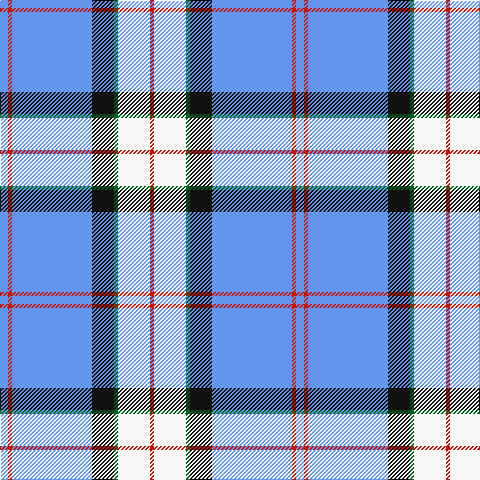

In pattern [BRBKGWR](/stripes/brbkgwr/).

This was sourced from register-of-tartans.  It is a [7 stripe tartan](/stripes/stripes7/).

Original link https://www.tartanregister.gov.uk/tartanDetails.aspx?ref=3793

## Register references

External register numbers recorded for this tartan.

- Scottish Register of Tartans: [3793](https://www.tartanregister.gov.uk/tartanDetails.aspx?ref=3793)
- Scottish Tartans Authority (ITI): 2047
- Scottish Tartans World Register: 2047

## Thread count
B/8 R4 B80 K22 G4 W32 R/4

## Palette
Each colour and the base-6 reference it is a variant of.

| Colour | Shade | Base |
|---|---|---|
| B | <code style="background-color:#6495ED;">#6495ED</code> `oklch(67.5% 0.141 261.3)` <small>#6495ED</small> | B <code style="background-color:#2A418A;">#2A418A</code> |
| G | <code style="background-color:#006818;">#006818</code> `oklch(45.0% 0.142 145.0)` <small>#006818</small> | G <code style="background-color:#006100;">#006100</code> |
| K | <code style="background-color:#101010;">#101010</code> `oklch(17.3% 0.000 89.9)` <small>#101010</small> | K <code style="background-color:#000000;">#000000</code> |
| N | <code style="background-color:#C0C0C0;">#C0C0C0</code> `oklch(80.8% 0.000 89.9)` <small>#C0C0C0</small> | W <code style="background-color:#F7F7F7;">#F7F7F7</code> |
| R | <code style="background-color:#CC1100;">#CC1100</code> `oklch(53.5% 0.214 30.2)` <small>#CC1100</small> | R <code style="background-color:#CC0000;">#CC0000</code> |
| W | <code style="background-color:#F8F8F8;">#F8F8F8</code> `oklch(97.9% 0.000 89.9)` <small>#F8F8F8</small> | W <code style="background-color:#F7F7F7;">#F7F7F7</code> |

# Sample pattern

## Nearest tartans

The nearest existing variants by ΔTartan distance.

1. [Mount Vernon Primary School](/setts/s5/lt25db11r5w1k1~x4/) — ΔT 0.91
1. [Mount Vernon Primary School (Corp)](/setts/s5/lb25db11r5w1k1~x4/) — ΔT 0.97
1. [Harmony, Eildon](/setts/s8/db41t2w2t2db5b12w31db4~x2/) — ΔT 1.16
1. [Gothenburg](/setts/s7/b26w28b14ly3k1ly2k1~x2/) — ΔT 1.19
1. [Harmony Eildon (Dance)](/setts/s8/db41t2w2t2db5t12w31db4~x2/) — ΔT 1.25
1. [Torridon, Saphire (Dance)](/setts/s7/w3db2w30db30k2db2ly3~x2/) — ΔT 1.26
1. [Herriot New Zealand](/setts/s6/w15ly2k5lb3b40k10/) — ΔT 1.27
1. [Gothenburg/Goteborg](/setts/s7/db26w28db14ly3k1ly2k1~x2/) — ΔT 1.28
1. [Bell Family Tartan Tartan Number: 1489. Earliest known date: 1984 Designed for William H. Bell, Colonel, USAF Ret., President of the Bell Family Association of the United States (Clan Bell). The Bells are one of the eight great riding Clans of the Borders. See products available Copyright © Blair Urquhart, Comrie, 2015](/setts/s9/r3g2k9lb2k2lb24ly2lb2ly1~x2/) — ΔT 1.32
1. [Cunningham, Dress Blue (Dance) Fashion Tartan Tartan Number: 4642. Earliest known date: 01/01/2002 Like so many of the invented 'Dance' tartans this one is not known by the relevant Clan Cunningham Association (USA). /Threadcount and colours aren't 100% original. Generated manually./ See products available Copyright © Blair Urquhart, Comrie, 2015](/setts/s7/t2db1k1db20w20db1w2~x4/) — ΔT 1.35

## Neighbour map

Every grey dot is one of 14299 variants placed by the first two principal components of the ΔTartan feature space (44% of its variance). Red is this tartan; blue dots are its nearest — click one to open its page.

<svg viewBox="0 0 640 380" role="img" style="max-width:100%;height:auto;border:1px solid #e0e0e0;border-radius:4px;display:block" xmlns="http://www.w3.org/2000/svg"><image href="/nn/cloud.v1.png" width="640" height="380"/><a href="/setts/s5/lt25db11r5w1k1~x4/"><circle cx="300.9" cy="132.8" r="4" fill="#3465a4"><title>Mount Vernon Primary School</title></circle></a><a href="/setts/s5/lb25db11r5w1k1~x4/"><circle cx="315.2" cy="135.8" r="4" fill="#3465a4"><title>Mount Vernon Primary School (Corp)</title></circle></a><a href="/setts/s8/db41t2w2t2db5b12w31db4~x2/"><circle cx="286.7" cy="135.3" r="4" fill="#3465a4"><title>Harmony, Eildon</title></circle></a><a href="/setts/s7/b26w28b14ly3k1ly2k1~x2/"><circle cx="313.4" cy="134.0" r="4" fill="#3465a4"><title>Gothenburg</title></circle></a><a href="/setts/s8/db41t2w2t2db5t12w31db4~x2/"><circle cx="279.3" cy="133.8" r="4" fill="#3465a4"><title>Harmony Eildon (Dance)</title></circle></a><a href="/setts/s7/w3db2w30db30k2db2ly3~x2/"><circle cx="239.6" cy="121.8" r="4" fill="#3465a4"><title>Torridon, Saphire (Dance)</title></circle></a><a href="/setts/s6/w15ly2k5lb3b40k10/"><circle cx="252.3" cy="138.4" r="4" fill="#3465a4"><title>Herriot New Zealand</title></circle></a><a href="/setts/s7/db26w28db14ly3k1ly2k1~x2/"><circle cx="309.0" cy="132.3" r="4" fill="#3465a4"><title>Gothenburg/Goteborg</title></circle></a><a href="/setts/s9/r3g2k9lb2k2lb24ly2lb2ly1~x2/"><circle cx="319.2" cy="91.6" r="4" fill="#3465a4"><title>Bell Family Tartan Tartan Number: 1489. Earliest known date: 1984 Designed for William H. Bell, Colonel, USAF Ret., President of the Bell Family Association of the United States (Clan Bell). The Bells are one of the eight great riding Clans of the Borders. See products available Copyright © Blair Urquhart, Comrie, 2015</title></circle></a><a href="/setts/s7/t2db1k1db20w20db1w2~x4/"><circle cx="289.3" cy="128.7" r="4" fill="#3465a4"><title>Cunningham, Dress Blue (Dance) Fashion Tartan Tartan Number: 4642. Earliest known date: 01/01/2002 Like so many of the invented 'Dance' tartans this one is not known by the relevant Clan Cunningham Association (USA). /Threadcount and colours aren't 100% original. Generated manually./ See products available Copyright © Blair Urquhart, Comrie, 2015</title></circle></a><circle cx="287.2" cy="119.3" r="5" fill="#c00000"/></svg>

ID: /setts/s7/b4r2b40k11g2w16r2~x2/
