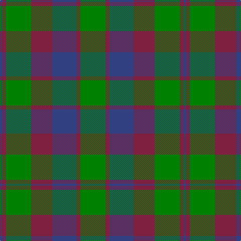

In pattern [BRGRBRG](/patterns/brgrbrg/).

This was sourced from weddslist.  It is a [7 stripes tartan](/stripes/stripes7/).

Original link http://www.weddslist.com/cgi-bin/tartans/pg.pl?source=sts

## Thread count
B/4 DR8 G50 DR42 B48 DR8 G/50

## Palette
Each colour and its ΔE from the base-6 reference it is a variant of.

| Colour | Shade | Base | ΔE (OKLab) |
|---|---|---|---|
| B | <code style="background-color:#304080;">#304080</code> `#304080` | B <code style="background-color:#2C4084;">#2C4084</code> | 0.01 |
| DR | <code style="background-color:#802040;">#802040</code> `#802040` | R <code style="background-color:#C80000;">#C80000</code> | 0.16 |
| G | <code style="background-color:#008000;">#008000</code> `#008000` | G <code style="background-color:#006400;">#006400</code> | 0.09 |

# Sample pattern

ID: /setts/s7/b4r8g50r42b48r8g50-b304080-g008000-r802040/
