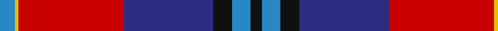
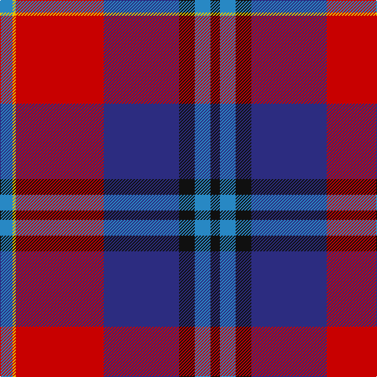

In pattern [BYRBKBK](/patterns/byrbkbk/).

This was sourced from register-of-tartans.  It is a [7 stripes tartan](/stripes/stripes7/).

Original link https://www.tartanregister.gov.uk/tartanDetails.aspx?ref=2893

## Attestations

This cloth appears in 2 source records; the oldest owns this page.

- 01/01/2004 — McKnight #2 (Personal) (register-of-tartans, [record](https://www.tartanregister.gov.uk/tartanDetails.aspx?ref=2893))
- pre 2004 — McKnight (Personal) (tartans-authority, [record](http://www.tartansauthority.com/tartan-ferret/display/6213/))

## Register references

External register numbers recorded for this tartan.

- Scottish Register of Tartans: [2893](https://www.tartanregister.gov.uk/tartanDetails.aspx?ref=2893)
- Scottish Tartans Authority (ITI): 6213

## Thread count
B/16 Y4 R112 DB96 K20 B20 K/12

## Palette
Each colour and its ΔE from the base-6 reference it is a variant of.

| Colour | Shade | Base | ΔE (OKLab) |
|---|---|---|---|
| B | <code style="background-color:#2888C4;">#2888C4</code> `#2888C4` | B <code style="background-color:#2A418A;">#2A418A</code> | 0.21 |
| DB | <code style="background-color:#2C2C80;">#2C2C80</code> `#2C2C80` | B <code style="background-color:#2A418A;">#2A418A</code> | 0.06 |
| K | <code style="background-color:#101010;">#101010</code> `#101010` | K <code style="background-color:#000000;">#000000</code> | 0.17 |
| R | <code style="background-color:#C80000;">#C80000</code> `#C80000` | R <code style="background-color:#CC0000;">#CC0000</code> | 0.01 |
| Y | <code style="background-color:#E8C000;">#E8C000</code> `#E8C000` | Y <code style="background-color:#F2BF00;">#F2BF00</code> | 0.02 |

# Sample pattern

## Nearest tartans

The nearest existing variants by ΔTartan distance.

1. [Royal Scottish Assurance (Corporate)](/setts/s9/b26g11r8k2r2w2r4w1r15~b2c2c80-g006818-k101010-rc80000-wfcfcfc~x2/) — ΔT 0.79
1. [McKnight (Personal)](/setts/s7/b4y1r28ba25k10b5k3~b2c4084-ba141e46-k101010-rdc0000-ye8c000~x2/) — ΔT 0.81
1. [Royal Scottish Assurance](/setts/s9/b26g11r8k2r2w2r4w1r15~b304080-g004010-k000000-rc00000-we0e0e0~x2/) — ΔT 0.83
1. [Diaspora](/setts/s6/b3g1r24b16ba28w3~b102040-ba304080-g004010-rc00020-we0e0e0~x2/) — ΔT 0.92
1. [Abernethy (Colerain, USA)](/setts/s7/y1b14r28g14r1ga14y1~b0b148e-g355f3b-ga273f2a-rec0416-ye0a126~x2/) — ΔT 1.06
1. [Regent Trade Tartan Tartan Number: 341. Earliest known date: 1819 See MacLaren See products available Copyright © Blair Urquhart, Comrie, 2015](/setts/s7/b18k7g5r4g7k1y2~b780078-g006818-k101010-rc80000-ye8c000~x2/) — ΔT 1.14
1. [Thomson, Reona Ellen (Personal)](/setts/s7/w2b5r34k5ra9k12b1~b780078-k101010-ra00048-ra888888-wfcfcfc~x2/) — ΔT 1.20
1. [Porsche Bank Austria](/setts/s11/b49k2g2k2g2k10r38b5r4k4y10~b2c2c80-g048888-k101010-rdc0000-ya0a0a0~x2/) — ΔT 1.23
1. [Cherry, John S. (Personal)](/setts/s7/r4b36ra35g2ra2g8w4~b003c64-g006818-re86000-rac80000-wfcfcfc~x2/) — ΔT 1.24
1. [Java Saint Andrew Society Dress](/setts/s7/b50r26k9r4w2y2r10~b003c64-k101010-rc80000-we0e0e0-yd09800~x2/) — ΔT 1.25

## Neighbour map

Every grey dot is one of 15726 variants placed by the first two principal components of the ΔTartan feature space (44% of its variance). Red is this tartan; blue dots are its nearest — click one to open its page.

<svg viewBox="0 0 640 380" role="img" style="max-width:100%;height:auto;border:1px solid #e0e0e0;border-radius:4px;display:block" xmlns="http://www.w3.org/2000/svg"><image href="/nn/cloud.v1.png" width="640" height="380"/><a href="/setts/s9/b26g11r8k2r2w2r4w1r15~b2c2c80-g006818-k101010-rc80000-wfcfcfc~x2/"><circle cx="241.4" cy="120.1" r="4" fill="#3465a4"><title>Royal Scottish Assurance (Corporate)</title></circle></a><a href="/setts/s7/b4y1r28ba25k10b5k3~b2c4084-ba141e46-k101010-rdc0000-ye8c000~x2/"><circle cx="223.8" cy="135.0" r="4" fill="#3465a4"><title>McKnight (Personal)</title></circle></a><a href="/setts/s9/b26g11r8k2r2w2r4w1r15~b304080-g004010-k000000-rc00000-we0e0e0~x2/"><circle cx="250.8" cy="125.0" r="4" fill="#3465a4"><title>Royal Scottish Assurance</title></circle></a><a href="/setts/s6/b3g1r24b16ba28w3~b102040-ba304080-g004010-rc00020-we0e0e0~x2/"><circle cx="241.5" cy="155.9" r="4" fill="#3465a4"><title>Diaspora</title></circle></a><a href="/setts/s7/y1b14r28g14r1ga14y1~b0b148e-g355f3b-ga273f2a-rec0416-ye0a126~x2/"><circle cx="220.0" cy="133.4" r="4" fill="#3465a4"><title>Abernethy (Colerain, USA)</title></circle></a><a href="/setts/s7/b18k7g5r4g7k1y2~b780078-g006818-k101010-rc80000-ye8c000~x2/"><circle cx="209.2" cy="161.3" r="4" fill="#3465a4"><title>Regent Trade Tartan Tartan Number: 341. Earliest known date: 1819 See MacLaren See products available Copyright © Blair Urquhart, Comrie, 2015</title></circle></a><a href="/setts/s7/w2b5r34k5ra9k12b1~b780078-k101010-ra00048-ra888888-wfcfcfc~x2/"><circle cx="311.7" cy="118.7" r="4" fill="#3465a4"><title>Thomson, Reona Ellen (Personal)</title></circle></a><a href="/setts/s11/b49k2g2k2g2k10r38b5r4k4y10~b2c2c80-g048888-k101010-rdc0000-ya0a0a0~x2/"><circle cx="254.8" cy="94.8" r="4" fill="#3465a4"><title>Porsche Bank Austria</title></circle></a><a href="/setts/s7/r4b36ra35g2ra2g8w4~b003c64-g006818-re86000-rac80000-wfcfcfc~x2/"><circle cx="245.5" cy="138.0" r="4" fill="#3465a4"><title>Cherry, John S. (Personal)</title></circle></a><a href="/setts/s7/b50r26k9r4w2y2r10~b003c64-k101010-rc80000-we0e0e0-yd09800~x2/"><circle cx="312.3" cy="135.0" r="4" fill="#3465a4"><title>Java Saint Andrew Society Dress</title></circle></a><circle cx="247.7" cy="128.4" r="5" fill="#c00000"/></svg>

ID: /setts/s7/b4y1r28ba24k5b5k3~b2888c4-ba2c2c80-k101010-rc80000-ye8c000~x4/
