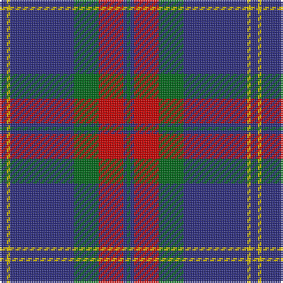

In pattern [BYBGRBG](/patterns/bybgrbg/).

This was sourced from tartans-authority.  It is a [7 stripes tartan](/stripes/stripes7/).

Original link http://www.tartansauthority.com/tartan-ferret/display/8745/

## Thread count
DB/4 Y2 DB36 G14 R14 DB2 G/2

## Palette
Each colour and its ΔE from the base-6 reference it is a variant of.

| Colour | Shade | Base | ΔE (OKLab) |
|---|---|---|---|
| DB | <code style="background-color:#2C2C80;">#2C2C80</code> `#2C2C80` | B <code style="background-color:#2A418A;">#2A418A</code> | 0.06 |
| G | <code style="background-color:#006818;">#006818</code> `#006818` | G <code style="background-color:#006100;">#006100</code> | 0.02 |
| R | <code style="background-color:#C80000;">#C80000</code> `#C80000` | R <code style="background-color:#CC0000;">#CC0000</code> | 0.01 |
| Y | <code style="background-color:#E8C000;">#E8C000</code> `#E8C000` | Y <code style="background-color:#F2BF00;">#F2BF00</code> | 0.02 |

# Sample pattern

## Nearest tartans

The nearest existing variants by ΔTartan distance.

1. [Katsushika Corporate Tartan Tartan Number: 2343. Earliest known date: 1997 Designed for Katsushika Scottish country dancers from Hiroshima. See products available Copyright © Blair Urquhart, Comrie, 2015](/setts/s8/b44y4b2y4b20r4g22r12-b2c2c80-g006818-rc80000-ye8c000/) — ΔT 0.69
1. [Kelvinside Academy (School)](/setts/s8/w4g15b8k4b28k2b4w2-b3c3c68-g6c6c6c-k101010-we0e0e0/) — ΔT 0.76
1. [Connecticut State Police PB (Cor.)](/setts/s6/b84ba4b4ba34y16ba8-b646464-ba00008c-yc88c00/) — ΔT 0.89
1. [Lothian Buses (Corporate?)](/setts/s6/w16b120r24g24r24b8-b2c2c80-g006818-rc80000-we0e0e0/) — ΔT 0.92
1. [Katsushika Scottish Country Dancers](/setts/s8/b44y4b2y4b20r4g22r12-b304080-g008000-rc00000-yf0c000/) — ΔT 0.93
1. [Murdoch Celebration (Personal)](/setts/s8/b60r4b4r8b18k52w4k8-b2c4084-k101010-rdc0000-we0e0e0/) — ΔT 0.95
1. [Tern House](/setts/s7/g23b3k8b4g4b56y8-b2c2c80-g006818-k101010-yd8b000/) — ΔT 0.99
1. [Katsushika (Corporate)](/setts/s8/b44y4b2y4b20g4ga22g12-b2c2c80-g808080-ga006818-ye8c000/) — ΔT 1.00
1. [Dege, of Saville Row](/setts/s6/r44b4r12ba4b36ra4-b000050-ba304080-r806050-rac00000/) — ΔT 1.02
1. [Perkins (2015)](/setts/s7/k6b20y10b58k20r12k4-b5f749c-k101010-rc80000-ye0a126/) — ΔT 1.03

## Neighbour map

Every grey dot is one of 15726 variants placed by the first two principal components of the ΔTartan feature space (44% of its variance). Red is this tartan; blue dots are its nearest — click one to open its page.

<svg viewBox="0 0 640 380" role="img" style="max-width:100%;height:auto;border:1px solid #e0e0e0;border-radius:4px;display:block" xmlns="http://www.w3.org/2000/svg"><image href="/nn/cloud.v1.png" width="640" height="380"/><a href="/setts/s8/b44y4b2y4b20r4g22r12-b2c2c80-g006818-rc80000-ye8c000/"><circle cx="341.1" cy="162.7" r="4" fill="#3465a4"><title>Katsushika Corporate Tartan Tartan Number: 2343. Earliest known date: 1997 Designed for Katsushika Scottish country dancers from Hiroshima. See products available Copyright © Blair Urquhart, Comrie, 2015</title></circle></a><a href="/setts/s8/w4g15b8k4b28k2b4w2-b3c3c68-g6c6c6c-k101010-we0e0e0/"><circle cx="349.4" cy="183.4" r="4" fill="#3465a4"><title>Kelvinside Academy (School)</title></circle></a><a href="/setts/s6/b84ba4b4ba34y16ba8-b646464-ba00008c-yc88c00/"><circle cx="378.2" cy="175.4" r="4" fill="#3465a4"><title>Connecticut State Police PB (Cor.)</title></circle></a><a href="/setts/s6/w16b120r24g24r24b8-b2c2c80-g006818-rc80000-we0e0e0/"><circle cx="339.9" cy="175.9" r="4" fill="#3465a4"><title>Lothian Buses (Corporate?)</title></circle></a><a href="/setts/s8/b44y4b2y4b20r4g22r12-b304080-g008000-rc00000-yf0c000/"><circle cx="344.3" cy="164.0" r="4" fill="#3465a4"><title>Katsushika Scottish Country Dancers</title></circle></a><a href="/setts/s8/b60r4b4r8b18k52w4k8-b2c4084-k101010-rdc0000-we0e0e0/"><circle cx="330.8" cy="178.7" r="4" fill="#3465a4"><title>Murdoch Celebration (Personal)</title></circle></a><a href="/setts/s7/g23b3k8b4g4b56y8-b2c2c80-g006818-k101010-yd8b000/"><circle cx="367.5" cy="171.2" r="4" fill="#3465a4"><title>Tern House</title></circle></a><a href="/setts/s8/b44y4b2y4b20g4ga22g12-b2c2c80-g808080-ga006818-ye8c000/"><circle cx="345.9" cy="169.8" r="4" fill="#3465a4"><title>Katsushika (Corporate)</title></circle></a><a href="/setts/s6/r44b4r12ba4b36ra4-b000050-ba304080-r806050-rac00000/"><circle cx="327.1" cy="206.2" r="4" fill="#3465a4"><title>Dege, of Saville Row</title></circle></a><a href="/setts/s7/k6b20y10b58k20r12k4-b5f749c-k101010-rc80000-ye0a126/"><circle cx="332.0" cy="181.7" r="4" fill="#3465a4"><title>Perkins (2015)</title></circle></a><circle cx="347.6" cy="170.3" r="5" fill="#c00000"/></svg>

ID: /setts/s7/b4y2b36g14r14b2g2-b2c2c80-g006818-rc80000-ye8c000/
