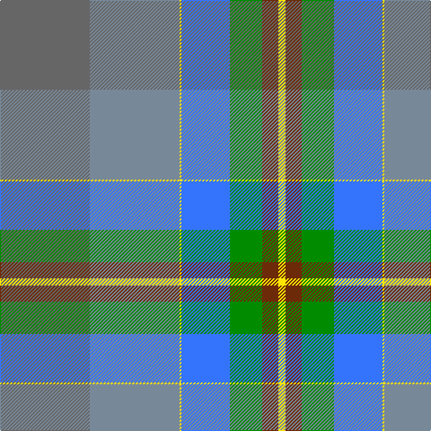

In pattern [BBYBGRY](/patterns/bbybgry/).

This was sourced from register-of-tartans.  It is a [7 stripes tartan](/stripes/stripes7/).

Original link https://www.tartanregister.gov.uk/tartanDetails.aspx?ref=10645

## Register references

External register numbers recorded for this tartan.

- Scottish Register of Tartans: [10645](https://www.tartanregister.gov.uk/tartanDetails.aspx?ref=10645)

## Thread count
N/100 Na100 Y2 B54 G36 T18 Y/8

## Palette
Each colour and its ΔE from the base-6 reference it is a variant of.

| Colour | Shade | Base | ΔE (OKLab) |
|---|---|---|---|
| B | <code style="background-color:#3474FC;">#3474FC</code> `#3474FC` | B <code style="background-color:#2A418A;">#2A418A</code> | 0.22 |
| G | <code style="background-color:#008B00;">#008B00</code> `#008B00` | G <code style="background-color:#006100;">#006100</code> | 0.13 |
| N | <code style="background-color:#666666;">#666666</code> `#666666` | B <code style="background-color:#2A418A;">#2A418A</code> | 0.17 |
| Na | <code style="background-color:#778899;">#778899</code> `#778899` | B <code style="background-color:#2A418A;">#2A418A</code> | 0.24 |
| T | <code style="background-color:#6D2A08;">#6D2A08</code> `#6D2A08` | R <code style="background-color:#CC0000;">#CC0000</code> | 0.19 |
| Y | <code style="background-color:#FFE600;">#FFE600</code> `#FFE600` | Y <code style="background-color:#F2BF00;">#F2BF00</code> | 0.10 |

# Sample pattern

## Nearest tartans

The nearest existing variants by ΔTartan distance.

1. [Lachance Commemorative Tartan Tartan Number: 10645. Earliest known date: 01/04/2012 This tartan is designed to commemorate the award of the Queens Diamond Jubilee Medal in 2012. The colours inspired by the Lachance Arms are: silver (‘argent’), nobility, peace and serenity; green (‘vert’), antiquity and strength; gold (‘or’), the light of the sun; blue (‘azure’), the eastern sky; brown (‘brun’) for the base of the trees. See products available Copyright © Blair Urquhart, Comrie, 2015](/setts/s7/b50ba50y1bb27g18r9y4~b666666-ba778899-bb0000cd-g008b00-r6d2a08-yffe600~x2/) — ΔT 1.11
1. [Lachance (Commemorative)](/setts/s7/b50r50y1ba27g18bb9y4~b5c5c5c-ba2c2c80-bb441800-g003820-r888888-yfccc00~x2/) — ΔT 1.13
1. [Lyon, Jeffrey M (Hunting) (Personal)](/setts/s10/b30ba1b1ba16g5r5y2ba2ga15ba1~b5c8ca8-ba1870a4-g288028-ga604000-rc80000-ye8c000~x2/) — ΔT 1.61
1. [Dalveen (2004)](/setts/s7/y22w1g6r6g6ya3ga12~g0098a0-ga408060-rc8002c-wf8f8f8-y48a4c0-yae8c000~x2/) — ΔT 1.68
1. [Hobkirk (School)](/setts/s10/b5w1r9b5ra4b5g20y1g1y1~b1474b4-g408060-rb468ac-rac80000-wfcfcfc-ye8c000~x4/) — ΔT 1.93
1. [Bird Family (Australia) (Personal)](/setts/s9/w3b19w1g17ga11gb10w1b3w1~b414c6c-g738182-ga7c7d5d-gb486934-wffffff~x2/) — ΔT 1.93
1. [Connecticut, State of](/setts/s10/b20r2w1r5g8y1g2ra1g8r8~b1474b4-g006818-r888888-rac80000-wfcfcfc-ye8c000~x4/) — ΔT 1.95
1. [Wright, Anne (Personal)](/setts/s6/b12ba6g30b9r8y1~b2c4084-ba5f749c-g408060-r960028-yd87c00~x2/) — ΔT 1.99
1. [The Climb (Fashion)](/setts/s8/g2ga9r16ra2b30g3ga6w1~b1474b4-g5c6428-ga285800-r880000-rac80000-we8ccb8~x2/) — ΔT 2.04
1. [Penman](/setts/s14/r22b12g12y2b4y2g12b12r12k1ra6k2g10b10~b1870a4-g00643c-k101010-r888888-rac8002c-ye8c000~x2/) — ΔT 2.05

## Neighbour map

Every grey dot is one of 15726 variants placed by the first two principal components of the ΔTartan feature space (44% of its variance). Red is this tartan; blue dots are its nearest — click one to open its page.

<svg viewBox="0 0 640 380" role="img" style="max-width:100%;height:auto;border:1px solid #e0e0e0;border-radius:4px;display:block" xmlns="http://www.w3.org/2000/svg"><image href="/nn/cloud.v1.png" width="640" height="380"/><a href="/setts/s7/b50ba50y1bb27g18r9y4~b666666-ba778899-bb0000cd-g008b00-r6d2a08-yffe600~x2/"><circle cx="198.6" cy="120.7" r="4" fill="#3465a4"><title>Lachance Commemorative Tartan Tartan Number: 10645. Earliest known date: 01/04/2012 This tartan is designed to commemorate the award of the Queens Diamond Jubilee Medal in 2012. The colours inspired by the Lachance Arms are: silver (‘argent’), nobility, peace and serenity; green (‘vert’), antiquity and strength; gold (‘or’), the light of the sun; blue (‘azure’), the eastern sky; brown (‘brun’) for the base of the trees. See products available Copyright © Blair Urquhart, Comrie, 2015</title></circle></a><a href="/setts/s7/b50r50y1ba27g18bb9y4~b5c5c5c-ba2c2c80-bb441800-g003820-r888888-yfccc00~x2/"><circle cx="214.5" cy="125.3" r="4" fill="#3465a4"><title>Lachance (Commemorative)</title></circle></a><a href="/setts/s10/b30ba1b1ba16g5r5y2ba2ga15ba1~b5c8ca8-ba1870a4-g288028-ga604000-rc80000-ye8c000~x2/"><circle cx="264.9" cy="113.9" r="4" fill="#3465a4"><title>Lyon, Jeffrey M (Hunting) (Personal)</title></circle></a><a href="/setts/s7/y22w1g6r6g6ya3ga12~g0098a0-ga408060-rc8002c-wf8f8f8-y48a4c0-yae8c000~x2/"><circle cx="230.6" cy="165.7" r="4" fill="#3465a4"><title>Dalveen (2004)</title></circle></a><a href="/setts/s10/b5w1r9b5ra4b5g20y1g1y1~b1474b4-g408060-rb468ac-rac80000-wfcfcfc-ye8c000~x4/"><circle cx="238.5" cy="127.6" r="4" fill="#3465a4"><title>Hobkirk (School)</title></circle></a><a href="/setts/s9/w3b19w1g17ga11gb10w1b3w1~b414c6c-g738182-ga7c7d5d-gb486934-wffffff~x2/"><circle cx="196.0" cy="155.9" r="4" fill="#3465a4"><title>Bird Family (Australia) (Personal)</title></circle></a><a href="/setts/s10/b20r2w1r5g8y1g2ra1g8r8~b1474b4-g006818-r888888-rac80000-wfcfcfc-ye8c000~x4/"><circle cx="226.3" cy="139.5" r="4" fill="#3465a4"><title>Connecticut, State of</title></circle></a><a href="/setts/s6/b12ba6g30b9r8y1~b2c4084-ba5f749c-g408060-r960028-yd87c00~x2/"><circle cx="318.3" cy="183.5" r="4" fill="#3465a4"><title>Wright, Anne (Personal)</title></circle></a><a href="/setts/s8/g2ga9r16ra2b30g3ga6w1~b1474b4-g5c6428-ga285800-r880000-rac80000-we8ccb8~x2/"><circle cx="264.7" cy="120.9" r="4" fill="#3465a4"><title>The Climb (Fashion)</title></circle></a><a href="/setts/s14/r22b12g12y2b4y2g12b12r12k1ra6k2g10b10~b1870a4-g00643c-k101010-r888888-rac8002c-ye8c000~x2/"><circle cx="179.1" cy="149.1" r="4" fill="#3465a4"><title>Penman</title></circle></a><circle cx="225.8" cy="130.4" r="5" fill="#c00000"/></svg>

ID: /setts/s7/b50ba50y1bb27g18r9y4~b666666-ba778899-bb3474fc-g008b00-r6d2a08-yffe600~x2/
