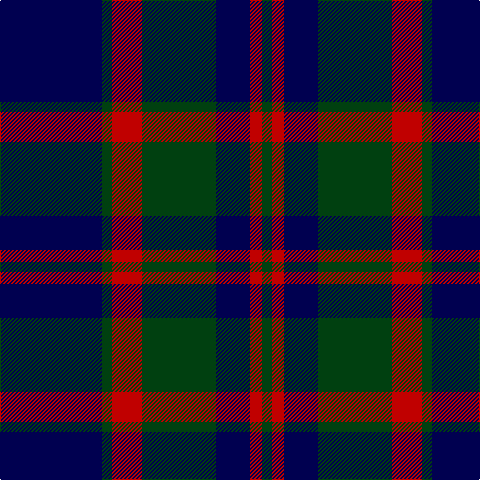

In pattern [BGRGBRG](/patterns/bgrgbrg/).

This was sourced from weddslist.  It is a [7 stripes tartan](/stripes/stripes7/).

Original link http://www.weddslist.com/cgi-bin/tartans/pg.pl?source=sts

## Thread count
DB/102 DG10 R30 DG74 DB34 R12 DG/10

## Palette
Each colour and its ΔE from the base-6 reference it is a variant of.

| Colour | Shade | Base | ΔE (OKLab) |
|---|---|---|---|
| DB | <code style="background-color:#000050;">#000050</code> `#000050` | B <code style="background-color:#2A418A;">#2A418A</code> | 0.21 |
| DG | <code style="background-color:#004010;">#004010</code> `#004010` | G <code style="background-color:#006100;">#006100</code> | 0.11 |
| R | <code style="background-color:#C00000;">#C00000</code> `#C00000` | R <code style="background-color:#CC0000;">#CC0000</code> | 0.03 |

# Sample pattern

## Nearest tartans

The nearest existing variants by ΔTartan distance.

1. [Barnaby Brown Pibroch](/setts/s9/g2r1g8b2g1b2g1b10r2~b000050-g004010-rc00020~x4/) — ΔT 0.86
1. [Perthshire (New) District Tartan Tartan Number: 2188. Earliest known date: 1992 The New Perthshire District tartan has established itself through use and wont since 1992. It provides a useful alternative to the Drummond pattern which was always closely associated with Perthshire. See products available Copyright © Blair Urquhart, Comrie, 2015](/setts/s6/b26r6g16b8g3r2~b202060-g006818-rc80000~x2/) — ΔT 1.05
1. [Cadence Design Systems (Corporate)](/setts/s7/k51g5r15g37k17r6g7~g006818-k00003c-rc80000~x2/) — ΔT 1.07
1. [Pride of the Forth](/setts/s6/k3b23k3b3k20y3~b5c5c5c-k101010-y48a4c0~x2/) — ΔT 1.15
1. [Pride of the Forth](/setts/s6/b3k20ba3k3ba23k3~b3c82af-ba5c5c5c-k101010~x2/) — ΔT 1.16
1. [Robertson of Struan 1816](/setts/s7/r3b1r1b11g10r2b2~b202060-g006818-rc80000~x4/) — ΔT 1.17
1. [Brown, Barnaby (Personal)](/setts/s9/g2r1g8b2g1b2g1b10r2~b202060-g006818-rc8002c~x4/) — ΔT 1.20
1. [Tartan Army Children's Charity (Corp](/setts/s7/b34k7b12k39b3k4y3~b5c5c5c-k101010-y48a4c0~x2/) — ΔT 1.22
1. [Paxton (Personal)](/setts/s11/k24b5k9g3k2g3k2g14b7k2b10~b780078-g006818-k101010~x2/) — ΔT 1.23
1. [Guthrie Family Tartan Tartan Number: 1085. Earliest known date: pre 2003 From the Barony of Guthrie in Angus, the name is also said to derive from Guthrum, a Scandinavian prince. Sir David Guthrie was King's Treasurer in the fifteenth century and built Guthrie Castle near Friockheim, Angus, in 1468. See products available Copyright © Blair Urquhart, Comrie, 2015](/setts/s9/k1g8k9r1k1r1k9b8r1~b2c2c80-g006818-k101010-rc80000~x6/) — ΔT 1.25

## Neighbour map

Every grey dot is one of 15726 variants placed by the first two principal components of the ΔTartan feature space (44% of its variance). Red is this tartan; blue dots are its nearest — click one to open its page.

<svg viewBox="0 0 640 380" role="img" style="max-width:100%;height:auto;border:1px solid #e0e0e0;border-radius:4px;display:block" xmlns="http://www.w3.org/2000/svg"><image href="/nn/cloud.v1.png" width="640" height="380"/><a href="/setts/s9/g2r1g8b2g1b2g1b10r2~b000050-g004010-rc00020~x4/"><circle cx="324.9" cy="225.3" r="4" fill="#3465a4"><title>Barnaby Brown Pibroch</title></circle></a><a href="/setts/s6/b26r6g16b8g3r2~b202060-g006818-rc80000~x2/"><circle cx="350.8" cy="235.5" r="4" fill="#3465a4"><title>Perthshire (New) District Tartan Tartan Number: 2188. Earliest known date: 1992 The New Perthshire District tartan has established itself through use and wont since 1992. It provides a useful alternative to the Drummond pattern which was always closely associated with Perthshire. See products available Copyright © Blair Urquhart, Comrie, 2015</title></circle></a><a href="/setts/s7/k51g5r15g37k17r6g7~g006818-k00003c-rc80000~x2/"><circle cx="276.0" cy="227.6" r="4" fill="#3465a4"><title>Cadence Design Systems (Corporate)</title></circle></a><a href="/setts/s6/k3b23k3b3k20y3~b5c5c5c-k101010-y48a4c0~x2/"><circle cx="322.9" cy="244.6" r="4" fill="#3465a4"><title>Pride of the Forth</title></circle></a><a href="/setts/s6/b3k20ba3k3ba23k3~b3c82af-ba5c5c5c-k101010~x2/"><circle cx="331.0" cy="248.0" r="4" fill="#3465a4"><title>Pride of the Forth</title></circle></a><a href="/setts/s7/r3b1r1b11g10r2b2~b202060-g006818-rc80000~x4/"><circle cx="293.1" cy="218.1" r="4" fill="#3465a4"><title>Robertson of Struan 1816</title></circle></a><a href="/setts/s9/g2r1g8b2g1b2g1b10r2~b202060-g006818-rc8002c~x4/"><circle cx="316.8" cy="216.6" r="4" fill="#3465a4"><title>Brown, Barnaby (Personal)</title></circle></a><a href="/setts/s7/b34k7b12k39b3k4y3~b5c5c5c-k101010-y48a4c0~x2/"><circle cx="360.8" cy="221.6" r="4" fill="#3465a4"><title>Tartan Army Children's Charity (Corp</title></circle></a><a href="/setts/s11/k24b5k9g3k2g3k2g14b7k2b10~b780078-g006818-k101010~x2/"><circle cx="293.9" cy="204.8" r="4" fill="#3465a4"><title>Paxton (Personal)</title></circle></a><a href="/setts/s9/k1g8k9r1k1r1k9b8r1~b2c2c80-g006818-k101010-rc80000~x6/"><circle cx="276.4" cy="213.1" r="4" fill="#3465a4"><title>Guthrie Family Tartan Tartan Number: 1085. Earliest known date: pre 2003 From the Barony of Guthrie in Angus, the name is also said to derive from Guthrum, a Scandinavian prince. Sir David Guthrie was King's Treasurer in the fifteenth century and built Guthrie Castle near Friockheim, Angus, in 1468. See products available Copyright © Blair Urquhart, Comrie, 2015</title></circle></a><circle cx="308.2" cy="237.3" r="5" fill="#c00000"/></svg>

ID: /setts/s7/b51g5r15g37b17r6g5~b000050-g004010-rc00000~x2/
