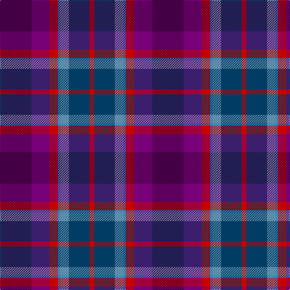

In pattern [BBRBBBR](/patterns/bbrbbbr/).

This was sourced from tartans-authority.  It is a [7 stripes tartan](/stripes/stripes7/).

Original link http://www.tartansauthority.com/tartan-ferret/display/10351/

## Thread count
DP/52 P30 R14 Ba4 B14 DB34 R/8

## Palette
Each colour and its ΔE from the base-6 reference it is a variant of.

| Colour | Shade | Base | ΔE (OKLab) |
|---|---|---|---|
| B | <code style="background-color:#5C8CA8;">#5C8CA8</code> `#5C8CA8` | B <code style="background-color:#2A418A;">#2A418A</code> | 0.23 |
| Ba | <code style="background-color:#2888C4;">#2888C4</code> `#2888C4` | B <code style="background-color:#2A418A;">#2A418A</code> | 0.21 |
| DB | <code style="background-color:#003C64;">#003C64</code> `#003C64` | B <code style="background-color:#2A418A;">#2A418A</code> | 0.08 |
| DP | <code style="background-color:#440044;">#440044</code> `#440044` | B <code style="background-color:#2A418A;">#2A418A</code> | 0.18 |
| P | <code style="background-color:#780078;">#780078</code> `#780078` | B <code style="background-color:#2A418A;">#2A418A</code> | 0.17 |
| R | <code style="background-color:#C80000;">#C80000</code> `#C80000` | R <code style="background-color:#CC0000;">#CC0000</code> | 0.01 |

# Sample pattern

## Nearest tartans

The nearest existing variants by ΔTartan distance.

1. [Redpath, The Ronald](/setts/s7/b52r30ra14w4y14ba34ra8-b8e388e-ba000080-r9f5f9f-rae3170d-wb0e2ff-y7d9ec0/) — ΔT 1.33
1. [Scotland Forever](/setts/s11/b12k6ba38k12ba8k6bb24g8bb24w4b10-b202060-ba14283c-bb780078-g006818-k101010-wfcfcfc/) — ΔT 1.47
1. [First (Corporate)](/setts/s7/r8b2r2b24k12ba32w2-b780078-ba003c64-k101010-ra00048-we0e0e0/) — ΔT 1.52
1. [Galway County, Crest Range](/setts/s9/b20ba10bb30k6bb30k10r50k6w8-b505050-ba2c4084-bb141e46-k101010-r960000-we0e0e0/) — ΔT 1.65
1. [First](/setts/s8/b2r8b2r2b24k12ba32w2-b780078-ba003c64-k101010-ra00048-we0e0e0/) — ΔT 1.66
1. [Myres Castle (Corporate)](/setts/s7/g6ga24b12gb6ba30y4ba4-b780078-ba440044-g408060-ga003820-gb549450-ybc8c00/) — ΔT 1.66
1. [Creiff Highland Gathering](/setts/s9/k6b32g10b6ba4b4k24bb46w4-b780078-ba9058d8-bb003c64-g006818-k101010-wfcfcfc/) — ΔT 1.70
1. [Alba](/setts/s8/b48ba4g6r4g6k22ba58w4-b780078-ba2c2c4c-g006818-k101010-r9c68a4-wfcfcfc/) — ΔT 1.70
1. [Cowal (Corporate)](/setts/s10/b12ba44k24bb20g6k2g6bb20b4w4-b1c0070-ba003c64-bb780078-g006818-k101010-we0e0e0/) — ΔT 1.77
1. [Scotland Forever Fashion Weavers Tartan Tartan Number: 6038. Earliest known date: pre 2003 For Alec Scott. The Lochcarron notes on this tartan say: Scotland Forever! is without doubt the best known war cry of the traditional Scottish regiments. It was most famously used by the Scots Greys on their timely and victorious charge at Waterloo in 1815. It spread throughout the ranks of the other Scottish regiments including the Royals, the 42nd and the Cameron Highlanders. See products available Copyright © Blair Urquhart, Comrie, 2015](/setts/s11/b12k6ba38k12ba8k6bb24g8bb24w4b10-b1474b4-ba202060-bb784078-g006818-k101010-wfcfcfc/) — ΔT 1.78

## Neighbour map

Every grey dot is one of 15726 variants placed by the first two principal components of the ΔTartan feature space (44% of its variance). Red is this tartan; blue dots are its nearest — click one to open its page.

<svg viewBox="0 0 640 380" role="img" style="max-width:100%;height:auto;border:1px solid #e0e0e0;border-radius:4px;display:block" xmlns="http://www.w3.org/2000/svg"><image href="/nn/cloud.v1.png" width="640" height="380"/><a href="/setts/s7/b52r30ra14w4y14ba34ra8-b8e388e-ba000080-r9f5f9f-rae3170d-wb0e2ff-y7d9ec0/"><circle cx="135.9" cy="166.1" r="4" fill="#3465a4"><title>Redpath, The Ronald</title></circle></a><a href="/setts/s11/b12k6ba38k12ba8k6bb24g8bb24w4b10-b202060-ba14283c-bb780078-g006818-k101010-wfcfcfc/"><circle cx="137.0" cy="181.9" r="4" fill="#3465a4"><title>Scotland Forever</title></circle></a><a href="/setts/s7/r8b2r2b24k12ba32w2-b780078-ba003c64-k101010-ra00048-we0e0e0/"><circle cx="248.1" cy="177.7" r="4" fill="#3465a4"><title>First (Corporate)</title></circle></a><a href="/setts/s9/b20ba10bb30k6bb30k10r50k6w8-b505050-ba2c4084-bb141e46-k101010-r960000-we0e0e0/"><circle cx="138.1" cy="180.7" r="4" fill="#3465a4"><title>Galway County, Crest Range</title></circle></a><a href="/setts/s8/b2r8b2r2b24k12ba32w2-b780078-ba003c64-k101010-ra00048-we0e0e0/"><circle cx="250.0" cy="166.0" r="4" fill="#3465a4"><title>First</title></circle></a><a href="/setts/s7/g6ga24b12gb6ba30y4ba4-b780078-ba440044-g408060-ga003820-gb549450-ybc8c00/"><circle cx="171.5" cy="196.9" r="4" fill="#3465a4"><title>Myres Castle (Corporate)</title></circle></a><a href="/setts/s9/k6b32g10b6ba4b4k24bb46w4-b780078-ba9058d8-bb003c64-g006818-k101010-wfcfcfc/"><circle cx="163.0" cy="155.0" r="4" fill="#3465a4"><title>Creiff Highland Gathering</title></circle></a><a href="/setts/s8/b48ba4g6r4g6k22ba58w4-b780078-ba2c2c4c-g006818-k101010-r9c68a4-wfcfcfc/"><circle cx="232.0" cy="148.7" r="4" fill="#3465a4"><title>Alba</title></circle></a><a href="/setts/s10/b12ba44k24bb20g6k2g6bb20b4w4-b1c0070-ba003c64-bb780078-g006818-k101010-we0e0e0/"><circle cx="167.5" cy="140.0" r="4" fill="#3465a4"><title>Cowal (Corporate)</title></circle></a><a href="/setts/s11/b12k6ba38k12ba8k6bb24g8bb24w4b10-b1474b4-ba202060-bb784078-g006818-k101010-wfcfcfc/"><circle cx="118.9" cy="174.3" r="4" fill="#3465a4"><title>Scotland Forever Fashion Weavers Tartan Tartan Number: 6038. Earliest known date: pre 2003 For Alec Scott. The Lochcarron notes on this tartan say: Scotland Forever! is without doubt the best known war cry of the traditional Scottish regiments. It was most famously used by the Scots Greys on their timely and victorious charge at Waterloo in 1815. It spread throughout the ranks of the other Scottish regiments including the Royals, the 42nd and the Cameron Highlanders. See products available Copyright © Blair Urquhart, Comrie, 2015</title></circle></a><circle cx="163.4" cy="183.3" r="5" fill="#c00000"/></svg>

ID: /setts/s7/b52ba30r14bb4bc14bd34r8-b440044-ba780078-bb2888c4-bc5c8ca8-bd003c64-rc80000/
