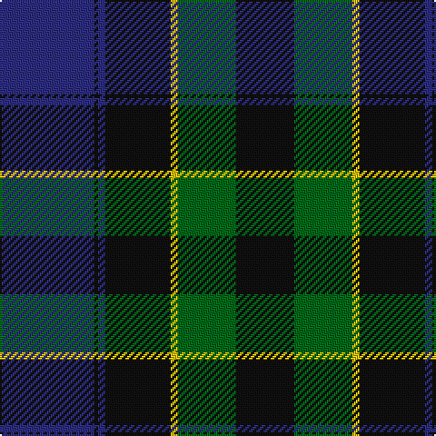

In pattern [BKBKYGK](/patterns/bkbkygk/).

This was sourced from register-of-tartans.  It is a [7 stripes tartan](/stripes/stripes7/).

Original link https://www.tartanregister.gov.uk/tartanDetails.aspx?ref=3034

## Attestations

This cloth appears in 3 source records; the oldest owns this page.

- 01/01/1900 — Mowat (register-of-tartans, [record](https://www.tartanregister.gov.uk/tartanDetails.aspx?ref=3034))
- pre 2002 — Mowat (Clan) (tartans-authority, [record](http://www.tartansauthority.com/tartan-ferret/display/258/))
- undated — Mowat Clan Tartan Tartan Number: 258. Earliest known date: 1906. Designed for Kincardine & Deeside branch of the National Trust for Scotland. Blue is a muted sky blue. Green is a dark pine green. See products available Copyright © Blair Urquhart, Comrie, 2015 (house-of-tartan, [record](http://www.house-of-tartan.scotland.net/house/TartanViewjs.asp?colr=Def&tnam=258))

## Thread count
DB/52 K2 DB4 K36 Y4 G32 K/32

## Palette
Each colour and its ΔE from the base-6 reference it is a variant of.

| Colour | Shade | Base | ΔE (OKLab) |
|---|---|---|---|
| DB | <code style="background-color:#2C2C80;">#2C2C80</code> `#2C2C80` | B <code style="background-color:#2A418A;">#2A418A</code> | 0.06 |
| G | <code style="background-color:#006818;">#006818</code> `#006818` | G <code style="background-color:#006100;">#006100</code> | 0.02 |
| K | <code style="background-color:#101010;">#101010</code> `#101010` | K <code style="background-color:#000000;">#000000</code> | 0.17 |
| Y | <code style="background-color:#E8C000;">#E8C000</code> `#E8C000` | Y <code style="background-color:#F2BF00;">#F2BF00</code> | 0.02 |

# Sample pattern

## Nearest tartans

The nearest existing variants by ΔTartan distance.

1. [Dundas #2](/setts/s7/k8b32k24g24r2g4k4-b2c2c80-g006818-k101010-rc80000/) — ΔT 0.98
1. [Dundas Clan Tartan Tartan Number: 1041. Earliest known date: 1842 The Dundas tartan originated in the Vestiarium Scoticum (1842). The design has the traditional green, black, blue background of the Highland military tartans with twin red stripes on the green. Dundas's played an important role in restoring the Highland way of life after the penalties imposed as a result of the '45 rebellion. It was Henry Dundas, who in 1784, introduced the bill to parliament restoring estates forfieted to the Crown after the uprising, following the repeal on the wearing of tartan in 1782. The Chief today is Sir David Dundas of Dundas, Bart. Appears in Edgars 'Old and Rare' See products available Copyright © Blair Urquhart, Comrie, 2015](/setts/s7/k8b32k24g48r2g4k4-b2c2c80-g006818-k101010-rc80000/) — ΔT 1.00
1. [Unidentified #36](/setts/s8/k32g32k4g32k32w4b32k2-b5a008c-g005020-k101010-we0e0e0/) — ΔT 1.03
1. [MacTaggart](/setts/s7/g60b8g4k40b36r2b8-b2c2c80-g285800-k101010-rc80000/) — ΔT 1.06
1. [MacRobart (Personal)](/setts/s6/b60k20g20w4g30w4-b202060-g006818-k101010-wa8ace8/) — ΔT 1.08
1. [Glenturret Distillery](/setts/s6/y8b48g6k42g46k2-b1c0070-g006818-k101010-yd09800/) — ΔT 1.09
1. [Hakkarain Personal Finnish Tartan Tartan Number: 6110. Earliest known date: 2003 A personal tartan designed by Jari Hakkarainen of Porvoo in Finland. See products available Copyright © Blair Urquhart, Comrie, 2015](/setts/s6/b74r36k74ra4k4ra4-b202060-k101010-r888888-rac80000/) — ΔT 1.13
1. [Dundas](/setts/s7/k8b32k24g48r2g4k4-b000052-g11450d-k000000-raa0000/) — ΔT 1.13
1. [Common Kilt Tartan Tartan Number: 554. Earliest known date: c. 1790 A version of the Blatck Watch tartan produced by Wilson's of Bannockburn before the widespread use of clan names for tartan. The military Black Watch tartan was also woven with a red stripe. See products available Copyright © Blair Urquhart, Comrie, 2015](/setts/s8/r6k4b50k56g50k4r2b4-b2c2c80-g006818-k101010-rc80000/) — ΔT 1.14
1. [Monarchs](/setts/s6/b76k16ba4k16g36ba4-b304080-ba600030-g006030-k000000/) — ΔT 1.15

## Neighbour map

Every grey dot is one of 15726 variants placed by the first two principal components of the ΔTartan feature space (44% of its variance). Red is this tartan; blue dots are its nearest — click one to open its page.

<svg viewBox="0 0 640 380" role="img" style="max-width:100%;height:auto;border:1px solid #e0e0e0;border-radius:4px;display:block" xmlns="http://www.w3.org/2000/svg"><image href="/nn/cloud.v1.png" width="640" height="380"/><a href="/setts/s7/k8b32k24g24r2g4k4-b2c2c80-g006818-k101010-rc80000/"><circle cx="244.3" cy="210.9" r="4" fill="#3465a4"><title>Dundas #2</title></circle></a><a href="/setts/s7/k8b32k24g48r2g4k4-b2c2c80-g006818-k101010-rc80000/"><circle cx="287.5" cy="185.4" r="4" fill="#3465a4"><title>Dundas Clan Tartan Tartan Number: 1041. Earliest known date: 1842 The Dundas tartan originated in the Vestiarium Scoticum (1842). The design has the traditional green, black, blue background of the Highland military tartans with twin red stripes on the green. Dundas's played an important role in restoring the Highland way of life after the penalties imposed as a result of the '45 rebellion. It was Henry Dundas, who in 1784, introduced the bill to parliament restoring estates forfieted to the Crown after the uprising, following the repeal on the wearing of tartan in 1782. The Chief today is Sir David Dundas of Dundas, Bart. Appears in Edgars 'Old and Rare' See products available Copyright © Blair Urquhart, Comrie, 2015</title></circle></a><a href="/setts/s8/k32g32k4g32k32w4b32k2-b5a008c-g005020-k101010-we0e0e0/"><circle cx="245.6" cy="217.3" r="4" fill="#3465a4"><title>Unidentified #36</title></circle></a><a href="/setts/s7/g60b8g4k40b36r2b8-b2c2c80-g285800-k101010-rc80000/"><circle cx="306.5" cy="185.4" r="4" fill="#3465a4"><title>MacTaggart</title></circle></a><a href="/setts/s6/b60k20g20w4g30w4-b202060-g006818-k101010-wa8ace8/"><circle cx="260.3" cy="212.9" r="4" fill="#3465a4"><title>MacRobart (Personal)</title></circle></a><a href="/setts/s6/y8b48g6k42g46k2-b1c0070-g006818-k101010-yd09800/"><circle cx="221.4" cy="194.3" r="4" fill="#3465a4"><title>Glenturret Distillery</title></circle></a><a href="/setts/s6/b74r36k74ra4k4ra4-b202060-k101010-r888888-rac80000/"><circle cx="268.8" cy="191.5" r="4" fill="#3465a4"><title>Hakkarain Personal Finnish Tartan Tartan Number: 6110. Earliest known date: 2003 A personal tartan designed by Jari Hakkarainen of Porvoo in Finland. See products available Copyright © Blair Urquhart, Comrie, 2015</title></circle></a><a href="/setts/s7/k8b32k24g48r2g4k4-b000052-g11450d-k000000-raa0000/"><circle cx="284.0" cy="188.5" r="4" fill="#3465a4"><title>Dundas</title></circle></a><a href="/setts/s8/r6k4b50k56g50k4r2b4-b2c2c80-g006818-k101010-rc80000/"><circle cx="268.2" cy="162.9" r="4" fill="#3465a4"><title>Common Kilt Tartan Tartan Number: 554. Earliest known date: c. 1790 A version of the Blatck Watch tartan produced by Wilson's of Bannockburn before the widespread use of clan names for tartan. The military Black Watch tartan was also woven with a red stripe. See products available Copyright © Blair Urquhart, Comrie, 2015</title></circle></a><a href="/setts/s6/b76k16ba4k16g36ba4-b304080-ba600030-g006030-k000000/"><circle cx="300.9" cy="189.5" r="4" fill="#3465a4"><title>Monarchs</title></circle></a><circle cx="282.6" cy="193.5" r="5" fill="#c00000"/></svg>

ID: /setts/s7/b52k2b4k36y4g32k32-b2c2c80-g006818-k101010-ye8c000/
