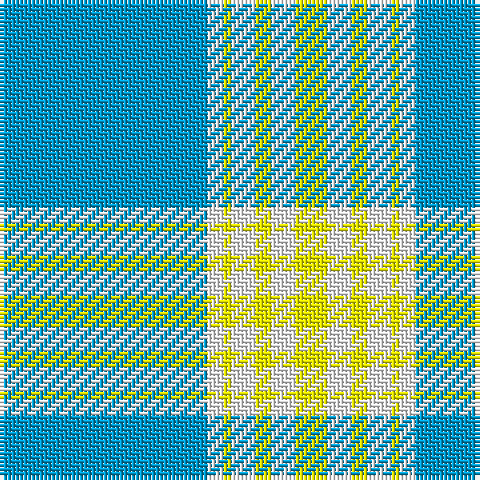

In pattern [BWYWYWY](/patterns/bwywywy/).

This was sourced from register-of-tartans.  It is a [7 stripes tartan](/stripes/stripes7/).

Original link https://www.tartanregister.gov.uk/tartanDetails.aspx?ref=10007

## Thread count
B/52 W4 Y2 W6 Y4 W6 Y/8

## Palette
Each colour and its ΔE from the base-6 reference it is a variant of.

| Colour | Shade | Base | ΔE (OKLab) |
|---|---|---|---|
| B | <code style="background-color:#0099CC;">#0099CC</code> `#0099CC` | B <code style="background-color:#2C4084;">#2C4084</code> | 0.26 |
| W | <code style="background-color:#FFFFFF;">#FFFFFF</code> `#FFFFFF` | W <code style="background-color:#F4F4F0;">#F4F4F0</code> | 0.03 |
| Y | <code style="background-color:#FFFF00;">#FFFF00</code> `#FFFF00` | Y <code style="background-color:#E8C000;">#E8C000</code> | 0.16 |

# Sample pattern

ID: /setts/s7/b52w4y2w6y4w6y8-b0099cc-wffffff-yffff00/
