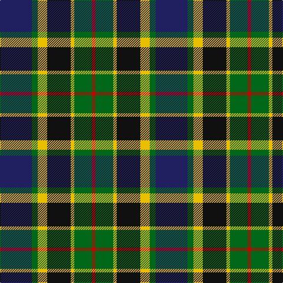

In pattern [BGYKYGR](/patterns/bgykygr/).

This was sourced from register-of-tartans.  It is a [7 stripes tartan](/stripes/stripes7/).

Original link https://www.tartanregister.gov.uk/tartanDetails.aspx?ref=3106

## Thread count
DB/54 G10 Y16 K40 Y6 G30 R/6

## Palette
Each colour and its ΔE from the base-6 reference it is a variant of.

| Colour | Shade | Base | ΔE (OKLab) |
|---|---|---|---|
| DB | <code style="background-color:#202060;">#202060</code> `#202060` | B <code style="background-color:#2A418A;">#2A418A</code> | 0.11 |
| G | <code style="background-color:#006818;">#006818</code> `#006818` | G <code style="background-color:#006100;">#006100</code> | 0.02 |
| K | <code style="background-color:#101010;">#101010</code> `#101010` | K <code style="background-color:#000000;">#000000</code> | 0.17 |
| LN | <code style="background-color:#E0E0E0;">#E0E0E0</code> `#E0E0E0` | W <code style="background-color:#F7F7F7;">#F7F7F7</code> | 0.07 |
| R | <code style="background-color:#C80000;">#C80000</code> `#C80000` | R <code style="background-color:#CC0000;">#CC0000</code> | 0.01 |
| Y | <code style="background-color:#E8C000;">#E8C000</code> `#E8C000` | Y <code style="background-color:#F2BF00;">#F2BF00</code> | 0.02 |

# Sample pattern

## Nearest tartans

The nearest existing variants by ΔTartan distance.

1. [Nelson Mandela (Personal)](/setts/s7/b54g10y16k40y6g30r6-b202060-g006818-k101010-rc80000-yd8b000/) — ΔT 0.20
1. [MacDonald, (Flora.. )](/setts/s7/g34y4k28r4b18r4b20-b304080-g008000-k000000-rc00000-yf0c000/) — ΔT 0.55
1. [MacWilliam](/setts/s6/r10b24r4k30g36ba5-b304080-ba000050-g008000-k000000-rc00000/) — ΔT 0.70
1. [Junior Chamber International](/setts/s7/r8g32k32b8g6b24y4-b304080-g008000-k000000-rc00000-yf0c000/) — ΔT 0.71
1. [Colquhoun #2](/setts/s7/r12g48w6k48b48k6b6-b1474b4-g006818-k101010-rc80000-wfcfcfc/) — ΔT 0.74
1. [Argyll / MacCorquodale](/setts/s7/b4k2g16k16ba16k2r4-b5480b0-ba304080-g008000-k000000-rc00000/) — ΔT 0.74
1. [Colquhoun](/setts/s7/r8g32w4k32b32k4b4-b304080-g008000-k000000-rc00000-we0e0e0/) — ΔT 0.79
1. [MacNeil Clan Tartan Tartan Number: 1767. Earliest known date: 1886 This version shows the narrow 'tramlines' about the yellow stripe, the usual modern form that differs from Logans earlier version. The MacNeils claim descent from Niall, King of Ireland, who came to Barra in 1049. The present chief, Professor Ian Roderick MacNeil of Barra, lives in Chicago, U.S.A. There is also a tartan for the MacNeils of Colonsay. MacNeils are hereditary pipers to the MacLeans of Duart. See products available Copyright © Blair Urquhart, Comrie, 2015](/setts/s6/w6b28k24g24k4y6-b2c2c80-g006818-k101010-we0e0e0-ye8c000/) — ΔT 0.79
1. [MacLeod of Assynt](/setts/s6/r6k4g30k20b40y4-b304080-g008000-k000000-rc00000-yf0c000/) — ΔT 0.81
1. [Biskup](/setts/s10/b24r8b36r4k38g36r8g6y4g16-b304080-g008000-k000000-rc00000-yf0c000/) — ΔT 0.82

## Neighbour map

Every grey dot is one of 15726 variants placed by the first two principal components of the ΔTartan feature space (44% of its variance). Red is this tartan; blue dots are its nearest — click one to open its page.

<svg viewBox="0 0 640 380" role="img" style="max-width:100%;height:auto;border:1px solid #e0e0e0;border-radius:4px;display:block" xmlns="http://www.w3.org/2000/svg"><image href="/nn/cloud.v1.png" width="640" height="380"/><a href="/setts/s7/b54g10y16k40y6g30r6-b202060-g006818-k101010-rc80000-yd8b000/"><circle cx="123.2" cy="197.2" r="4" fill="#3465a4"><title>Nelson Mandela (Personal)</title></circle></a><a href="/setts/s7/g34y4k28r4b18r4b20-b304080-g008000-k000000-rc00000-yf0c000/"><circle cx="112.7" cy="198.1" r="4" fill="#3465a4"><title>MacDonald, (Flora.. )</title></circle></a><a href="/setts/s6/r10b24r4k30g36ba5-b304080-ba000050-g008000-k000000-rc00000/"><circle cx="105.7" cy="205.3" r="4" fill="#3465a4"><title>MacWilliam</title></circle></a><a href="/setts/s7/r8g32k32b8g6b24y4-b304080-g008000-k000000-rc00000-yf0c000/"><circle cx="105.6" cy="200.1" r="4" fill="#3465a4"><title>Junior Chamber International</title></circle></a><a href="/setts/s7/r12g48w6k48b48k6b6-b1474b4-g006818-k101010-rc80000-wfcfcfc/"><circle cx="120.6" cy="196.3" r="4" fill="#3465a4"><title>Colquhoun #2</title></circle></a><a href="/setts/s7/b4k2g16k16ba16k2r4-b5480b0-ba304080-g008000-k000000-rc00000/"><circle cx="107.9" cy="198.1" r="4" fill="#3465a4"><title>Argyll / MacCorquodale</title></circle></a><a href="/setts/s7/r8g32w4k32b32k4b4-b304080-g008000-k000000-rc00000-we0e0e0/"><circle cx="106.3" cy="191.3" r="4" fill="#3465a4"><title>Colquhoun</title></circle></a><a href="/setts/s6/w6b28k24g24k4y6-b2c2c80-g006818-k101010-we0e0e0-ye8c000/"><circle cx="93.5" cy="218.6" r="4" fill="#3465a4"><title>MacNeil Clan Tartan Tartan Number: 1767. Earliest known date: 1886 This version shows the narrow 'tramlines' about the yellow stripe, the usual modern form that differs from Logans earlier version. The MacNeils claim descent from Niall, King of Ireland, who came to Barra in 1049. The present chief, Professor Ian Roderick MacNeil of Barra, lives in Chicago, U.S.A. There is also a tartan for the MacNeils of Colonsay. MacNeils are hereditary pipers to the MacLeans of Duart. See products available Copyright © Blair Urquhart, Comrie, 2015</title></circle></a><a href="/setts/s6/r6k4g30k20b40y4-b304080-g008000-k000000-rc00000-yf0c000/"><circle cx="150.1" cy="192.0" r="4" fill="#3465a4"><title>MacLeod of Assynt</title></circle></a><a href="/setts/s10/b24r8b36r4k38g36r8g6y4g16-b304080-g008000-k000000-rc00000-yf0c000/"><circle cx="112.1" cy="175.6" r="4" fill="#3465a4"><title>Biskup</title></circle></a><circle cx="117.4" cy="194.4" r="5" fill="#c00000"/></svg>

ID: /setts/s7/b54g10y16k40y6g30r6-b202060-g006818-k101010-rc80000-ye8c000/
