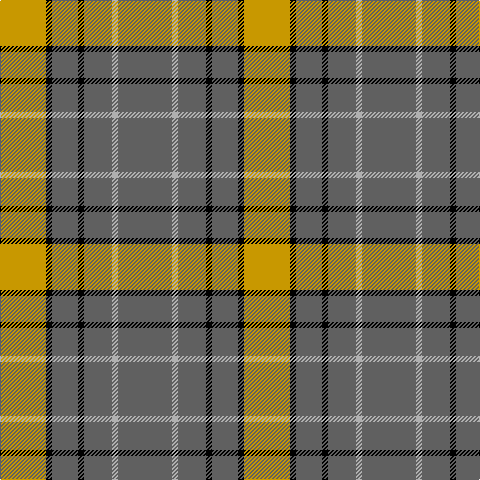

In pattern [BYBKBKY](/patterns/bybkbky/).

This was sourced from register-of-tartans.  It is a [7 stripes tartan](/stripes/stripes7/).

Original link https://www.tartanregister.gov.uk/tartanDetails.aspx?ref=1494

## Attestations

This cloth appears in 2 source records; the oldest owns this page.

- 01/03/1988 — Grange School (register-of-tartans, [record](https://www.tartanregister.gov.uk/tartanDetails.aspx?ref=1494))
- pre 2002 — Grange School (School) (tartans-authority, [record](http://www.tartansauthority.com/tartan-ferret/display/5094/))

## Thread count
DY/46 K6 N26 K6 N28 Na6 N/54

## Palette
Each colour and its ΔE from the base-6 reference it is a variant of.

| Colour | Shade | Base | ΔE (OKLab) |
|---|---|---|---|
| DY | <code style="background-color:#C89800;">#C89800</code> `#C89800` | Y <code style="background-color:#E8C000;">#E8C000</code> | 0.12 |
| K | <code style="background-color:#000000;">#000000</code> `#000000` | K <code style="background-color:#000000;">#000000</code> | 0.00 |
| N | <code style="background-color:#606060;">#606060</code> `#606060` | B <code style="background-color:#2C4084;">#2C4084</code> | 0.15 |
| Na | <code style="background-color:#B0B0B0;">#B0B0B0</code> `#B0B0B0` | Y <code style="background-color:#E8C000;">#E8C000</code> | 0.18 |

# Sample pattern

ID: /setts/s7/b54y6b28k6b26k6ya46-b606060-k000000-yb0b0b0-yac89800/
