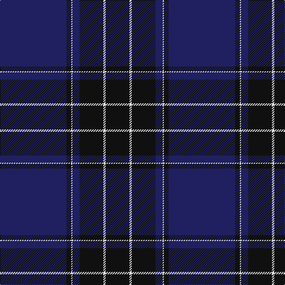

In pattern [BKWBKWK](/patterns/bkwbkwk/).

This was sourced from tartans-authority.  It is a [7 stripes tartan](/stripes/stripes7/).

Original link http://www.tartansauthority.com/tartan-ferret/display/8472/

## Thread count
DB/112 K8 LN2 DB12 K40 LN4 K/40

## Palette
Each colour and its ΔE from the base-6 reference it is a variant of.

| Colour | Shade | Base | ΔE (OKLab) |
|---|---|---|---|
| DB | <code style="background-color:#202060;">#202060</code> `#202060` | B <code style="background-color:#2A418A;">#2A418A</code> | 0.11 |
| K | <code style="background-color:#101010;">#101010</code> `#101010` | K <code style="background-color:#000000;">#000000</code> | 0.17 |
| LN | <code style="background-color:#E0E0E0;">#E0E0E0</code> `#E0E0E0` | W <code style="background-color:#F7F7F7;">#F7F7F7</code> | 0.07 |

# Sample pattern

## Nearest tartans

The nearest existing variants by ΔTartan distance.

1. [Blue Spirit Fashion Tartan Tartan Number: 7001. Earliest known date: 01/08/2006 Designed by Kirsty Anderson of The House of Edgar for ACS Clothing of Glasgow. See products available Copyright © Blair Urquhart, Comrie, 2015](/setts/s8/b3k12b3k17b40k2b2w1x2~b1b056a-k1e1a10-we0e0e0/) — ΔT 1.11
1. [Potts (Personal)](/setts/s6/g1b36ba28b3g3y1x2~b202060-ba441800-g74846c-yfccc00/) — ΔT 1.41
1. [Blue Spirit (Fashion)](/setts/s8/b3k13b3k22b49k2b2w1x2~b20008c-k101010-wa8ace8/) — ΔT 1.47
1. [Blue Spirit](/setts/s8/b3k13b3k22b49k2b2w1x2~b1c0070-k101010-wa8ace8/) — ΔT 1.48
1. [U.S. Navy/Edzell (Military)](/setts/s6/b45ba7w3ba27r1ba7x2~b14283c-ba2c2c80-rc80000-we0e0e0/) — ΔT 1.49
1. [Potts (Personal)](/setts/s6/g1b36ba28b3g3k1x2~b202060-ba441800-g74846c-k000000/) — ΔT 1.50
1. [Home or Hume Clan Tartan Tartan Number: 127. Earliest known date: 1842 D.W.Stewart says, "The tartan of the ancient and notable family of Home, though differing in colour, has the same scheme as the Grey Douglas. Both first appear in the Vestiarium Scoticum." Border 'Clans' are mentioned in an Act of the Scottish Parliament in 1587, but no evidence of a Clan tartan exists before the earliest date given here. See products available Copyright © Blair Urquhart, Comrie, 2015](/setts/s8/k28r1k2r1k8b24g2b3x2~b2c2c80-g006818-k101010-rc80000/) — ΔT 1.54
1. [Earl Blue Marl](/setts/s6/b80k28ba9k3r5k12x2~b2c2c80-ba780078-k101010-r9c68a4/) — ΔT 1.65
1. [Danzas](/setts/s7/y4b3y1b17ba40b2ba3x2~b102040-ba304080-yf0c000/) — ΔT 1.67
1. [Ramsay Blue Clan Tartan Tartan Number: 259. Earliest known date: 1930 This sample comes from the MacGregor-Hastie collection which forms the basis of the cloth archive of the Scottish Tartans Society. Some of the samples, including this one, were unmarked. One can assume that the sample dates between 1930 and 1950. See products available Copyright © Blair Urquhart, Comrie, 2015](/setts/s6/k4w2k28b30k1b3x2~b2c2c80-k101010-we0e0e0/) — ΔT 1.73

## Neighbour map

Every grey dot is one of 15726 variants placed by the first two principal components of the ΔTartan feature space (44% of its variance). Red is this tartan; blue dots are its nearest — click one to open its page.

<svg viewBox="0 0 640 380" role="img" style="max-width:100%;height:auto;border:1px solid #e0e0e0;border-radius:4px;display:block" xmlns="http://www.w3.org/2000/svg"><image href="/nn/cloud.v1.png" width="640" height="380"/><a href="/setts/s8/b3k12b3k17b40k2b2w1x2~b1b056a-k1e1a10-we0e0e0/"><circle cx="535.5" cy="195.6" r="4" fill="#3465a4"><title>Blue Spirit Fashion Tartan Tartan Number: 7001. Earliest known date: 01/08/2006 Designed by Kirsty Anderson of The House of Edgar for ACS Clothing of Glasgow. See products available Copyright © Blair Urquhart, Comrie, 2015</title></circle></a><a href="/setts/s6/g1b36ba28b3g3y1x2~b202060-ba441800-g74846c-yfccc00/"><circle cx="451.6" cy="179.5" r="4" fill="#3465a4"><title>Potts (Personal)</title></circle></a><a href="/setts/s8/b3k13b3k22b49k2b2w1x2~b20008c-k101010-wa8ace8/"><circle cx="519.2" cy="174.0" r="4" fill="#3465a4"><title>Blue Spirit (Fashion)</title></circle></a><a href="/setts/s8/b3k13b3k22b49k2b2w1x2~b1c0070-k101010-wa8ace8/"><circle cx="555.6" cy="189.6" r="4" fill="#3465a4"><title>Blue Spirit</title></circle></a><a href="/setts/s6/b45ba7w3ba27r1ba7x2~b14283c-ba2c2c80-rc80000-we0e0e0/"><circle cx="448.3" cy="189.8" r="4" fill="#3465a4"><title>U.S. Navy/Edzell (Military)</title></circle></a><a href="/setts/s6/g1b36ba28b3g3k1x2~b202060-ba441800-g74846c-k000000/"><circle cx="471.4" cy="188.0" r="4" fill="#3465a4"><title>Potts (Personal)</title></circle></a><a href="/setts/s8/k28r1k2r1k8b24g2b3x2~b2c2c80-g006818-k101010-rc80000/"><circle cx="433.5" cy="177.1" r="4" fill="#3465a4"><title>Home or Hume Clan Tartan Tartan Number: 127. Earliest known date: 1842 D.W.Stewart says, &quot;The tartan of the ancient and notable family of Home, though differing in colour, has the same scheme as the Grey Douglas. Both first appear in the Vestiarium Scoticum.&quot; Border 'Clans' are mentioned in an Act of the Scottish Parliament in 1587, but no evidence of a Clan tartan exists before the earliest date given here. See products available Copyright © Blair Urquhart, Comrie, 2015</title></circle></a><a href="/setts/s6/b80k28ba9k3r5k12x2~b2c2c80-ba780078-k101010-r9c68a4/"><circle cx="451.2" cy="193.1" r="4" fill="#3465a4"><title>Earl Blue Marl</title></circle></a><a href="/setts/s7/y4b3y1b17ba40b2ba3x2~b102040-ba304080-yf0c000/"><circle cx="474.1" cy="167.7" r="4" fill="#3465a4"><title>Danzas</title></circle></a><a href="/setts/s6/k4w2k28b30k1b3x2~b2c2c80-k101010-we0e0e0/"><circle cx="412.9" cy="198.8" r="4" fill="#3465a4"><title>Ramsay Blue Clan Tartan Tartan Number: 259. Earliest known date: 1930 This sample comes from the MacGregor-Hastie collection which forms the basis of the cloth archive of the Scottish Tartans Society. Some of the samples, including this one, were unmarked. One can assume that the sample dates between 1930 and 1950. See products available Copyright © Blair Urquhart, Comrie, 2015</title></circle></a><circle cx="497.7" cy="187.6" r="5" fill="#c00000"/></svg>

ID: /setts/s7/b56k4w1b6k20w2k20x2~b202060-k101010-we0e0e0/
