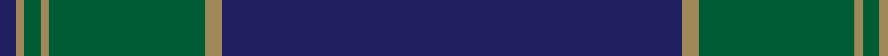
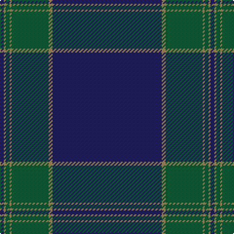

In pattern [BYGYGYB](/patterns/bygygyb/).

This was sourced from house-of-tartan.  It is a [7 stripes tartan](/stripes/stripes7/).

Original link http://www.house-of-tartan.scotland.net/house/TartanViewjs.asp?colr=Def&tnam=5758

## Thread count
DB/4 LT2 G4 LT2 G38 LT4 DB/112

## Palette
Each colour and its ΔE from the base-6 reference it is a variant of.

| Colour | Shade | Base | ΔE (OKLab) |
|---|---|---|---|
| DB | <code style="background-color:#202060;">#202060</code> `#202060` | B <code style="background-color:#2A418A;">#2A418A</code> | 0.11 |
| G | <code style="background-color:#005C34;">#005C34</code> `#005C34` | G <code style="background-color:#006100;">#006100</code> | 0.05 |
| LT | <code style="background-color:#A08858;">#A08858</code> `#A08858` | Y <code style="background-color:#F2BF00;">#F2BF00</code> | 0.21 |
| Y | <code style="background-color:#E8C000;">#E8C000</code> `#E8C000` | Y <code style="background-color:#F2BF00;">#F2BF00</code> | 0.02 |

# Sample pattern

## Nearest tartans

The nearest existing variants by ΔTartan distance.

1. [Affara (Personal)](/setts/s7/b80k5g12k2y2g2k10~b2c2c80-g006818-k101010-ye8c000~x2/) — ΔT 1.24
1. [Wilson #2](/setts/s6/b48g14r3g2r3g2~b2c4084-g005020-rdc0000~x2/) — ΔT 1.44
1. [Marist School, The](/setts/s8/b29ba2b1ba1b1ba1bb8y1~b102040-ba4000ff-bb304080-yf0c000~x4/) — ΔT 1.45
1. [United French Freemasons (Corporate](/setts/s6/b144r9ba44b4ba4b4~b202060-ba2888c4-r880000/) — ΔT 1.58
1. [Salvation Army Hunting Corporate Tartan Tartan Number: 150. Earliest known date: 1983 Designed to be ready for the Perth Citadel Corps Centenary. The hunting version replaces red with green. See products available Copyright © Blair Urquhart, Comrie, 2015](/setts/s7/b40g8k1y2k1g8b5~b2c2c80-g006818-k101010-ye8c000~x4/) — ΔT 1.60
1. [Munster Ancestry (Fashion)](/setts/s8/b4ba48b21ba14g3ba6b1y3~b5c5c5c-ba2c2c80-g604000-ye8c000~x2/) — ΔT 1.60
1. [Wilson](/setts/s6/b64g20r4g3r4g3~b2c4084-g005020-rdc0000/) — ΔT 1.65
1. [Danzas](/setts/s7/y4b3y1b17ba40b2ba3~b102040-ba304080-yf0c000~x2/) — ΔT 1.65
1. [Deuchars IPA (Corporate)](/setts/s12/b45ba3b3ba15b3ba3b7w1b7y1b1y1~b003c64-ba1474b4-we0e0e0-yf09400~x2/) — ΔT 1.72
1. [United States Trade sett Tartan Tartan Number: 2126. Earliest known date: 1989 This design is different in warp and weft. The display gives the general appearance only. Produced to celebrate American tourism is Scotland. The colours are taken from the flags of the two nations and the Atlantic Ocean that separates them. See products available Copyright © Blair Urquhart, Comrie, 2015](/setts/s9/b7ba5y6ba5r7ba2b2ba70y2~b2c2c80-ba003c64-rc80000-yb8b8b8/) — ΔT 1.72

## Neighbour map

Every grey dot is one of 15726 variants placed by the first two principal components of the ΔTartan feature space (44% of its variance). Red is this tartan; blue dots are its nearest — click one to open its page.

<svg viewBox="0 0 640 380" role="img" style="max-width:100%;height:auto;border:1px solid #e0e0e0;border-radius:4px;display:block" xmlns="http://www.w3.org/2000/svg"><image href="/nn/cloud.v1.png" width="640" height="380"/><a href="/setts/s7/b80k5g12k2y2g2k10~b2c2c80-g006818-k101010-ye8c000~x2/"><circle cx="533.5" cy="145.5" r="4" fill="#3465a4"><title>Affara (Personal)</title></circle></a><a href="/setts/s6/b48g14r3g2r3g2~b2c4084-g005020-rdc0000~x2/"><circle cx="519.0" cy="200.1" r="4" fill="#3465a4"><title>Wilson #2</title></circle></a><a href="/setts/s8/b29ba2b1ba1b1ba1bb8y1~b102040-ba4000ff-bb304080-yf0c000~x4/"><circle cx="528.1" cy="156.1" r="4" fill="#3465a4"><title>Marist School, The</title></circle></a><a href="/setts/s6/b144r9ba44b4ba4b4~b202060-ba2888c4-r880000/"><circle cx="555.8" cy="175.7" r="4" fill="#3465a4"><title>United French Freemasons (Corporate</title></circle></a><a href="/setts/s7/b40g8k1y2k1g8b5~b2c2c80-g006818-k101010-ye8c000~x4/"><circle cx="501.1" cy="149.7" r="4" fill="#3465a4"><title>Salvation Army Hunting Corporate Tartan Tartan Number: 150. Earliest known date: 1983 Designed to be ready for the Perth Citadel Corps Centenary. The hunting version replaces red with green. See products available Copyright © Blair Urquhart, Comrie, 2015</title></circle></a><a href="/setts/s8/b4ba48b21ba14g3ba6b1y3~b5c5c5c-ba2c2c80-g604000-ye8c000~x2/"><circle cx="531.0" cy="161.9" r="4" fill="#3465a4"><title>Munster Ancestry (Fashion)</title></circle></a><a href="/setts/s6/b64g20r4g3r4g3~b2c4084-g005020-rdc0000/"><circle cx="505.0" cy="205.5" r="4" fill="#3465a4"><title>Wilson</title></circle></a><a href="/setts/s7/y4b3y1b17ba40b2ba3~b102040-ba304080-yf0c000~x2/"><circle cx="474.1" cy="167.7" r="4" fill="#3465a4"><title>Danzas</title></circle></a><a href="/setts/s12/b45ba3b3ba15b3ba3b7w1b7y1b1y1~b003c64-ba1474b4-we0e0e0-yf09400~x2/"><circle cx="571.5" cy="132.6" r="4" fill="#3465a4"><title>Deuchars IPA (Corporate)</title></circle></a><a href="/setts/s9/b7ba5y6ba5r7ba2b2ba70y2~b2c2c80-ba003c64-rc80000-yb8b8b8/"><circle cx="569.9" cy="134.3" r="4" fill="#3465a4"><title>United States Trade sett Tartan Tartan Number: 2126. Earliest known date: 1989 This design is different in warp and weft. The display gives the general appearance only. Produced to celebrate American tourism is Scotland. The colours are taken from the flags of the two nations and the Atlantic Ocean that separates them. See products available Copyright © Blair Urquhart, Comrie, 2015</title></circle></a><circle cx="579.7" cy="164.2" r="5" fill="#c00000"/></svg>

ID: /setts/s7/b56y2g19y1g2y1b2~b202060-g005c34-ya08858~x2/
