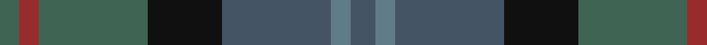
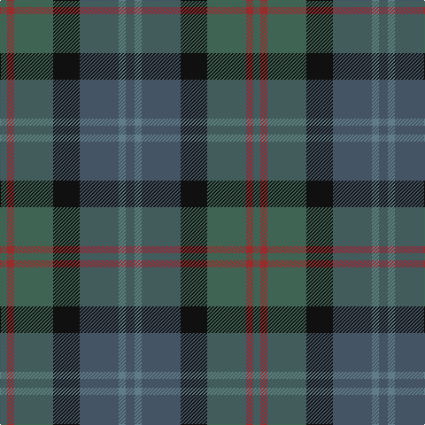

In pattern [BBBKGRG](/patterns/bbbkgrg/).

This was sourced from register-of-tartans.  It is a [7 stripes tartan](/stripes/stripes7/).

Original link https://www.tartanregister.gov.uk/tartanDetails.aspx?ref=463

## Attestations

This cloth appears in 2 source records; the oldest owns this page.

- 01/01/2006 — Cairngorm #2 (register-of-tartans, [record](https://www.tartanregister.gov.uk/tartanDetails.aspx?ref=463))
- pre 2006 — Cairngorm #2 (tartans-authority, [record](http://www.tartansauthority.com/tartan-ferret/display/7071/))

## Register references

External register numbers recorded for this tartan.

- Scottish Register of Tartans: [463](https://www.tartanregister.gov.uk/tartanDetails.aspx?ref=463)
- Scottish Tartans Authority (ITI): 7071

## Thread count
N/8 DR8 N44 K30 Na44 B8 Na/10

## Palette
Each colour and its ΔE from the base-6 reference it is a variant of.

| Colour | Shade | Base | ΔE (OKLab) |
|---|---|---|---|
| B | <code style="background-color:#607C88;">#607C88</code> `#607C88` | B <code style="background-color:#2A418A;">#2A418A</code> | 0.20 |
| DR | <code style="background-color:#982C2C;">#982C2C</code> `#982C2C` | R <code style="background-color:#CC0000;">#CC0000</code> | 0.10 |
| K | <code style="background-color:#101010;">#101010</code> `#101010` | K <code style="background-color:#000000;">#000000</code> | 0.17 |
| N | <code style="background-color:#406454;">#406454</code> `#406454` | G <code style="background-color:#006100;">#006100</code> | 0.11 |
| Na | <code style="background-color:#445464;">#445464</code> `#445464` | B <code style="background-color:#2A418A;">#2A418A</code> | 0.10 |

# Sample pattern

## Nearest tartans

The nearest existing variants by ΔTartan distance.

1. [House of Bruar (Corporate)](/setts/s6/b6ba26bb28g26bb8ga3~b4c0000-ba4c3428-bb14283c-g006818-ga8c7038~x2/) — ΔT 1.24
1. [Swankie](/setts/s7/b3r6g21ra5ba10b22g3~b102040-ba401000-g004010-rc00000-ra906030~x2/) — ΔT 1.31
1. [Bennachie (Whisky)](/setts/s7/b14k5ba5k5b14g32r4~b003c64-ba6c0070-g285800-k101010-r880000~x2/) — ΔT 1.38
1. [Saorsa (Corporate)](/setts/s6/b11g15k2ba5bb3ba11~b202060-ba5c5c5c-bb1c0070-g408060-k101010~x2/) — ΔT 1.40
1. [Sound of Mull](/setts/s9/b30ba4g6bb4g6bc6g12bc13bd4~b141e46-ba003c64-bb505050-bc646464-bd4c0000-g503c14~x2/) — ΔT 1.41
1. [Limerick, County](/setts/s11/b6y4b3ba2b5ba2b3ba2g14r3ba2~b4c3428-ba003c64-g5c6428-r880000-ybc8c00~x2/) — ΔT 1.44
1. [Baron of Crawfordjohn (Personal)](/setts/s7/b8ba10b22g7ga10g22bb3~b003c64-ba2c2c80-bb780078-g003820-ga408060~x2/) — ΔT 1.49
1. [I Y](/setts/s6/k4g16k13b16ba3b3~b141e46-ba5f749c-g005448-k101010~x2/) — ΔT 1.52
1. [Royal Highland Society (Corporate)](/setts/s8/y4g17k10b3k3b17r3b3~b003c64-g003820-k101010-r880000-yc4ac74~x2/) — ΔT 1.52
1. [Dewar (WCWM)](/setts/s6/b1g1b7g5ga7y1~b084848-g604000-ga8c7038-yb8b8b8~x4/) — ΔT 1.52

## Neighbour map

Every grey dot is one of 15726 variants placed by the first two principal components of the ΔTartan feature space (44% of its variance). Red is this tartan; blue dots are its nearest — click one to open its page.

<svg viewBox="0 0 640 380" role="img" style="max-width:100%;height:auto;border:1px solid #e0e0e0;border-radius:4px;display:block" xmlns="http://www.w3.org/2000/svg"><image href="/nn/cloud.v1.png" width="640" height="380"/><a href="/setts/s6/b6ba26bb28g26bb8ga3~b4c0000-ba4c3428-bb14283c-g006818-ga8c7038~x2/"><circle cx="249.8" cy="258.4" r="4" fill="#3465a4"><title>House of Bruar (Corporate)</title></circle></a><a href="/setts/s7/b3r6g21ra5ba10b22g3~b102040-ba401000-g004010-rc00000-ra906030~x2/"><circle cx="215.1" cy="237.4" r="4" fill="#3465a4"><title>Swankie</title></circle></a><a href="/setts/s7/b14k5ba5k5b14g32r4~b003c64-ba6c0070-g285800-k101010-r880000~x2/"><circle cx="250.1" cy="231.8" r="4" fill="#3465a4"><title>Bennachie (Whisky)</title></circle></a><a href="/setts/s6/b11g15k2ba5bb3ba11~b202060-ba5c5c5c-bb1c0070-g408060-k101010~x2/"><circle cx="183.4" cy="251.4" r="4" fill="#3465a4"><title>Saorsa (Corporate)</title></circle></a><a href="/setts/s9/b30ba4g6bb4g6bc6g12bc13bd4~b141e46-ba003c64-bb505050-bc646464-bd4c0000-g503c14~x2/"><circle cx="221.8" cy="212.8" r="4" fill="#3465a4"><title>Sound of Mull</title></circle></a><a href="/setts/s11/b6y4b3ba2b5ba2b3ba2g14r3ba2~b4c3428-ba003c64-g5c6428-r880000-ybc8c00~x2/"><circle cx="223.2" cy="215.4" r="4" fill="#3465a4"><title>Limerick, County</title></circle></a><a href="/setts/s7/b8ba10b22g7ga10g22bb3~b003c64-ba2c2c80-bb780078-g003820-ga408060~x2/"><circle cx="239.6" cy="276.8" r="4" fill="#3465a4"><title>Baron of Crawfordjohn (Personal)</title></circle></a><a href="/setts/s6/k4g16k13b16ba3b3~b141e46-ba5f749c-g005448-k101010~x2/"><circle cx="236.0" cy="296.8" r="4" fill="#3465a4"><title>I Y</title></circle></a><a href="/setts/s8/y4g17k10b3k3b17r3b3~b003c64-g003820-k101010-r880000-yc4ac74~x2/"><circle cx="194.5" cy="234.9" r="4" fill="#3465a4"><title>Royal Highland Society (Corporate)</title></circle></a><a href="/setts/s6/b1g1b7g5ga7y1~b084848-g604000-ga8c7038-yb8b8b8~x4/"><circle cx="254.8" cy="261.8" r="4" fill="#3465a4"><title>Dewar (WCWM)</title></circle></a><circle cx="216.4" cy="255.4" r="5" fill="#c00000"/></svg>

ID: /setts/s7/b5ba4b22k15g22r4g4~b445464-ba607c88-g406454-k101010-r982c2c~x2/
