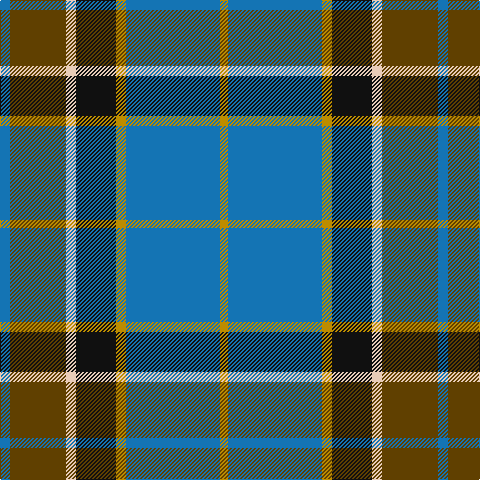

**Bands:** [YBYKWGB](/stripes/ybykwgb/) · **Stripes:** [LO B LO K LB DY B](/stripes/stripes7/) LO B LO K LB DY B

This was sourced from tartans-authority.  It is a [7 band tartan](/bands/bands7/).

Original link http://www.tartansauthority.com/tartan-ferret/display/8661/

## Thread count
B/10 T56 LR10 K40 DY10 B94 DY/8

## Palette
Each colour and its ΔE from the base-6 reference it is a variant of.

| Colour | Shade | Base | ΔE (OKLab) |
|---|---|---|---|
| B | <code style="background-color:#1474B4;">#1474B4</code> `#1474B4` | B <code style="background-color:#2A418A;">#2A418A</code> | 0.15 |
| DY | <code style="background-color:#BC8C00;">#BC8C00</code> `#BC8C00` | Y <code style="background-color:#F2BF00;">#F2BF00</code> | 0.16 |
| K | <code style="background-color:#101010;">#101010</code> `#101010` | K <code style="background-color:#000000;">#000000</code> | 0.17 |
| LR | <code style="background-color:#E8CCB8;">#E8CCB8</code> `#E8CCB8` | W <code style="background-color:#F7F7F7;">#F7F7F7</code> | 0.12 |
| T | <code style="background-color:#604000;">#604000</code> `#604000` | G <code style="background-color:#006100;">#006100</code> | 0.14 |

# Sample pattern

## Nearest tartans

The nearest existing variants by ΔTartan distance.

1. [Afternoon Tea / Darjeeling](/setts/s6/w15y98db72r25db8ly15/) — ΔT 0.76
1. [Heckenberg Htg (Personal)](/setts/s7/db3g13t1r3t1db10ly1~x2/) — ΔT 0.76
1. [DeLoughery (Personal)](/setts/s6/db20k6lo4db3g20w2~x2/) — ΔT 0.78
1. [MX-5 Owners' Club](/setts/s7/r6db27t2g2t2g30w4~x2/) — ΔT 0.80
1. [Canine All Dogs](/setts/s6/r5t3g24db24r4ly2~x2/) — ΔT 0.81
1. [MacFadzean/MacPhedran](/setts/s7/g3db12w1k12g13r2g2~x4/) — ΔT 0.83
1. [Ednie (Personal)](/setts/s7/b11k4g4m1g4k1r1~x4/) — ΔT 0.83
1. [Afternoon Tea / Darjeeling](/setts/s6/w15dg98dt72r25dt8ly15/) — ΔT 0.87
1. [Dunbartonshire](/setts/s9/g11k2g1m4db1m4db13lt2db1~x4/) — ΔT 0.87
1. [Leslie, Hebridean](/setts/s6/k6g15w2db22r2k4~x2/) — ΔT 0.88

## Neighbour map

Every grey dot is one of 14299 variants placed by the first two principal components of the ΔTartan feature space (44% of its variance). Red is this tartan; blue dots are its nearest — click one to open its page.

<svg viewBox="0 0 640 380" role="img" style="max-width:100%;height:auto;border:1px solid #e0e0e0;border-radius:4px;display:block" xmlns="http://www.w3.org/2000/svg"><image href="/nn/cloud.v1.png" width="640" height="380"/><a href="/setts/s6/w15y98db72r25db8ly15/"><circle cx="203.2" cy="180.3" r="4" fill="#3465a4"><title>Afternoon Tea / Darjeeling</title></circle></a><a href="/setts/s7/db3g13t1r3t1db10ly1~x2/"><circle cx="236.5" cy="178.7" r="4" fill="#3465a4"><title>Heckenberg Htg (Personal)</title></circle></a><a href="/setts/s6/db20k6lo4db3g20w2~x2/"><circle cx="206.8" cy="203.1" r="4" fill="#3465a4"><title>DeLoughery (Personal)</title></circle></a><a href="/setts/s7/r6db27t2g2t2g30w4~x2/"><circle cx="242.9" cy="158.5" r="4" fill="#3465a4"><title>MX-5 Owners' Club</title></circle></a><a href="/setts/s6/r5t3g24db24r4ly2~x2/"><circle cx="218.8" cy="188.2" r="4" fill="#3465a4"><title>Canine All Dogs</title></circle></a><a href="/setts/s7/g3db12w1k12g13r2g2~x4/"><circle cx="193.9" cy="187.3" r="4" fill="#3465a4"><title>MacFadzean/MacPhedran</title></circle></a><a href="/setts/s7/b11k4g4m1g4k1r1~x4/"><circle cx="213.1" cy="194.5" r="4" fill="#3465a4"><title>Ednie (Personal)</title></circle></a><a href="/setts/s6/w15dg98dt72r25dt8ly15/"><circle cx="206.2" cy="187.6" r="4" fill="#3465a4"><title>Afternoon Tea / Darjeeling</title></circle></a><a href="/setts/s9/g11k2g1m4db1m4db13lt2db1~x4/"><circle cx="195.6" cy="161.6" r="4" fill="#3465a4"><title>Dunbartonshire</title></circle></a><a href="/setts/s6/k6g15w2db22r2k4~x2/"><circle cx="214.6" cy="197.6" r="4" fill="#3465a4"><title>Leslie, Hebridean</title></circle></a><circle cx="219.0" cy="176.9" r="5" fill="#c00000"/></svg>

ID: /setts/s7/b5dy28lb5k20lo5b47lo4~x2/
